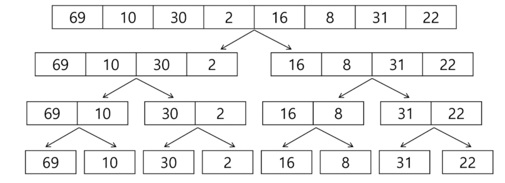
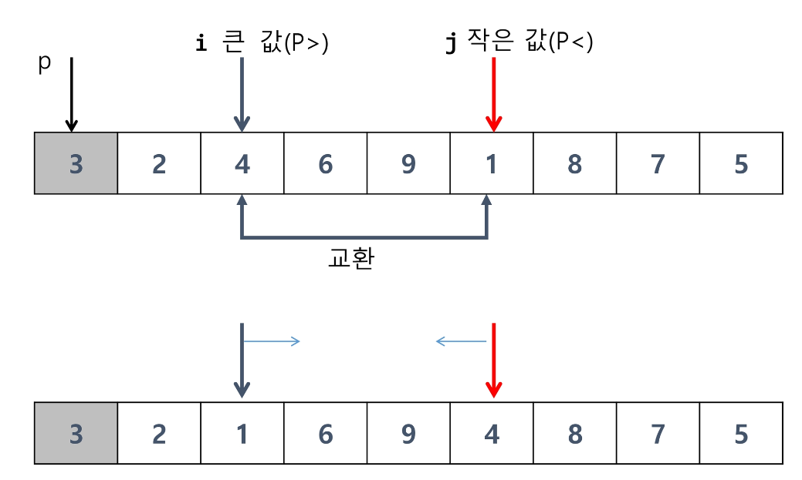
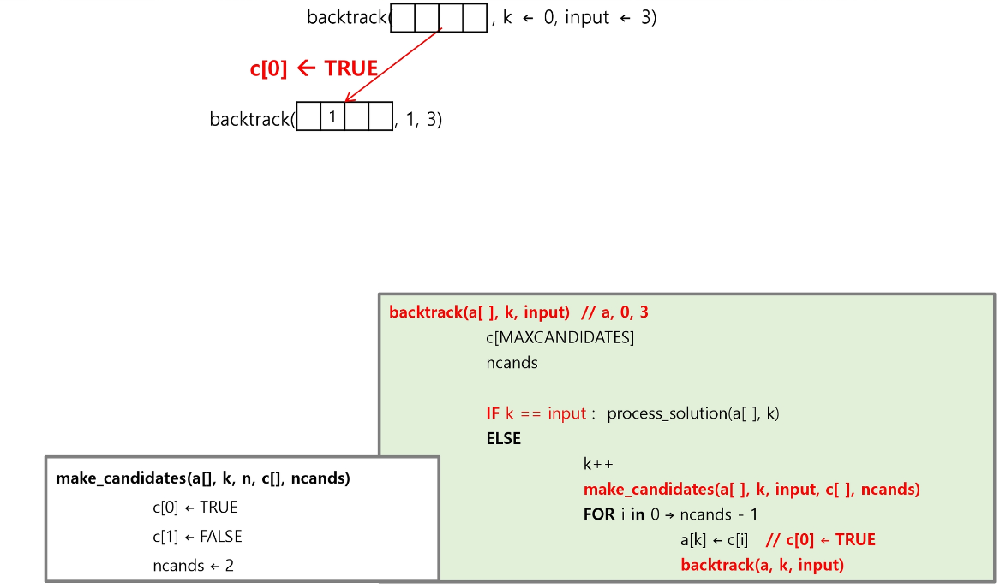

# 분할 정복 & 백트래킹

---

# 목차

* 분할정복

* 퀵 정렬

* 이진 검색

* 백트래킹

---

## 분할 정복 기법

---

> ### 유래

* 1805년 12월 2일 아우스터리츠 전투에서 나폴레옹이 사용한 전략

* 전력이 우세한 연합군을 공격하기 위해 나폴레옹은 연합군의 중앙부로 쳐들어가 연합군을 둘로 나눔

* 둘로 나뉜 연합군을 한 부분씩 격파함

> ### 설계 전략

* 분할(Divide) : 해결할 문제를 여러 개의 작은 부분으로 나눈다.

* 정복(Conquer) : 나눈 작은 문제를 각각 해결한다.

* 통합(Combine) : (필요하다면) 해결된 해답을 모은다.

> ### Top-down approach

> ### 반복 알고리즘 : O(n)

> ### 분할 정복 기반의 알고리즘 :  O(log2n)

---

## 병합 정렬

---

> ### 여러 개의 정렬된 자료의 집합을 병합하여 한 개의 정렬된 집합으로 만드는 방식

> ### 분할 정복 알고리즘 활용

* 자료를 최소 단위의 문제까지 나눈 후에 차례대로 정렬하여 최종 결과를 얻어냄

* Top-down 방식

> ### 시간 복잡도

* O(n log n)

> ### 병합 정렬 과정

* {69, 10, 30, 2, 16, 8, 31, 22}를 병합 정렬하는 과정

* 분할 단계 : 전체 자료 집합에 대하여, 최소 크기의 부분집합이 될 때까지 분할 작업을 계속한다.

* 병합 단계 : 2개의 부분집합을 정렬하면서 하나의 집합으로 병합

* 8개의 부분집합이 1개로 병합될 때까지 반복함

> ### 알고리즘 : 분할 과정

> ### 알고리즘 : 병합 과정

---

## 퀵 정렬

---

> ### 주어진 배열을 두 개로 분할하고, 각각을 정렬한다.

* 병합 정렬과 동일?

> ### 다른 점1 : 병합 정렬은 그냥 두 부분으로 나누는 반면에, 퀵정렬은 분할할 때, 기준 아이템 중심으로, 이보다 작은 것은 왼편, 큰 것은 오른편에 위치시킨다.

> ### 다른 점 2 : 각 부분 정렬이 끝난 후, 병합정렬은 "병합"이란 후처리 작업이 필요하나, 퀵 정렬은 필요로 하지 않는다.

> ### 알고리즘

> ### Hoare-Partition 알고리즘

> ### 아이디어

* P(피봇)값들 보다 큰 값은 오른쪽, 작은 값들은 왼쪽 집합에 위치하도록 한다.

* 피봇을 두 집합의 가운데에 위치시킨다.

> ### 피봇 선택

* 왼쪽 끝/오른쪽 끝/임의의 세개 값 중에 중간 값

> ### Lomuto partition 알고리즘

---

## 이진 검색

---

> ### 자료의 가운데에 있는 항목의 키 값과 비교하여 다음 검색의 위치를 결정하고 검색을 계속 진행하는 방법

* 목적 키를 찾을 때까지 이진 검색을 순환적으로 반복 수행함으로써 검색 범위를 반으로 줄여가면서 보다 빠르게 검색을 수행함

> ### 이진 검색을 하기 위해서는 자료가 정렬된 상태여야 한다.

> ### 검색 과정

1. 자료의 중앙에 있는 원소를 고른다.

2. 중앙 원소의 값과 찾고자 하는 목표 값을 비교한다.

3. 목표 값이 중앙 원소의 값보다 작으면 자료의 왼쪽 반에 대해서 새로 검색을 수행하고, 크다면 자료의 오른쪽 반에 대해서 새로 검색을 수행한다.

4. 찾고자 하는 값을 찾을 때까지 1~3의 과정을 반복한다.  

> ### 예) 이진 검색으로 7을 찾는 경우

> ### 예) 이진 검색으로 20을 찾는 경우

> ### 알고리즘 : 반복구조

> ### 알고리즘 : 재귀구조

---

## 분할 정복의 활용

---

> ### 병합 정렬은 외부 정렬의 기본이 되는 정렬 알고리즘이다. 또한, 멀티코어 CPU 나 다수의 프로세서에서 정렬 알고리즘을 병렬화하기 위해 병합 정렬 알고리즘이 활용된다.

> ### 퀵 정렬은 매우 큰 입력 데이터에 대해서 좋은 성능을 보이는 알고리즘이다.

---

## 백트래킹

---

> ### 백트래킹 개념

#### 여러 가지 선택지들이 존재하는 상황에서 한가지를 선택한다.

#### 선택이 이루어지면 새로운 선택지들의 집합이 생성된다.

#### 이런 선택을 반복하면서 최종 상태에 도달한다.

* 올바른 선택을 계속하면 목표 상태에 도달한다.

> ### 당첨 리프 노드 찾기

* 루트에서 갈 수 있는 노드를 선택한다.

* 꽝 노드까지 도달하면 최근의 선택으로 되돌아와서 다시 시작한다.

* 더 이상의 선택지가 없다면 이전의 선택지로 돌아가서 다른 선택을 한다.

* 루트까지 돌아갔을 경우 더 이상 선택지가 없다면 찾는 답이 없다.

> ### 백트래킹과 깊이 우선 탐색과의 차이

* 어떤 노드에서 출발하는 경로가 해결책으로 이어질 것 같지 않으면 더 이상 그 경로를 따라가지 않음으로써 시도의 횟수를 줄임

* 깊이 우선 탐색이 모든 경로를 추적하는데 비해 백트래킹은 불필요한 경로를 조기에 차단

* 깊이 우선 탐색을 가하기에는 경우의 수가 너무나 많음. 즉, N! 가지의 경우의 수를 가진 문제에 대해 깊이 우선 탐색을 가하면 당연히 처리 불가능한 문제

* 백트래킹 알고리즘을 적용하면 일반적으로 경우의 수가 줄어들지만 이 역시 최악의 경우에는 여전히 지수함수 시간을 요하므로 처리 불가능

> ### 8-Queens 문제

* 퀸 8개를 크기의 체스판 안에 서로를 공격할 수 없도록 배치하는 모든 경우를 구하는 문제

* 후보 해의 수: 

* 실제 해의 수 : 이중에서 실제 해는 92개뿐

* 즉, 44억 개가 넘는 후보 해의 수속에서 92개를 최대한 효율적으로 찾아내는 것이 관건

* 4-Queens 문제로 축소해서 생각해보기
  
  * 같은 행에 위치할 수 없다.
  
  * 모든 경우의 수 : 4x4x4x4 = 256
  
  

> ### 루트 노드에서 리프 노드까지의 경로는 해답후보가 되는데, 깊이 우선 검색을 하여 그 해답후보 중에서 해답을 찾을 수 있다.

> ### 그러나 이 방법을 사용하면 해답이 될 가능성이 전혀 없는 노드의 후손 노드들도 모두 검색해야 하므로 비효율적이다.

> ### 모든 후보를 검사?

* No!

> ### 백트래킹 기법

* 어떤 노드의 유망성을 점검한 후에 유망하지 않다고 결정되면 그 노드의 부모로 되돌아가 다음 자식 노드로 감

* 어떤 노드를 방문하였을 때 그 노드를 포함한 경로가 해답이 될 수 없으면 그 노드는 유망하지 않다고 하며, 반대로 해답의 가능성이 있으면 유망하다고 한다.

* 가지치기 : 유망하지 않는 노드가 포함되는 경로는 더 이상 고려하지 않는다.

> ### 백트래킹을 이용한 알고리즘은 다음과 같은 절차로 진행된다.

1. 상태 공간 트리의 깊이 우선 검색을 실시한다.

2. 각 노드가 유망한지를 점검한다.

3. 만일 그 노드가 유망하지 않으면, 그 노드의 부모 노드로 돌아가서 검색을 계속한다.

> ### 일반 백트래킹 알고리즘

> ### 상태 공간 트리

> ### 깊이 우선 검색 vs 백트래킹

* 순수한 깊이 우선 검색 = 155 노드

* 백트래킹 = 27 노드

---

## 상태공간트리를 구축하여 문제를 해결

---

> ### {1, 2, 3}의 powerset을 구하는 백트래킹 알고리즘

> ### powerset을 구하는 백트래킹 알고리즘

> ### 백트래킹을 이용하여 순열 구하기

* 접근 방법은 앞의 부분집합 구하는 방법과 유사하다

