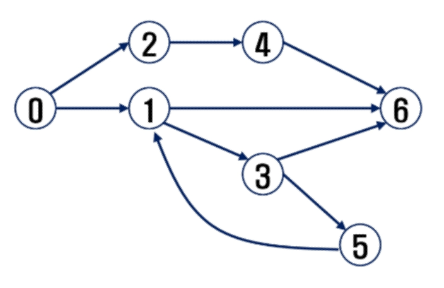
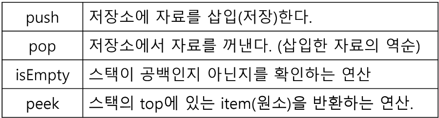
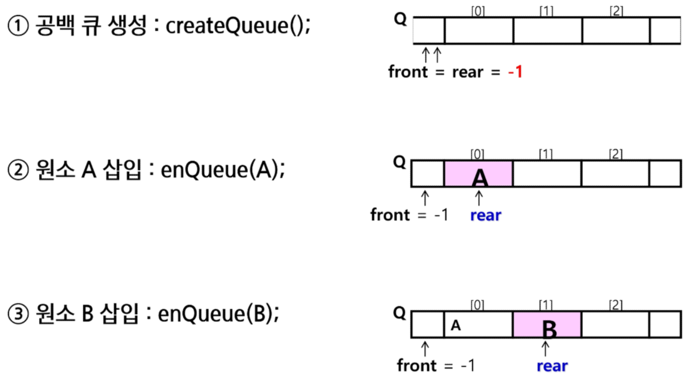
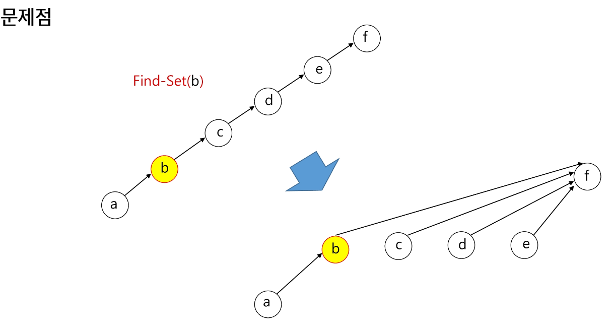
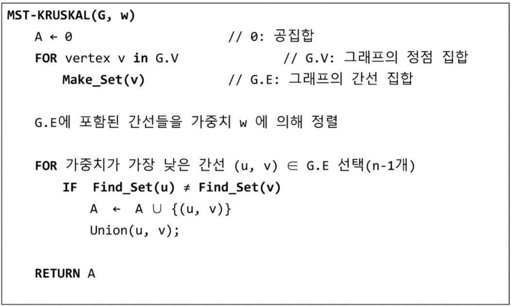

# 그래프 & 백트래킹

---

# 목차

* 그래프 기본

* DFS

* BFS

* 서로소 집합들

* 최소 비용 신장 트리 (MST)

* 최단 경로

---

## 문제 제시 : 친구관계

---

* A의 친구는 B다.

* C의 친구는 E, F이다.

* (D - E), (F - G), (N - B, I, L), (G - A, C, D, H), (I - J, H), (B - D, K, L), (M - I, J), (E - A, H), (C -B, I, L), (B - I), (J - A, G)

* A의 친구 중에 친구가 가장 많은 친구는 누구인가?

---

## 그래프

---

* 그래프는 아이템(사물 또는 추상적 개념)들과 이들 사이의 연결 관계를 표현한다.

* 그래프는 정점들의 집합과 이들을 연결하는 간선들의 집합으로 구성된 자료구조
  
  * lVl : 정점의 개수, lEl : 그래프에 포함된 간선의 개수
  
  * lVl 개의 정점을 가지는 그래프는 최대 lVl (lVl - 1)/2 간선이 가능
    
    예) 5개 정점이 있는 그래프의 최대 간선 수는 10(=5*4/2) 개이다.

* 선형 자료구조나 트리 자료구조로 표현하기 어려운 N : N 관계를 가지는 원소들을 표현하기에 용이하다

> ### 그래프 유형

* 무향 그래프

* 유향 그래프

* 가중치 그래프

* 사이클 없는 방향 그래프

* 완전 그래프
  
  * 정점들에 대해 가능한 모든 간선들을 가진 그래프

* 부분 그래프
  
  * 원래 그래프에서 일부의 정점이나 간선을 제외한 그래프

> ### 인접 정점

* 인접
  
  * 두 개의 정점에 간선이 존재(연결됨)하면 서로 인접해 있다고 한다.
  
  * 완전 그래프에 속한 임의의 두 정점들은 모두 인접해 있다.

> ### 그래프 경로

* 경로란 간선들을 순서대로 나열한 것
  
  * 간선들 : (0, 2), (2, 4), (4, 6)
  
  * 정점들 : 0 - 2 - 4 - 6

* 경로 중 한 정점을 최대한 한번만 지나는 경로를 단순경로라 한다.
  
  * 0 - 2 - 4 - 6, 0 - 1 - 6

* 시작한 정점에서 끝나는 경로를 사이클이라고 한다.
  
  * 1 - 3 - 5 - 1

> ### 그래프 표현

* 간선의 정보를 저장하는 방식, 메모리나 성능을 고려해서 결정

* 인접 행렬
  
  * lVl * lVl 크기의 2차원 배열을 이용해서 간선 정보를 저장
  
  * 배열의 배열(포인터 배열)

* 인접 리스트
  
  * 각 정점마다 해당 정점으로 나가는 간선의 정보를 저장

* 간선의 배열
  
  * 간선(시작 정점, 끝 정점)을 배열에 연속적으로 저장

> ### 인접 행렬

* 두 정점을 연결하는 간선의 유무를 행렬로 표현
  
  * lVl * lVl 정방 행렬
  
  * 행 번호와 열 번호는 그래프의 정점에 대응
  
  * 두 정점이 인접되어 있으면 1, 그렇지 않으면 0으로 표현
  
  * 무향 그래프
    
    * i번째 행의 합 = i번째 열의 합 = Vi의 차수
  
  * 유향 그래프
    
    * 행 i의 합 = Vi 의 진출 차수
    
    * 열 i의 합 = Vi 의 진입 차수

* 인접 행렬의 단점은?

> ### 인접 리스트

* 각 정점에 대한 인접 정점들을 순차적으로 표현

* 하나의 정점에 대한 인접 정점들을 각각 노드로 하는 연결 리스트로 저장

---

# DFS

---

> ### 그래프 순회(탐색)

* 그래프 순회는 비선형구조인 그래프로 표현된 모든 자료(정점)를 빠짐없이 탐색하는 것을 의미한다.

* 두 가지 방법
  
  * 깊이 우선 탐색(DFS)
  
  * 너비 우선 탐색(BFS)

> ### DFS

* 시작 정점의 한 방향으로 갈 수 있는 경로가 있는 곳까지 깊이 탐색해 가다가 더 이상 갈 곳이 없게 되면, 가장 마지막에 만났던 갈림길 간선이 있는 정점으로 되돌아와서 다른 방향의 정점으로 탐색을 계속 반복하여 결국 모든 정점을 방문하는 순회방법

* 가장 마지막에 만났던 갈림길의 정점으로 되돌아가서 다시 깊이 우선 탐색을 반복해야 하므로 후입선출 구조의 스택 사용

* DFS 알고리즘 - 재귀

* DFS 알고리즘 - 반복

* DFS 예

> ### 스택

* 스택의 특성
  
  * 물건을 쌓아 올리듯 자료를 쌓아 올린 형태의 자료구조이다
  
  * 선형구조 : 자료 간의 관게가 1대1의 관계를 갖는다.
    
    * 비선형 구조 : 자료 간의 관계가 1대 N의 관계를 갖는다. (예: 트리)
  
  * 마지막에 삽입한 자료를 가장 먼저 깨낸다.
    
    * 후입선출 이라고 부름

> ### 스택의 구현

* 스택을 구현하기 위해서 필요한 저장소와 연산
  
  * 자료를 선형으로 저장할 저장소
    
    * C언어에서는 배열을 사용할 수 있다.
    
    * 저장소 자체를 스택이라 부르기도 한다.
    
    * 스택에서 마지막 삽입된 원소의 위치를 top이라 부른다.
  
  * 연산

* 스택의 삽입/삭제 과정
  
  * 빈 스택에 원소 A, B, C를 차례로 삽입 후 한번 삭제하는 연산과정

* 스택의 push 알고리즘
  
  * top은 스택에서 마지막 자료의 위치를 가리킨다.

* 스택의 pop알고리즘

---

## BFS

---

> ### BFS

* 너비우선탐색은 탐색 시작점의 인접한 정점들을 먼저 모두 차례로 방문한 후에, 방문했던 정점을 시작점으로 하여 다시 인접한 정점들을 차례로 방문하는 방식

* 인접한 정점들에 대해 탐색을 한 후, 차례로 다시 너비우선탐색을 진행해야 하므로, 선입선출 형태의 자료구조인 큐를 활용함

---

## 큐

---

> ### 큐의 특성

* 스택과 마찬가지로 삽입과 삭제의 위치가 제한적인 자료구조
  
  * 큐의 뒤에서는 삽입만 하고, 큐의 앞에서는 삭제만 이루어지는 구조

* 큐에 삽입한 순서대로 원소가 저장되어, 가장 먼저 삽입된 원소는 가장 먼저 삭제된다.
  
  * 선입선출구조

> ### 큐의 구조 및 기본연산

* 큐의 선입선출 구조

* 큐의 기본 연산
  
  * 삽입 : enQueue
  
  * 삭제 : deQueue

> ### 큐의 구현

* 삽입 : enqueue(item)
  
  * 마지막 원소 뒤에 새로운 원소를 삽입하기 위해
    
    1. rear 값을 하나 증가시켜 새로운 원소를 삽입할 자리를 마련
    
    2. 그 인덱스에 해당하는 배열원소 Q[rear]에 item을 저장

* 삭제 : dequeue()
  
  * 가장 앞에 있는 원소를 삭제하기 위해
    
    1. front 값을 하나 증가시켜 큐에 남아있게 될 첫번째 원소 이동
    
    2. 새로운 첫번째 원소를 리턴함으로써 삭제와 동일한 기능함

* 공백상태 및 포화상태 검사 : isEmpty(), isFull()
  
  * 공백상태 : front = rear
  
  * 포화상태 : rear = n -1 (n : 배열의 크기, n - 1 : 배열의 마지막 인덱스)

---

## BFS

---

> ### BFS

* BFS는 예제 그래프를 붙여진 번호 순서로 탐색함

> ### BFS 알고리즘

* 입력 파라미터 : 그래프 G와 탐색 시작점 v

> ### BFS 예

---

## 서로소 집합

---

* 서로소 또는 상호배타 집합들은 서로 중복 포함된 원소가 없는 집합들이다. 다시 말해 교집합이 없다.

* 집합에 속한 하나의 특정 멤버를 통해 각집합들을 구분한다. 이를 대표자라 한다.

* 상호배타 집합을 표현하는 방법
  
  * 연결 리스트
  
  * 트리

* 상호배타 집합 연산
  
  * Make-Set(x)
  
  * Find-Set(x)
  
  * Union (x, y)

* 상호 배타 집합 예

> ### 상호 배타 집합 표현 - 연결리스트

* 같은 집합의 원소들은 하나의 연결리스트로 관리한다

* 연결리스트의 맨 앞의 원소를 집합의 대표 원소로 삼는다

* 각 원소는 집합의 대표원소를 가리키는 링크를 갖는다.

* 연결리스트 연산 예

> ### 상호 배타 집합 표현 - 트리

* 하나의 집합을 하나의 트리로 표현한다

* 자식 노드가 부모 노드를 가리키며 루트 노드가 대표자가 된다.

* 연산 예

* 상호 배타 집합을 표현한 트리의 배열을 이용한 저장된 모습

> ### 상호배타 집합에 대한 연산

* 연산의 효율을 높이는 방법
  
  * Rank를 이용한 Union
    
    * 각 노드는 자신을 루트로 하는 subtree의 높이를 랭크 Rank라는 이름으로 저장한다
    
    * 두 집합을 합칠 때 rank가 낮은 집합을 rank가 높은 집합에 붙인다
  
  * Path compression
    
    * Find-Set을 행하는 과정에서 만나는 모든 노드들이 직접 root를 가리키도록 포인터를 바꾸어 준다

* 랭크를 이용한 Union의 예

* 랭크를 이용한 Union에서 랭크가 증가하는 예

* Path Compression의 예

* Make-Set() 연산
  
  * Make-Set(x) : 유일한 멤버 x를 포함하는 새로운 집합을 생성하는 연산

* Find-Set 연산
  
  * Find-Set(x) : x를 포함하는 집합을 찾는 오퍼레이션

* Find-set 연산은 특정 노드에서 루트까지의 경로를 찾아 가면서 노드의 부모 정보를 갱신한다

* Union 연산
  
  * Union(x, y) : x와 y를 포함하는 두 집합을 통합하는 오퍼레이션

> ### [참고]

* Find-Set(x) : x를 포함하는 집합을 찾는 연산 (반복)

---

## MST

---

* 그래프에서 최소 비용 문제
  
  * 1. 모든 정점을 연결하는 간선들의 가중치의 합이 최소가 되는 트리
    
    2. 두 정점 사이의 최소 비용의 경로 찾기

* 신장 트리
  
  * n개의 정점으로 이루어진 무방향 그래프에서 n개의 정점과 n-1개의 간선으로 이루어진 트리

* 최소 신장 트리
  
  * 무방향 가중치 그래프에서 신장 트리를 구성하는 간선들의 가중치의 합이 최소인 신장 트리

> ### MST 표현

> ### Prim 알고리즘

* 하나의 정점에서 연결된 간선들 중에 하나씩 선택하면서 MST를 만들어 가는 방식
  
  1. 임의 정점을 하나 선택해서 시작
  
  2. 선택한 정점과 인접하는 정점들 중의 최소 비용의 간선이 존재하는 정점을 선택
  
  3. 모든 정점이 선택될 때 까지 1, 2 과정을 반복

* 서로소인 2개의 집합 정보를 유지
  
  * 트리 정점들 - MST를 만들기 위해 선택된 정점들
  
  * 비트리 정점들 - 선택 되지 않은 정점들

* 알고리즘 적용 예

* 알고리즘

> ### KRUSKAL 알고리즘

* 간선을 하나씩 선택해서 MST를 찾는 알고리즘
  
  1. 최초, 모든 간선을 가중치에 따라 오름차순으로 정렬
  
  2. 가중치가 가장 낮은 간선부터 선택하면서 트리를 증가시킴
     
     사이클이 존재하면 다음으로 가중치가 낮은 간선 선택
  
  3. n-1 개의 간선이 선택될 때 까지 2를 반복

* 알고리즘 적용 예

* 알고리즘

---

## 최단 경로

---

> ### 최단 경로

* 최단 경로 정의
  
  * 간선의 가중치가 있는 그래프에서 두 정점 사이의 경로들 중에 간선의 가중치의 합이 최소인 경로

* 하나의 시작 정점에서 끝 정점까지의 최단 경로
  
  * 다익스트라 알고리즘
    
    * 음의 가중치를 허용하지 않음
  
  * 벨만 포드 알고리즘
    
    * 음의 가중치를 허용

* 모든 정점들에 대한 최단 경로
  
  * 플로이드 워샬 알고리즘

> ### Dijkstra 알고리즘

* 시작 정점에서 거리가 최소인 정점을 선택해 나가면서 최단 경로를 구하는 방식이다.

* 시작정점(s)에서 끝정점(t) 까지의 최단 경로에 정점 x가 존재한다

* 이때, 최단경로는 s에서 x까지의 최단 경로와 x에서 t까지의 최단경로 구성된다

* 탐욕 기법을 사용한 알고리즘으로 MST의 프림 알고리즘과 유사하다

* 알고리즘

