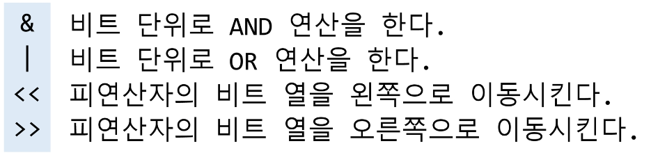
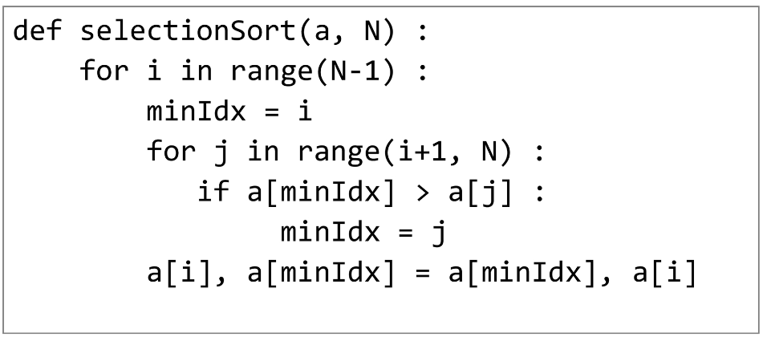

# 배열 2(Array 2)

---

# 목차

* 배열 : 2차원 배열

* 부분집합 생성

* 바이너리 서치 (Binary Search)

* 셀렉션 알고리즘 (Selection Algorithm)

* 선택 정렬 (Selection Sort)

---

## 2차원 배열

---

### 2차원 배열의 선언

* 1차원 list를 묵어놓은 list

* 2차원 이상의 다차원 list는 차원에 따라 Index를 선언

* 2차원 list의 선언 : 세로길이(행의 개수), 가로길이(열의 개수)를 필요로 함

* Python 에서는 데이터 초기화를 통해 변수선언과 초기화가 가능함

---

## 2차원 배열의 접근

---

### 배열 순회

* n X m 배열의 n*m 개의 모든 원소를 빠짐없이 조사하는 방법

### 행 우선 순회

### 열 우선 순회

### 지그재그 순회

### 델타를 이용한 2차 배열 탐색

* 2차 배열의 한 좌표에서 4방향의 인접 배열 요소를 탐색하는 방법

### 전치 행렬

### 연습문제

---

## 부분집합 합(Subset Sum) 문제

* 유한 개의 정수로 이루어진 집합이 있을 때, 이 집합의 부분집합 중에서 그 집합의 원소를 모두 더한 값이 0이 되는 경우가 있는지를 알아내는 문제

* 예를 들어, [-7, -3, -2, 5, 8]라는 집합이 있을 때, [-3, -2, 5]는 이 집합의 부분집합이면서 (-3)+(-2)+5 = 0이므로 이 경우의 답은 참이 된다.

## 부분집합 생성하기

* 완전검색 기법으로 부분집합 합 문제를 풀기 위해서는, 우선 집합의 모든 부분집합을 생성한 후에 각 부분집합의 합을 계산해야 한다.

* 주어진 집합의 부분집합을 생성하는 방법에 대해서 생각해보자.

### 부분집합의 수

* 집합의 원소가 n개일 때, 공집합을 포함한 부분집합의 수는 2**n개 이다.

* 이는 각 원소를 부분집합에 포함시키거나 포함시키지 않는 2가지 경우를 모든 원소에 적용한 경우의 수와 같다.

* Ex)

### 각 원소가 부분집합에 포함되었는지를 loop 이용하여 확인하고 부분집합을 생성하는 방법

---

## 비트 연산자

---

### 비트 연산자

### << 연산자

* 1 << n : 2**n 즉, 원소가 n개의 경우의 모든 부분집합의 수를 의미한다.

### & 연산자

* i & (1 << j) : i의 j번째 비트가 1인지 아닌지를 검사한다.

### 보다 간결하게 부분집합을 생성하는 방법

* Python 코드 예

---

## 검색(Search)

* 저장되어 있는 자료 중에서 원하는 항목을 찾는 작업

* 목적하는 탐색 키를 가진 항목을 찾는 것
  
  * 탐색 키(search key) : 자료를 구별하여 인식할 수 있는 키

* 검색의 종류
  
  * 순차 검색(sequential search)
  
  * 이진 검색(binary search)
  
  * 해쉬(hash)

---

## 순차 검색(Sequential Search)

### 일렬로 되어 있는 자료를 순서대로 검색하는 방법

* 가장 간단하고 직관적인 검색 방법

* 배열이나 연결 리스트 등 순차구조로 구현된 자료구조에서 원하는 항목을 찾을 때 유용함

* 알고리즘이 단순하여 구현이 쉽지만, 검색 대상의 수가 많은 경우에는 수행시간이 급격히 증가하여 비효율적임

### 2가지 경우

* 정렬되어 있지 않은 경우

* 정렬되어 있는 경우

### 정렬되어 있지 않은 경우

#### 검색 과정

* 첫 번째 원소부터 순서대로 검색 대상과 키 값이 같은 원소가 있는지 비교하며 찾는다.

* 키 값이 동일한 원소를 찾으면 그 원소의 인덱스를 반환한다.

* 자료구조의 마지막에 이를 때까지 검색 대상을 찾지 못하면 검색 실패

#### Ex) 2를 검색하는 경우

#### Ex) 8을 검색하는 경우

 

#### 찾고자 하는 원소의 순서에 따라 비교회수가 결정됨

* 첫 번째 원소를 찾을 때는 1번 비교, 두 번째 원소를 찾을 때는 2번 비교..

* 정렬되지 않은 자료에서의 순차 검색의 평균 비교 회수
  
  * = (1/n)*(1+2+3+...+n) = (n+1)/2

* 시간 복잡도 : O(n)

#### 구현 Ex)

### 정렬되어 있는 경우

#### 검색과정

* 자료가 오름차순으로 정렬된 상태에서 검색을 실시한다고 가정하자.

* 자료를 순차적으로 검색하면서 키 값을 비교하여, 원소의 키 값이 검색 대상의 키 값보다 크면 찾는 원소가 없다는 것이므로 더 이상 검색하지 않고 검색을 종료한다.

#### Ex) 11을 검색하는 경우

#### Ex) 10을 검색하는 경우

#### 찾고자 하는 원소의 순서에 따라 비교회수가 결정됨

* 정렬이 되어있으므로, 검색 실패를 반환하는 경우 평균 비교 회수가 반으로 줄어든다.

* 시간 복잡도 : O(n)

##### 구현 Ex

---

## 이진 검색(Binary Search)

* 자료의 가운데에 있는 항목의 키 값과 비교하여 다음 검색의 위치를 결정하고 검색을 계속 진행하는 방법
  
  * 목적 키를 찾을 때까지 이진 검색을 순환적으로 반복 수행함으로써 검색 범위를 반으로 줄여가면서 보다 빠르게 검색을 수행함

* 이진 검색을 하기 위해서는 자료가 정렬된 상태여야 한다.

* 검색 과정
  
  * 자료의 중앙에 있는 원소를 고른다.
  
  * 중앙 원소의 값과 찾고자 하는 목표 값을 비교한다.
  
  * 목표 값이 중앙 원소의 값보다 작으면 자료의 왼쪽 반에 대해서 새로 검색을 수행하고, 크다면 자료의 오른쪽 반에 대해서 새로 검색을 수행한다.
  
  * 찾고자 하는 값을 찾을 때까지 1~3의 과정을 반복한다.

#### Ex) 이진 검색으로 7을 찾는 경우

#### Ex) 이진 검색으로 20을 찾는 경우

## 이진 검색 알고리즘

#### 구현

* 검색 범위의 시작점과 종료점을 이용하여 검색을 반복 수행한다.

* 이진 검색의 경우, 자료에 삽입이나 삭제가 발생했을 때 배열의 상태를 항상 정렬 상태로 유지하는 추가 작업이 필요하다.

### 재귀 함수 이용

* 아래와 같이 재귀 함수를 이용하여 이진 검색을 구현할 수도 있다.

* 재귀 함수에 대해서는 나중에 더 자세히 배우도록 한다.

---

## 인덱스

#### 인덱스라는 용어는 Database에서 유래했으며, 테이블에 대한 동작 속도를 높여주는 자료 구조를 일컫는다. Database 분야가 아닌 곳에서는 Look up table 등의 용어를 사용하기도 한다.

#### 인덱스를 저장하는데 필요한 디스크 공간은 보통 테이블을 저장하는데 필요한 디스크 공간보다 작다. 왜냐하면 보통 인덱스는 키-필드만 갖고 있고, 테이블의 다른 세부 항목들은 갖고 있지 않기 때문이다.

#### 배열을 사용한 인덱스

* 대량의 데이터를 매번 정렬하면, 프로그램의 반응은 느려질 수 밖에 없다. 이러한 대량 데이터의 성능 저하 문제를 해결하기 위해 배열 인덱스를 사용할 수 있다.

## 다음 예에서 원본 데이터 배열과 별개로, 배열 인덱스를 추가한 예를 보여 주고 있다.

* 원본 데이터에 데이터가 삽입될 경우 상대적으로 크기가 작은 인덱스 배열을 정렬하기 때문에 속도가 빠르다.

#### 포켓볼 순서대로 정렬하기

* 왼쪽과 같이 흩어진 당구공을 오른쪽 그림처럼 정리한다고 하자. 어떻게 하겠는가?

* 많은 사람들은 당구대 위에 있는 공 중 가장 작은 숫자의 공부터 골라서 차례대로 정리할 것이다. 이것이 바로 선택 정렬이다.

#### 주어진 자료들 중 가장 작은 값의 원소부터 차례대로 선택하여 위치를 교환하는 방식

* 앞서 살펴본 셀렉션 알고리즘을 전체 자료에 적용한 것이다.

#### 정렬 과정

* 주어진 리스트 중에서 최솟값을 찾는다.

* 그 값을 리스트의 맨 앞에 위치한 값과 교환한다.

* 맨 처음 위치를 제외한 나머지 리스트를 대상으로 위의 과정을 반복한다.

* 미정렬원소가 하나 남은 상황에서는 마지막 원소가 가장 큰 값을 갖게 되므로, 실행을 종료하고 선택 정렬이 완료된다.

#### 알고리즘

#### 선택 정렬

### 저장되어 있는 자료로부터 k번째로 큰 혹은 작은 원소를 찾는 방법을 셀렉션 알고리즘이라 한다.

* 최소값, 최대값 혹은 중간값을 찾는 알고리즘을 의미하기도 한다.

### 선택 과정

* 셀렉션은 아래와 같은 과정을 통해 이루어진다.
  
  * 정렬 알고리즘을 이용하여 자료 정렬하기
  
  * 원하는 순서에 있는 원소 가져오기

### 아래는 k번째로 작은 원소를 찾는 알고리즘

* 1번부터 k번째까지 작은 원소들을 찾아 배열의 앞쪽으로 이동시키고, 배열의 k번째를 반환한다.

* k가 비교적 작을 때 유용하며 O(kn)의 수행시간을 필요로 한다.

#### 시간 복잡도

* O(n2)

### 학습한 정렬 알고리즘의 특성을 다른 정렬들과 비교해보자.

