# 문자열(string)

---

# 목차

* 문자열

* 패턴 매칭

* 문자열 암호화

* 문자열 압축

---

# 문자의 표현

---

## 컴퓨터에서의 문자표현

* 글자 A를 메모리에 저장하는 방법에 대해서 생각해보자

* 물론 칼로 A라는 글자를 새기는 방식은 아닐 것이다. 메모리는 숫자만을 저장할 수 있기 때문에 A라는 글자의 모양 그대로 비트맵으로 저장하는 방법을 사용하지 않는 한(이 방법은 메모리 낭비가 심하다) 각 문자에 대해서 대응되는 숫자를 정해 놓고 이것을 메모리에 저장하는 방법이 사용될 것이다.

* 영어가 대소문자 합쳐서 52 이므로 6(64가지)비트면 모두 표현할 수 있다.
  
  이를 코드체계라고 한다.
  
  -000000 -> 'a', 000001 -> 'b'

#### 그런데 네트워크가 발전되기 전 미국의 각 지역 별로 코드체계를 정해 놓고 사용했지만

#### 네트워크(인터넷 : 인터넷은 미국에서 발전했다)이 발전하면서 서로간에 정보를 주고 받을 때 정보를 달리 해석한다는 문제가 생겼다.

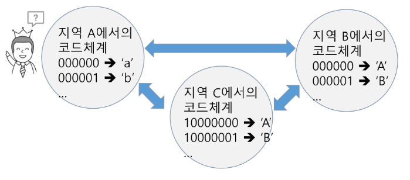

#### 그래서 혼동을 피하기 위해 표준안을 만들기로 했다.

#### 바로 이러한 목적으로 1967년, 미국에서 ASCII(American Standard Code for Information Interchange)라는 문자 인코딩 표준이 제정되었다.

#### ASCII는 7bit 인코딩으로 128문자를 표현하며 33개의 출력 불가능한 제어 문자들과 공백을 비롯한 95개의 출력 가능한 문자들로 이루어져 있다.

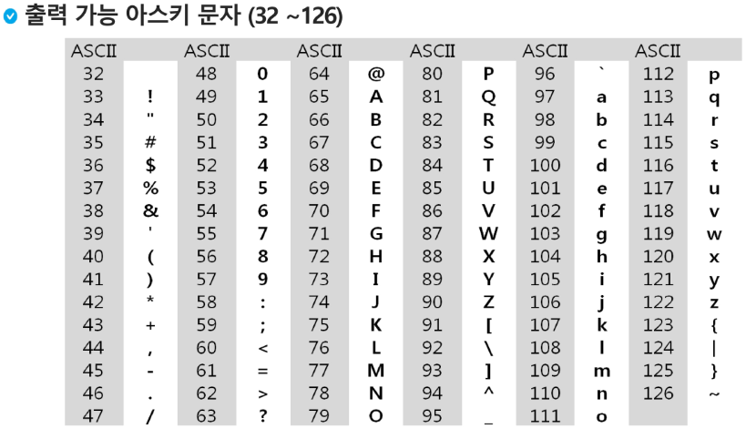

#### 확장 아스키는 표준 문자 이외의 악센트 문자, 도형 문자, 특수 문자, 특수 기호 등 부가적인 문자를 128개 추가할 수 있게 하는 부호이다.

* 표준 아스키는 7bit를 사용하여 문자를 표현하는데 비해 확장 아스키는 1B  내의 8bit를 모두 사용함으로써 추가적인 문자를 표현할 수 있다.

* 컴퓨터 생산자와 소프트웨어 개발자가 여러 가지 다양한 문자에 할당할 수 있도록 하고 있다. 이렇게 할당된 확장 부호는 표준 아스키와 같이 서로 다른 프로그램이나 컴퓨터 사이에 교환되지 못한다.

* 그러므로 표준 아스키는 마이크로컴퓨터 하드웨어 및 소프트웨어 사이에서 세계적으로 통용되는데 비해, 확장 아스키는 프로그램이나 컴퓨터 또는 프린터가 그것을 해독할 수 있도록 설계되어 있어야만 올바로 해독될 수 있다.

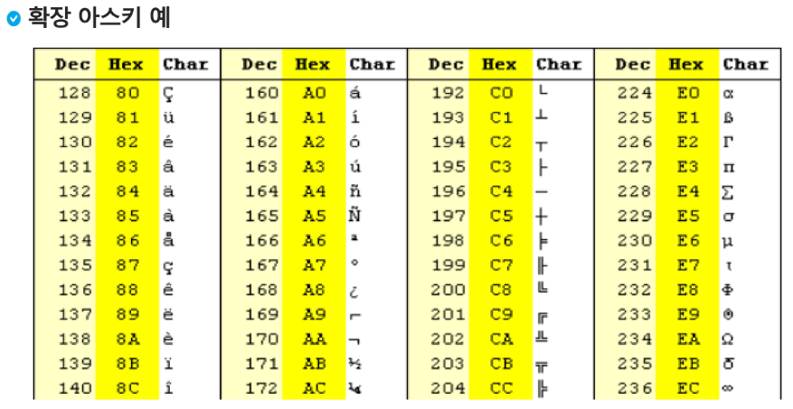

#### 오늘날 대부분의 컴퓨터는 문자를 읽고 쓰는데 ASCII형식을 사용한다.

#### 그런데 컴퓨터가 발전하면서 미국 뿐 아니라 각 나라에서도 컴퓨터가 발전했으며 각 국가들은 자국의 문자를 표현하기 위하여 코드체계를 만들어서 사용하게 되었다.

* 우리나라도 아주 오래된 이야기지만 한글 코드체계를 만들어 사용했고 조합형, 완성형 두 종류를 가지고 있었다.

#### 인터넷이 전 세계로 발전하면서  ASCII를 만들었을 때의 문제와 같은 문제가 국가간에 정보를 주고 받을 때 발생했다.

#### 자국의 코드체계를 타 국가가 가지고 있지 않으면 정보를 잘못 해석 할 수 밖에 없었다.

#### 그래서 다국어 처리를 위해 표준을 마련했다 이를 유니코드라고 한다.

#### 유니코드의 일부

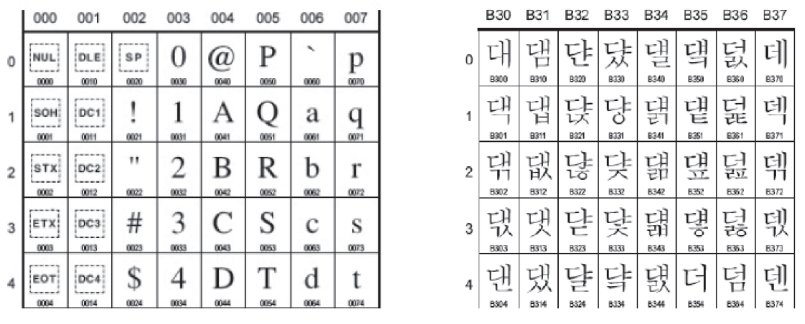

#### 유니코드도 다시 Character Set으로 분류된다.

* UCS-2(Universal Charaacter Set 2)

* UCS-4(Universal Charaacter Set 4)

* 유니코드를 저장하는 변수의 크기를 정의

* 그러나, 바이트 순서에 대해서 표준화하지 못했음

* 다시 말해 파일을 인식 시 이 파일이  UCS-2, UCS_4인지 인식하고 각 경우를 구분해서 모두 다르게 구현해야 하는 문제 발생

* 그래서 유니 코드의 적당한 외부 인코딩이 필요하게 되었다.

#### big-endian, little-endian

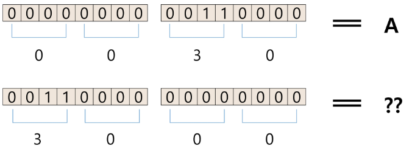

#### 유니코드 인코딩 (UTF : Unicode Transformation Format)

* UTF-8 (in web)
  
  -MIN : 8bit, MAX: 32bit(1 Byte * 4)

* UTF-16 (in web)
  
  -MIN : 16bit, MAX: 32bit(2 Byte * 2)

* UTF-32 (in web)
  
  -MIN : 32bit, MAX: 32bit(4 Byte * 1)

#### Python 인코딩

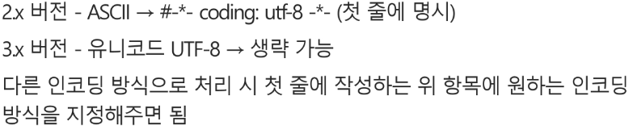

#### 문자열의 분류

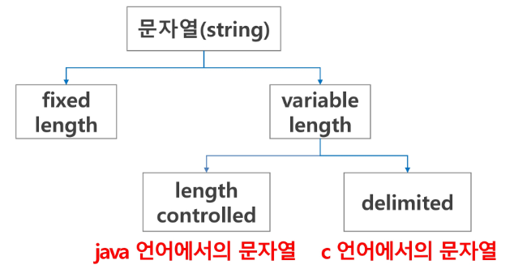

#### java에서 String  클래스에 대한 메모리 배치 예

* 그림에서 보이듯, java.lang.String 클래스에는 기본적인 객체 메타 데이터 외에도 네가지 필드들이 포함되어 있는데, hash값(hash), 문자열의 길이(count), 문자열 데이터의 시작점(offset), 그리고 실제 문자열 배열에 대한 참조(value)이다.

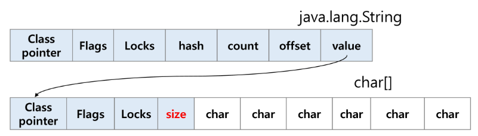

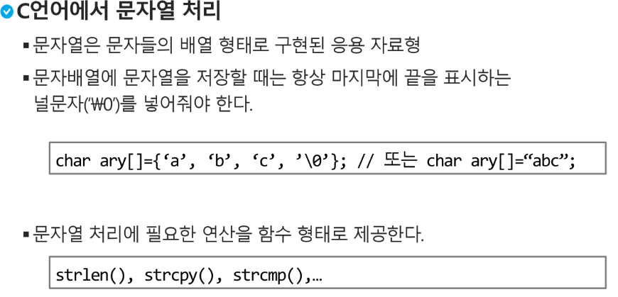

#### 다음 두 코드의 차이 이해하기

s1 = list(input())

* list로 반환

s2 = input()

* str으로 반환

#### strlen()함수 만들어 보기

def strlen(a): # '\0'을 만나면 '\0'을 제외한 글자수를 리턴

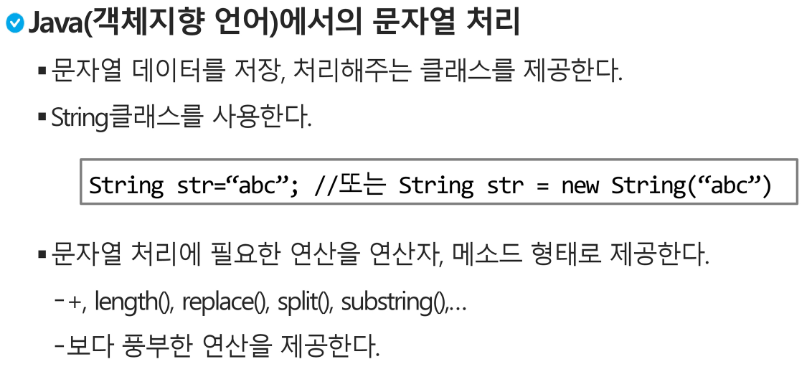

#### Python에서의 문자열 처리

* char 타입 없음

* 텍스트 데이터의 취급방법이 통일되어 있음

* 문자열 기호

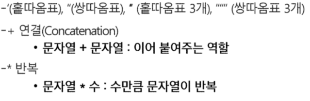

#### Python에서의 문자열 처리

* 문자열은 시퀀스 자료형으로 분류되고, 시퀀스 자료형에서 사용할 수 있는 인덱싱, 슬라이싱 연산들을 사용할 수 있음

* 문자열 클래스에서 제공되는 메소드
  
  replace(), split(), isalpha(), find()

* 문자열은 튜플과 같이 요소값을 변경 할 수 없음(immutable)

#### C와 Java의  String 처리의 기본적인 차이점

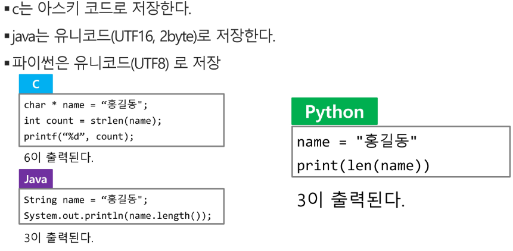

---

## 문자열 뒤집기

---

#### 자기 문자열에서 뒤집는 방법이 있고 새로운 빈 문자열을 만들어 소스의 뒤에서부터 읽어서 타겟에 쓰는 방법이 있겠다.

#### 자기 문자열을 이용할 경우는 swap을 위한 임시 변수가 필요하며 반복 수행을 문자열 길이의 반만을 수행해야 한다.

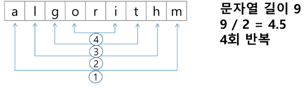

### 연습문제

#### Python에서 문자열 뒤집기

Ex) s = 'Reverse this strings'  # 'sgnirts siht esreveR'

* s = s[::-1]

* s = 'abcd'

* s = list(s)

* s.reverse()

* s = ".join(s)

#### for 문을 이용해 구현하기

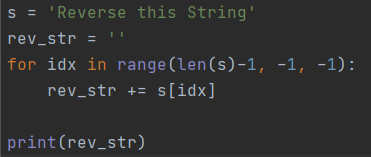

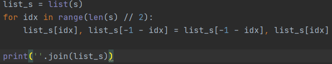

---

## 문자열 비교

---

#### C strcmp() 함수를 제공한다.

#### Java에서는 equals() 메소드를 제공한다.

* 문자열 비교에서 == 연산은 메모리 참조가 같은지를 묻는 것

#### Python에서는 == 연산자와 is 연산자를 제공한다.

* ==연산자는 내부적으로 특수 메서드 eq()를 호출

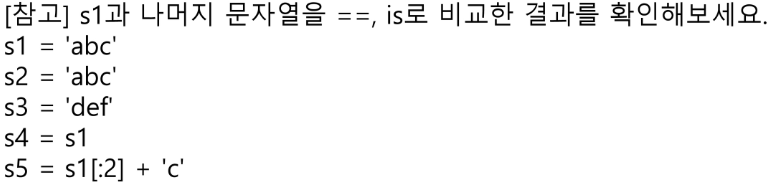

* s1 == s2 # True

* s1 == s3 # False

* s1 == s4 # True

* s1 == s5 # True

* s2 == s3 # False

* s2 == s4 # True

* s2 == s5 # True

* s3 == s4 # False

* s3 == s5 # False

* s4 == s5 # True

#### is 비교

- s1 is s2 # True

- s1 is s3 # False

- s1 is s4 # True

- s1 is s5 # False

- s2 is s3 # False

- s2 is s4 # True

- s2 is s5 # False

- s3 is s4 # False

- s3 is s5 # False

- s4 is s5 # False

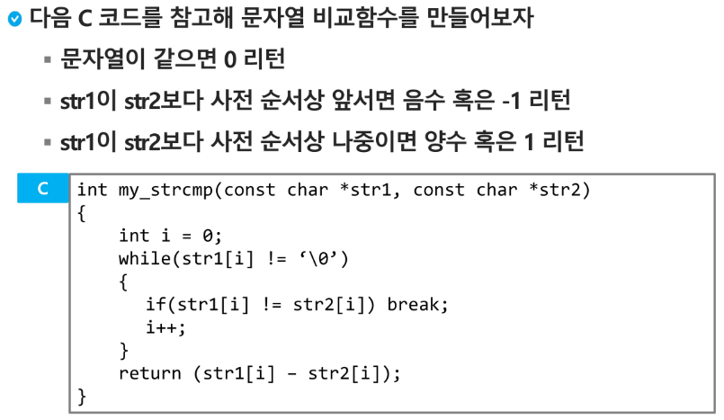

---

## 문자열 숫자를 정수로 변환하기

---

#### C 언어에서는 atoi()함수를 제공한다. 역 함수로는 itoa()가 있다.

#### Java에서는 숫자 클래스의 parse 메소드를 제공한다.

* 예 : Inetger.parseInt(String)

* 역함수로는 toString()메소드를 제공한다.

#### Python에서는 숫자와 문자변환 함수를 제공한다

* Ex) int("123"), float("3.14"), str(123), repr(123)

#### int()와 같은 atoi()함수 만들기

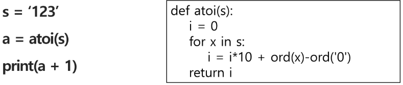

---

## 연습문제

---

#### str() 함수를 사용하지 않고, itoa()를 구현해 보기

* 양의 정수를 입력 받아 문자열로 변환하는 함수

* 입력 값 : 변환할 정수 값, 변환된 문자열을 저장할 문자배열

* 반환 값 : 없음
  
  [참고] ord(), chr()

* 음수를 변환할 때는 어떤 고려 사항이 필요한가요?

```python
def itoa(num):

    # 음수인지 아닌지 판단
    neg = False     # flag : 음수라면 True, 양수라면 False
    if num < 0:
        neg = True
        num = -num

    result = ''
    while num:
        num, remain = num // 10, num % 10
        result += chr(ord('0') + remain) + result

    if neg:
        return '-' + result
    else:
        return result

    return result

print(itoa(-123))
```

---

## 패턴 매칭

---

#### 패턴 매칭에 사용되는 알고리즘들

* 고지식한  패턴 검색 알고리즘

* 카프-라빈 알고리즘

* KMP 알고리즘

* 보이어-무어 알고리즘

---

#### 고지식한 알고리즘(Brute Force)

* 본문 문자열을 처음부터 끝까지 차례대로 순회하면서 패턴 내의 문자들을 일일이 비교하는 방식으로 동작

* [Visualizing String Matching Algorithms](http://whocouldthat.be/visualizing-string-matching/)

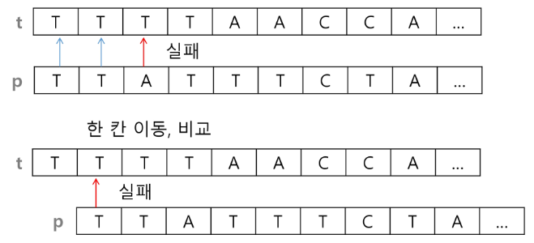

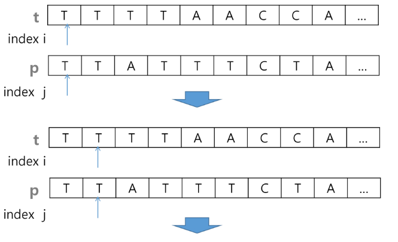

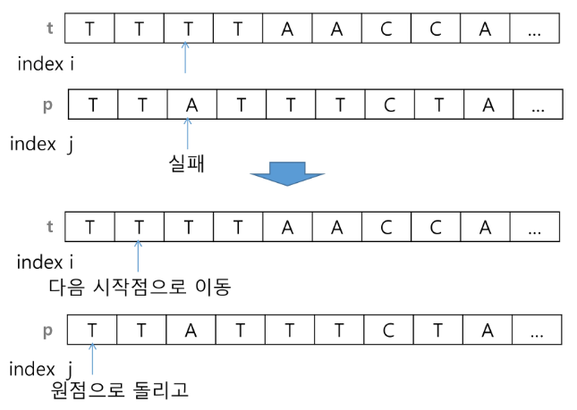

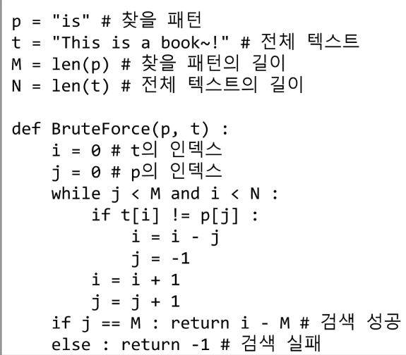

```python
text = 'This is a book~!'
pattern = 'is'

def brute_force(pattern, text):
    M = len(pattern) # 패턴의 길이
    N = len(text) # 텍스트의 길이

    for idx in range(N - M + 1):  # 텍스트 순회
        for jdx in range(M): # 패턴의 길이만큼 순회
            if pattern[jdx] != text[idx]:
                break
        else: # 패턴이 매칭된 상태
            return idx

    else:
        return -1
```

#### 고지식한 패턴 검색 알고리즘의 시간 복잡도

* 최악의 경우 시간 복잡도는 텍스트의 모든 위치에서 패턴을 비교해야 하므로 O(MN)이 됨

* 예에서는 최악의 경우 약 10,000*80 = 800,000 번의 비교가 일어난다.

* 비교횟수를 줄일 수 있는 방법은 없는가?

---

## KMP 알고리즘

---

#### 불일치가 발생한 텍스트 스트링의 앞 부분에 어떤 문자가 있는지를 미리 알고 있으므로, 불일치가 발생한 앞 부분에 대하여 다시 비교하지 않고 매칭을 수행

#### 패턴을 전처리하여 배열 next[M]을 구해서 잘못된 시작을 최소화함

* next[M] : 불일치가 발생했을 경우 이동할 다음 위치

#### 시간 복잡도 : O(M + N)

#### 아이디어 설명

* 텍스트에서 abcdabc까지는 매치되고, e에서 실패한 상황 패턴의 맨 앞의 abc와 실패 직전의 abc는 동일함을 이용할 수 있다.

* 실패한 텍스트 문자와 P[4]를 비교한다

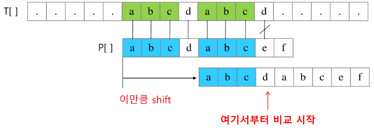

* 매칭이 실패했을 때 돌아갈 곳을 계산한다.

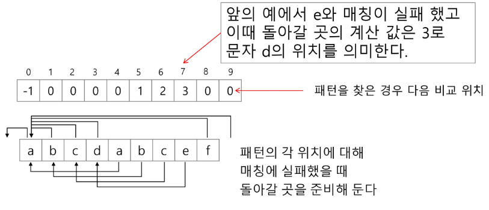

```python
def pre_process(pattern):
    # 전처리를 위한 테이블을 작성 (LPS longest prefix suffix)
    lps = [0] * len(pattern)
    j = 0 # lps를 만들기 위한 prefix index

    for i in range(1, len(pattern)): # 0번째 자리는 패턴 확인할 필요없음

        # prefix index 위치에 있는 문자와 비교
        if pattern[i] == pattern[j]:
            lps[i] = j + 1 # i의 앞에 중복되는 패턴이 존재한다.
            j += 1         # j는 중복된 글자의 자리수

        else:
            j = 0
            # 여기서 0으로 이동한 다음 prefix idx 비교를 한 번 더 해야함.
            if pattern[i] == pattern[j]:
                lps[i] = j + 1
                j += 1

    return lps

def KMP(text, pattern):
    lps = pre_process(pattern) # 전처리로 lps 테이블 생성

    i = 0 # text index
    j = 0 # pattern index
    while i < len(text):
        if pattern[j] == text[i]: # i, j 같은 문자라면
            # 다음 문자 비교
            i += 1
            j += 1
        else:
            if j != 0:
                j = lps[j - 1]
            else:
                i += 1

        if j == len(pattern): # pattern 이 전부 일치할 때
             return i - j     # text의 위치

    return -1    # 일치하는 문장이 없는 경우

text = 'ABC ABCDAB ABCDABCDABDE'
pattern = 'ABCDABD'

print(KMP(text, pattern))
```

---

## 보이어 - 무어 알고리즘

---

#### 오른쪽에서 왼쪽으로 비교

#### 대부분의 상용 소프트웨어에서 채택하고 있는 알고리즘

#### 보이어 - 무어 알고리즘은 패턴에 오른쪽 끝에 있는 문자가 불일치 하고 이 문자가 패턴 내에 존재하지 않는 경우, 이동 거리는 무려 패턴의 길이 만큼이 된다.

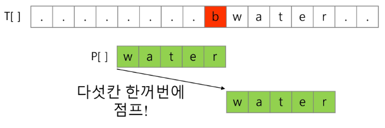

#### 오른쪽 끝에 있는 문자가 불일치 하고 이 문자가 패턴 내에 존재할 경우

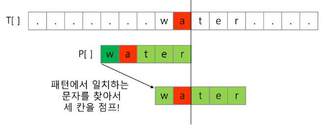

#### 보이어 - 무어 알고리즘을 이용한 예

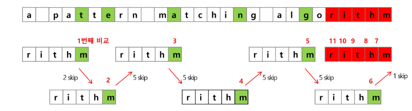

* rithm 문자열의 skip 배열

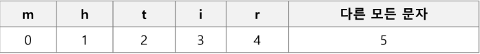

#### 문자열 매칭 알고리즘 비교

* 찾고자 하는 문자열 패턴의 길이 m, 총 문자열 길이 n

* 고지식한 패턴 검색 알고리즘 : 수행시간 O(mn)

* 카프 - 라빈 알고리즘 : 수행시간 O(n)

* KMP 알고리즘 : 수행시간 O(n)

#### 보이어 - 무어 알고리즘

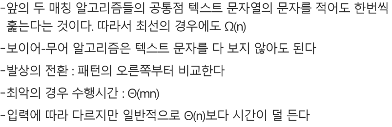

```python
def pre_process(pattern):
    M = len(pattern) # 패턴의 길이

    skip_table = dict()
    for i in range(M - 1):
        skip_table[pattern[i]] = M - i - 1

    return skip_table

def boyer_moore(text, pattern):
    skip_table = pre_process(pattern)
    M = len(pattern)

    i = 0 # text index
    while i <= len(text) - M:
        j = M - 1  # 뒤에서 비교해야 되기 때문 j를 끝에 index
        k = i + (M - 1) # 비교를 시작할 위치 (현재위치 + M번째 인덱스)

        # 비교할 j가 남아있고, text와 pattern이 일치하면
        # 그 다음 앞에 글자를 비교하기 위해 인덱스 감소
        while j >= 0 and pattern[j] == text[k]:
            j -= 1
            k -= 1

        if j == -1:   # 일치 함
            return i

        # 일치하지 않는다면
        else:
            # i를 비교할 시작 위치를 skip table에서 가져온다.
            i += skip_table.get(text[i + M - 1], M)

    return -1 # 일치되는 패턴이 없음

text = 'ABC ABCDAB ABCDABCDABDE'
pattern = 'ABCDABD'

print(boyer_moore(text, pattern))
```

 ---

## 문자열 암호화

---

#### 시저암호(Caesar cipher)

* 줄리어스 시저가 사용했다고 하는 암호이다.

* 시저는 기원전 100년경에 로마에서 활약했던 장군이었다.

* 시저 암호에서는 평문에서 사용되고 있는 알파벳을 일정한 문자 수만큼 [평행이동] 시킴으로써 암호화를 행한다.

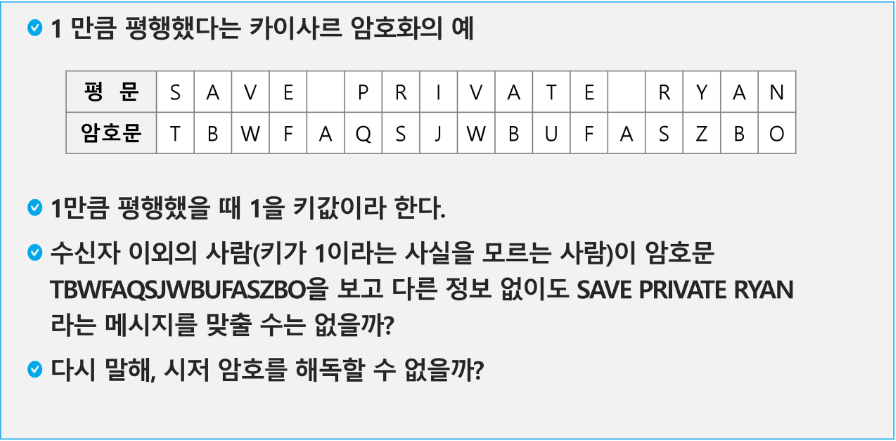

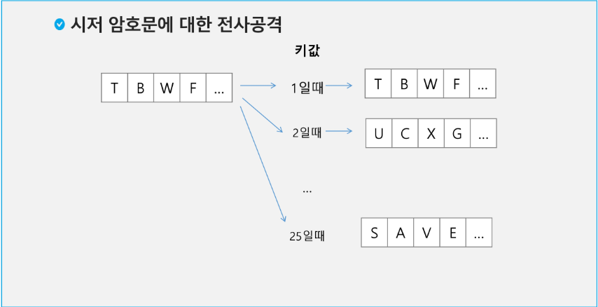

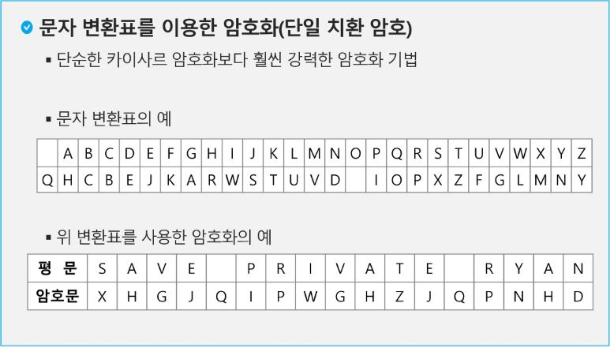

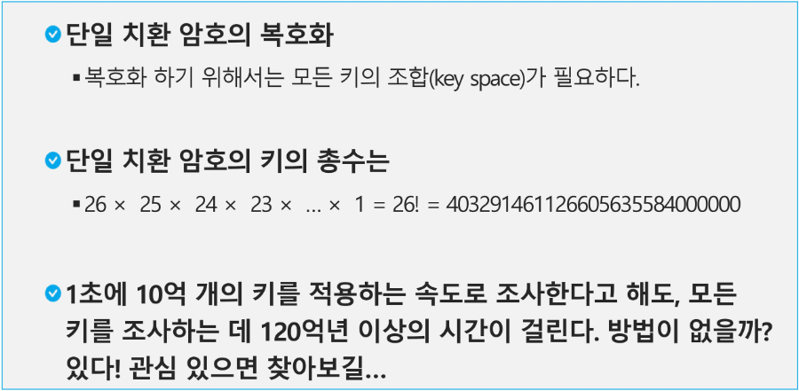

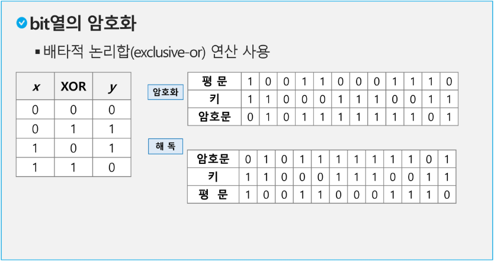

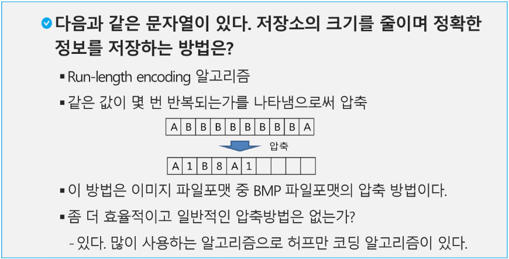
