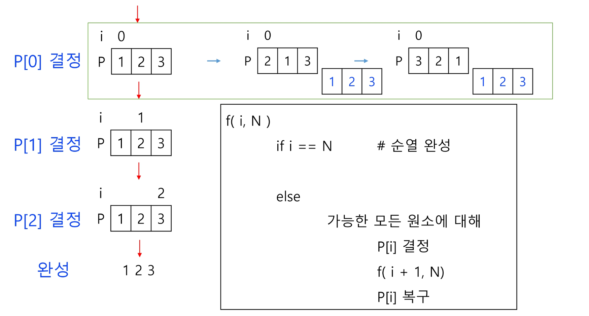
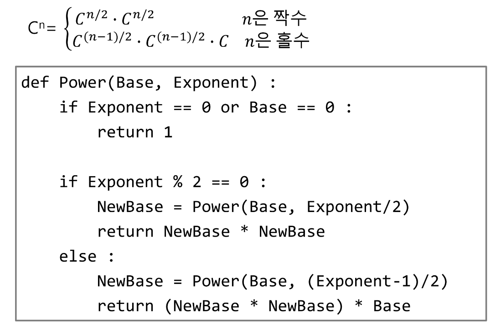

# 스택2

---

# 목차

* 계산기1

* 계산기2

* 백트래킹

* [참고] 부분집합, 순열

* ~~분할정복~~

---

## 계산기1

---

#### 문자열로 된 계산식이 주어질 때, 스택을 이용하여 이 계산식의 값을 계산할 수 있다.

#### 문자열 수식 계산의 일반적 방법

* step1. 중위 표기법의 수식을 후위 표기법으로 변경한다. (스택 이용)

* step2. 후위 표기법의 수식을 스택을 이용하여 계산한다.

#### step1. 중위표기식의 후위표기식 변환 방법1

* 수식의 각 연산자에 대해서 우선순위에 따라 괄호를 사용하여 다시 표현한다.

* 각 연산자를 그에 대응하는 오른쪽괄호의 뒤로 이동시킨다.

* 괄호를 제거한다.

#### step1. 중위 표기법에서 후위 표기법으로의 변환 알고리즘(스택 이용)2

* 1. 입력 받은 중위 표기식에서 토큰을 읽는다.

* 2. <u>토큰</u>이 <u>피연산자</u>이면 토큰을 출력한다.

* 3. 토큰이 연산자(괄호포함)일 때, 이 토큰이 <u>스택</u>의 <mark>top</mark>에 <u>저장되어 있는 연산자보다 우선순위가</u> <mark>높으면</mark> 스택에 <u>push</u>하고, 그렇지 않다면 스택 top의 연산자의 우선순위가 토큰의 우선순위보다 작을 때까지 스택에서 pop 한 후 토큰의 연산자를 push한다. 만약 top에 연산자가 없으면 <u>push</u>한다.

* 4. 토큰이 오른쪽 괄호 ')'이면 <mark>스택 top</mark>에 왼쪽 괄호를 '('올 때까지 스택에 pop 연산을 수행하고  <u>pop</u>한 여난자를 출력한다. 왼쪽 괄호를 만나면 pop만 하고 출력하지는 않는다.

* 5. 중위 표기식에 더 읽을 것이 없다면 중지하고, 더 읽을 것이 있다면 1부터 다시 반복한다.

* 6. 스택에 남아 있는 연산자를 모두 pop하여 출력한다.
     
     - 스택 밖의 왼쪽 괄호는 우선 순위가 가장 높으며, 스택 안의 왼쪽 괄호는 우선 순위가 가장 낮다.

#### 우선 중위 표기법에서 후위 표기법으로의 변환한다.

#### 중위 표기법으로 표현된 수식 예

* (6 + 5*(2 - 8) / 2)

* isp : 스택에 있는 것

* icp : 선택된 문자

* stack의 top에는 우선순위가 선택된 문자보다 낮아야 한다.

*  icp > isp
  
  * 우선순위가 더높음

* icp > isp 
  
  * push

* 닫는 괄호는 여는 괄호가 나올 때 까지 pop

#### stack에 있는 top과 비교

---

## 연습문제

---

* icp가 isp보다 커야지만 넣음 같으면 X

---

## 계산기 2

---

#### step2. 후위 표기법의 수식을 스택을 이용하여 계산

1. 피연산자를 <mark>만나면</mark> 스택에 <u>push</u> 한다.

2. <u>연산자</u>를 만나면 필요한 만큼의 피연산자를 스택에서 pop하여 연산하고, 연산결과를 다시 스택에 <u>push</u> 한다.

3. 수식이 끝나면, 마지막으로 스택을 <u>pop</u>하여 출력한다.

* 먼저 꺼낸 숫자를 뒤에 넣어줌

---

## 백트래킹

---

#### 백트래킹(Backtracking) 기법은 해를 찾는 도중에 <u>'막히면'</u> (즉, 해가 아니면) <u>되돌아가서</u> <u>다시 해를 찾아 가는 기법</u>이다.

#### 백트래킹 기법은 최적화 (optimiztaion) 문제와 결정 (decision) 문제를 해결할 수 있다.

#### 결정 문제 : 문제의 조건을 만족하는 해가 존재하는지의 여부를 'yes' 또는 'no'가 답하는 문제

* 미로 찾기

* n-Queen 문제

* Map coloring

* 부분 집합의 합(Subset Sum) 문제 등

### 미로 찾기

* 아래 그림과 같이 입구와 출구가 주어진 미로에서 입구부터 출구까지의 경로를 찾는 문제이다.

* 이동할 수 있는 방향은 4방향으로 제한한다.

### 미로 찾기 알고리즘

* 스택을 이용하여 지나온 경로를 역으로 되돌아 간다.

* 스택을 이용하여 다시 경로를 찾는다.

#### 백트래킹과 깊이우선탐색(DFS)과의 차이

* 어떤 노드에서 출발하는 경로가 해결책으로 이어질 것 같지 않으면 더 이상 그 경로를 따라가지 않음으로써 시도의 횟수를 줄임. <mark>(Prunning 가지치기)</mark> (if 조건문)

* 깊이우선탐색이 모든 경로를 추적한ㄴ데 비해 백트래킹은 불필요한 경로를 조기에 차단.

* 깊에우선탐색을 가하기에는 경우의 수가 너무나 많음. 즉, N! 가지의 경우의 수를 가진 문제에 대해 깊이우선탐색을 가하면 당연히 처리 불가능한 문제.

* 백트래킹 알고리즘을 적용하면 일반적으로 경우의 수가 줄어들지만 이 역시 최악의 경우에는 여전히 지수함수 시간(Exponential Time)을 요하므로 처리 불가능

#### 모든 후보를 검사?

* <mark>No!</mark>

#### 백트래킹 기법

* 어떤 노드의 유망성을 점검한 후에 <u>유망</u>(promising)하지 않다고 결정되면 그 노드의 부모로 <u>되돌아가(backtracking)</u> 다음 자식 노드로 감

* 어떤 노드를 방문하였을 때 그 노드를 포함한 경로가 해답이 될 수 없으면 그 노드는 유망하지 않다고 하며, 반대로 해답의 가능성이 있으면 유망하다고 한다.

* <mark>가지치기(pruning)</mark> : <u>유망하지 않는 노드가 포함</u>되는 경로는 더 이상 고려하지 않는다.

#### 백트래킹을 이용한 알고리즘은 다음과 같은 절차로 진행된다.

1. 상태 공간 트리의 <mark>깊이 우선 검색</mark>을 실시한다.

2. 각 노드가 <u>유망한지를 점검</u>한다. - if 조건문

3. 만일 그 노드가 유망하지 않으면, 그 노드의 부모 노드로 돌아가서 검색을 계속한다.

#### 일반 백트래킹 알고리즘

#### 상태 공간 트리

#### 깊이 우선 검색 vs 백트래킹

* 순수한 깊이 우선 검색 = 155 노드

* 백트래킹 = 27 노드

---

## 부분집합 구하기

---

#### 어떤 집합의 공집합과 자기자신을 포함한 모든 부분집합을 powerset이라고 하며 구하고자 하는 어떤 집합의 원소 개수가 n일 경우 부분집합의 개수는 2**n개 이다.

#### 백트래킹 기법으로 powerset을 구해보자.

* 앞에서 설명한 일반적인 백트래킹 접근 방법을 이용한다.

* n개의 원소가 들어있는 집합의 2**n 개의 부분집합을 만들 때는, true 또는 false값을 가지는 항목들로 구성된 n개의 배열을 만드는 방법을 이용.

* 여기서 배열의 i번째 항목은 i번째의 원소가 부분집합의 값인지 아닌지를 나타내는 값 이다.

#### 각 원소가 부분집합에 포함되었는지를 loop 이용하여 확인하고 부분집합을 생성하는 방법

#### {1, 2, 3}의 부분집합 표현

#### powerset을 구하는 백트래킹 알고리즘

#### powerset을 구하는 백트래킹 알고리즘(계속)

#### 예) {1, 2, 3}을 포함하는 모든 순열을 생성하는 함수

* 동일한 숫자가 포함되지 않았을 때, 각 자리 수 별로 loop을 이용해 아래와 같이 구현할 수 있다.

#### 백트래킹을 이용하여 순열 구하기

* 접근 방법은 앞의 부분집합 구하는 방법과 유사하다.

---

### 연습문제

---

---

## [참고] 부분 집합의 합

---

---

## [참고] 순열

---

---

## 분할 정복 알고리즘

---

#### 유래

* 1805년 12월 2일 아우스터리츠 전투에서 나폴레옹이 사용한 전략

* 전력이 우세한 연합군을 공격하기 위해 나폴레옹은 연합군의 중앙부로 쳐들어가 연합군을 둘로 나눔

* 둘로 나뉜 연합군을 한 부분씩 격파함

#### 설계 전략

* 분할(Divide) : 해결할 문제를 여러 개의 작은 부분으로 나눈다.

* 정복(Conquer) : 나눈 작은 문제를 각각 해결한다.

* 통합(Combine) : (필요하다면) 해결된 해답을 모은다.

---

## 분할정복 예제

---

#### 거듭 제곱(Exponentiation)

---

## 퀵 정렬

---

#### 주어진 배열을 두 개로 분할하고, 각각을 정렬한다.

* 합병정렬과 동일?

#### 다른점 1 : 합병정렬은 그냥 두 부분으로 나누는 반면에, 퀵정렬은 분할할 때, 기준 아이템(pivot item) 중심으로, 이보다 작은 것은 왼편, 큰 것은 오른편에 위치시킨다.

#### 다른점 2 : 각 부분 정렬이 끝난 후, 합병정렬은 "합병"이란 후처리 작업이 필요하나, 퀵정렬은 필요로 하지 않는다.

---

#### 알고리즘

#### 퀵 정렬 수행 과정

* 예제 : {69, 10, 30, 2, 16, 8, 31, 22}

* 원소의 개수가 8개이므로 네 번째 자리에 있는 원소 2를 첫 번째 피봇으로 선택하고 퀵 정렬 시작.

#### 퀵정렬의 최악의 시간 복잡도는 O(n**2)로, 합병정렬에 비해 좋지 못하다.

#### 그런데, 왜 "빠른"정렬이라고 했을까?

#### 이는 퀵정렬의 평균 복잡도는 nlogn 이기 때문이다.

---

## 정렬 알고리즘 비교

---

