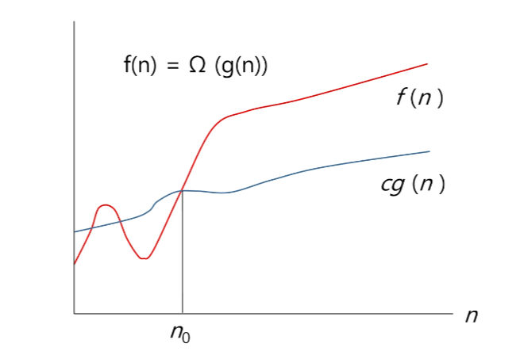

# Start

---

# 목차

* 복잡도 분석

* 표준 입축력 방법

* 비트 연산

* 진수

* 실수

---

## 복잡도 분석

---

> ### 알고리즘?

* (명) 알고리즘 : 유한한 단계를 통해 문제를 해결하기 위한 절차나 방법이다. 주로 컴퓨터용어로 쓰이며, 컴퓨터가 어떤 일을 수행하기 위한 단계적 방법을 말한다.

* 간단하게 다시 말하면 어떠한 문제를 해결하기 위한 절차라고 볼 수 있다.

* 예를 들어 1부터 100까지 합을 구하는 문제를 생각해 보자

> ### 알고리즘의 효율

* 공간적 효율성과 시간적 효율성
  
  * 공간적 효율성은 연산량 대비 얼마나 적은 메모리 공간을 요하는 가를 말한다.
  
  * 시간적 효율성은 연산량 대비 얼마나 적은 시간을 요하는 가를 말한다.
  
  * 효율성을 뒤집어 표현하면 복잡도가 된다. 복잡도가 높을수록 효율성은 저하된다.

* 시간적 복잡도 분석
  
  * 하드웨어 환경에 따라 처리시간이 달라진다.
    
    * 부동소수 처리 프로세서 존재유무, 나눗셈 가속기능 유무
    
    * 입출력 장비의 성능, 공유여부
  
  * 소프트웨어 환경에 따라 처리시간이 달라진다.
    
    * 프로그램 언어의 종류
    
    * 운영체제, 컴파일러의 종류
  
  * 이러한 환경적 차이로 인해 분석이 어렵다.

> ### 복잡도의 점근적 표리

* 시간 (또는 공간)복잡도는 입력 크기에 대한 함수로 표기하는데, 이 함수는 주로 여러 개의 항을 가지는 다항식이다.

* 이를 단순한 함수로 표현하기 위해 점근적 표기 (Asymptotic Notation)를 사용한다.

* 입력 크기 n이 무한대로 커질 때의 복잡도를 간단히 표현하기 위해 사용하는 표기법이다.
  
  * O(Big-Oh) 표기
  
  * $\Omega$(Big-Omega) 표기
  
  * $\Theta$(Big-Theta) 표기

> ### O(Big-Oh) 표기

* O 표기는 복잡도의 점근적 상한을 나타낸다.

* 복잡도가 f(n) = 2n2 - 7n + 4이라면, f(n)의 O표기는 O(n22)이다.

* 먼저 f(n)의 단순화된 표현은 n^2이다.

* 단순화된 함수 n^2에 임의의 상수 c를 곱한 cn^2이 n이 증가함에 따라 f(n)의 상한이 된다.  (단, c > 0)

> ### 복잡도 f(n)과 O표기를 그래프로 나타내고 있다.
> 
> ### n이 증가함에 따라 O(g(n))이 점근적 상한이라는 것 (즉, g(n)이 n0보다 큰 모든 n0에 대해서 항상 f(n)보다 크다는 것)을 보여준다.

> ### Ω(Big-Omega) 표기

* 복잡도의 점근적 하한을 의미한다.

* f(n) = 2n2

* f(n) = $\Omega$(n2)은 "n이 증가함에 따라 2n2-7n+4이 cn2보다 작을 수 없다"라는 의미이다. 이때 상수 c=1로 놓으면 된다.

* O 표기 때와 마찬가지로, $\Omega$표기도 복잡도 다항식의 최고차항만 계수 없이 취하면 된다.

* **"최소한 이만한 시간은 걸린다"**

> ### 복잡도 f(n)과 $\Omega$ 표기를 그래프로 나타낸 것인데, n이 증가함에 따라 $\Omega$(g(n))이 점근적 하한이라는 것 (즉, g(n)이 n0보다 큰 모든 n에 대해서 항상 f(n)보다 작다는 것)을 보여준다.

> ### $\Theta$ 표기

* O 표기와 $\Omega$ 표기가 같은 경우에 사용한다.

* f(n) = 2n2 + 8n + 3 = O(n2) = $\Omega$(n2)이다.

* "f(n)은 n이 증가함에 따라 <mark>n2과 동일한 증가율을 가진다</mark>"라는 의미이다.

> ### 자주 사용하는 O표기

* O(1)           상수 시간

* O(logn)     로그(대수) 시간

* O(n)           선형 시간

* O(nlogn)   로그 선형 시간

* O(n2)         제곱 시간

* O(2n)         지수 시간

> ### 왜 효율적인 알고리즘이 필요한가

* 10억 개의 숫자를 정렬하는데 PC에서 O(n2) 알고리즘은 300여 년이 걸리는 반면에 O(nlogn) 알고리즘은 5분 만에 정렬한다.

* 효율적인 알고리즘은 슈퍼컴퓨터보다 더 큰 가치가 있다.

* 값 비싼 H/W의 기술 개발보다 효율적인 알고리즘 개발이 훨씬 더 경제적이다.

---

## 표준 입출력 방법

---

> ### Python3 표준입출력

* 입력
  
  * Raw 값의 입력 : `input()`
    
    * 받은 입력값을 문자열로 취급
  
  * Evaluated된 값 입력 : `eval(input())`
    
    * 받은 입력값을 평가된 데이터 형으로 취급

* 출력
  
  * print()
    
    * 표준 출력 함수. 출력값의 마지막에 개행 문자 포함
  
  * print('text, end='')
    
    * 출력 시 마지막에 개행문자 제외할 시
  
  * print('%d' % number)
    
    * Formatting 된 출력

> ### 파일의 내용을 표준 입력으로 읽어오는 방법

* `import sys`

* `sys.stdin = open('a.txt, "r")`

> ### Python3 소스 코드

---

## 비트 연산

---

> ### 비트 연산자

> ### 1 << n

* 2n 의 값을 갖는다.

* 원소가 n개일 경우의 모든 부분집합의 수를 의미한다.

* Power set (모든 부분 집합)
  
  * 공집합과 자기 자신을 포함한 모든 부분집합
  
  * 각 원소가 포함되거나 포함되지 않는 2가지 경우의 수를 계산하면 모든 부분집합의 수가 계산된다.

> ### i & (1 << j)

* 계산 결과는 i의 j번째 비트가 1인지 아닌지를 의미한다.

> ### 비트 연산 예제 1

> ### 비트 연산 예제 2

> ### 엔디안(Endianness)

* 컴퓨터의 메모리와 같은 1차원의 공간에 여러 개의 연속된 대상을 배열하는 방법을 의미하며 HW 아키텍처마다 다르다.

* 주의 : 속도 향상을 위해 바이트 단위와 워드 단위를 변환하여 연산 할 때 올바로 이해하지 않으면 오류를 발생 시킬 수 있다.

* 엔디안은 크게 두 가지로 나뉨
  
  * 빅 엔디안(Big-endian)
    
    * 보통 큰 단위가 앞에 나옴. 네트워크.
  
  * 리틀 엔디안(Little-endian)
    
    * 작은 단위가 앞에 나옴. 대다수 데스크탑 컴퓨터.

> ### 엔디안 확인 코드

> ### 비트 연산 예제 3

> ### 비트 연산 예제 4

> ### 비트 연산 예제 5

* 비트 연산자 ^를 두 번 연산하면 처음 값을 반환한다.

---

## 진수

---

> ### 2진수, 8진수, 10진수, 16진수

> ### 10진수 => 타 진수로 변환

* 원하는 타진법의 수로 나눈 뒤 나머지를 거꾸로 읽는다.

* 예제)
  
  * (149)10 = (10010101)2 
    
    = (225)8
    
    = (95)16

> ### 타 진수 => 10진수로 변환

* 예) (135)8 = 1 * 82 + 3 * 81 + 5 * 80 = 9310

* 소수점이 있을 때의 예)
  
  * (135.12)8 = 1 * 82 + 3 * 81 + 5 * 80 + 1 * 8-1 + 2 * 8-2 = 93.1562510

> ### 2진수,  8진수, 16진수간 변환

> ### 컴퓨터에서의 음의 정수 표현 방법

* 1의 보수 : 부호와 절대값으로 표현된 값을 부호 비트를 제외한 나머지 비트들을 0은 1로, 1은 0로 변환한다.
  
  -6 : 1 0 0 0 0 0 0 0 0 0 0 0 0 1 1 0 : 부호와 절대값 표현.
  
  -6 : 1 1 1 1 1 1 1 1 1 1 1 1 1 0 0 1 : 1의 보수 표현.

* 2의 보수 : 1의 보수방법으로 표현된 값의 최하위 비트에 1을 더한다.
  
  -6 : 1 1 1 1 1 1 1 1 1 1 1 1 1 0 1 0 : 2의 보수 표현.

---

## 실수

---

> ### 실수의 표현

* 소수점 이하 4자리를 10진수로 나타내보면

> ### 2진 실수를 10진수로 변환하는 방법

* 예) 1001.0011

> ### 실수의 표현

* 컴퓨터는 실수를 표현하기 위해 부동 소수점 표기법을 사용한다

* 부동 소수점 표기 방법은 소수점의 위치를 고정시켜 표현하는 방식이다.
  
  - 소수점의 위치를 왼쪽의 가장 유효한 숫자 다음으로 고정시키고 밑수의 지수승으로 표현

> ### 실수를 저장하기 위한 형식

* 단정도 실수 (32비트)

* 배정도 실수 (64비트)

* 가수부 : 실수의 유효 자릿수들을 부호화된 고정 소수점으로 표현한 것

* 지수부 : 실제 소수점의 위치를 지수 승으로 표현한 것

> ### 단정도 실수의 가수 부분을 만드는 방법

* 예 : 1001.0011
  
  * 정수부의 첫 번째 자리가 1이 되도록 오른쪽으로 시프트
  
  * 소수점 이하를 23비트로 만든다
  
  * 소수점 이하만을 가수 부분에 저장
  
  * 지수 부분은 시프트 한 자릿수 만큼 증가 또는 감소

> ### 단정도 실수의 지수 부분을 만드는 방법

* 지수부에는 8비트가 배정(256개의 상태를 나타낼 수 있음)

* 숫자로는 0 - 255까지 나타낼 수 있지만, 음수 값을 나타낼 수 있어야 하므로 익세스 표현법을 사용
  
  * 익세스 표현법 : 지수부의 값을 반으로 나누어 그 값을 0으로 간주하여 음수지수와 양수지수를 표현하는 방법

> ### 단정도 표현에서의 지수부 익세스 표현

* 예 : 1001.0011을 단정도 실수로 표현한 예

> ### 컴퓨터는 실수를 근사적으로 표현한다.

* 이진법으로 표현 할 수 없는 형태의 실수는 정확한 값이 아니라 근사 값으로 저장되는데 이때 생기는 작은 오차가 계산 과정에서 다른 결과를 가져온다.

> ### 실수 자료형의 유효 자릿수를 알아 두자.

* 32 비트 실수형 유효자릿수 (십진수) => 6

* 64 비트 실수형 유효자릿수 (십진수) => 15

> ### 파이썬에서의 실수 표현 범위를 알아보자

* 파이썬에서는 내부적으로 더 많은 비트를 사용해서 훨씬 넓은 범위의 실수를 표현할 수 있다.

* 최대로 표현할 수 있는 값은 약 1.8 * 10308이고 이 이상은 inf로 표현

* 최소로 표현할 수 있는 값은 약 5.0 * 10-324이며, 이 이하는 0으로 표현