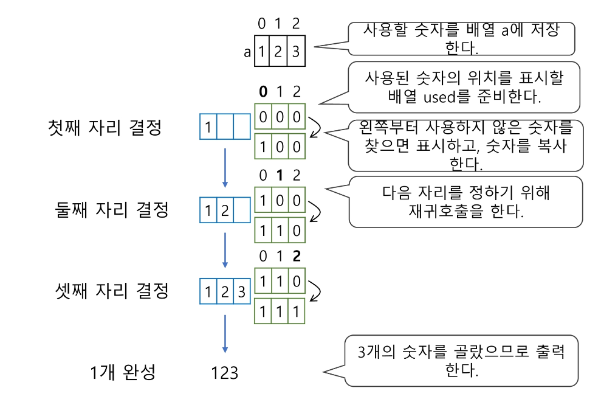

# 완전 검색 & 그리디

---

# 목차

* 반복과 재귀

* 완전검색기법

* 순열

* 부분 집합

* 조합

* 탐욕 알고리즘

* 활동 선택 문제

* Baby-jin

---

## 반복과 재귀

* 반복과 재귀는 유사한 작업을 수행할 수 있다.

* 반복은 수행하는 작업이 완료될 때 까지 계속 반복
  
  * 루프 (for, while 구조)

* 재귀는 주어진 문제의 해를 구하기 위해 동일하면서 더 작은 문제의 해를 이용하는 방법
  
  * 하나의 큰 문제를 해결할 수 있는(해결하기 쉬운) 더 작은 문제로 쪼개고 결과들을 결합한다.
  
  * 재귀 함수로 구현

* 반복 구조
  
  * 초기화
    
    * 반복되는 명령문을 실행하기 전에(한번만) 조건 검사에 사용할 변수의 초기값 설정
  
  * 조건검사
  
  * 반복할 명령문 실행
  
  * 업데이트
    
    * 무한 루프가 되지 않게 조건이 거짓(False)이 되게 한다.

* 반복을 이용한 선택정렬

* 재귀적 알고리즘
  
  * 재귀적 정의는 두 부분으로 나뉜다.
  
  * 하나 또는 그 이상의 기본 경우
    
    * 집합에 포함되어 있는 원소로 induction을 생성하기 위한 시드역할
  
  * 하나 또는 그 이상의 유도된 경우
    
    * 새로운 집합의 원소를 생성하기 위해 결합되어지는 방법

* 재귀 함수
  
  * 함수 내부에서 직접 혹은 간접적으로 자기 자신을 호출하는 함수.
  
  * 일반적으로 재귀적 정의를 이용해서 재귀 함수를 구현한다.
  
  * 따라서, 기본 부분과 유도 부분으로 구성된다.
  
  * 재귀적 프로그램을 작성하는 것은 반복 구조에 비해 간결하고 이해하기 쉽다.
    
    * 그러나, 재귀에 대해 익숙하지 않은 개발자들은 재귀적 프로그램이 어렵다고 느낀다.
  
  * 함수 호출은 프로그램 메모리 구조에서 스택을 사용한다. 따라서 재귀 호출은 반복적인 스택의 사용을 의미하며 메모리 및 속도에서 성능저하가 발생한다.

* 팩토리얼 재귀 함수
  
  * 재귀적 정의

* n! 에 대한 재귀함수

* 팩토리얼 재귀 함수의 호출

> ### 반복 또는 재귀?

* 해결할 문제를 고려해서 반복이나 재귀의 방법을 선택

* 재귀는 문제 해결을 위한 알고리즘 설계가 간단하고 자연스럽다
  
  * 추상 자료형의 알고리즘은 재귀적 구현이 간단하고 자연스러운 경우가 많다.

* 일반적으로, 재귀적 알고리즘은 반복 알고리즘보다 더 많은 메모리와 연산을 필요로 한다.

* 입력 값 n이 커질수록 재귀 알고리즘은 반복에 비해 비효율적일 수 있다.

> ### 반복과 재귀의 비교

> ### 2k 연산에 대한 재귀와 반복

---

## brute-force

---

> ### 고지식한 방법(brute-force)

* brute-force는 문제를 해결하기 위한 간단하고 쉬운 접근법이다.
  
  * "Just-do-it"
  
  * force의 의미는 사람(지능)보다는 컴퓨터의 force를 의미한다.

* brute-force 방법은 대부분의 문제에 적용 가능하다.

* 상대적으로 빠른 시간에 문제 해결(알고리즘 설계)을 할 수 있다.

* 문제에 포함된 자료(요소, 인스턴스)의 크기가 작다면 유용하다.

* 학술적 또는 교육적 목적을 위해 알고리즘의 효율성을 판단하기 위한 척도로 사용된다.

* Brute-force 탐색
  
  * 자료들의 리스트에서 키 값을 찾기 위해 첫 번째 자료부터 비교하면서 진행한다.
  
  * 결과
    
    * 탐색 성공
    
    * 탐색 실패

> ### 완전 검색으로 시작하라

* 모든 경우의 수를 생성하고 테스트하기 때문에 수행 속도는 느리지만, 해답을 찾아내지 못할 확률이 작다.
  
  * 완전검색은 입력의 크기를 작게 해서 간편하고 빠르게 답을 구하는 프로그램을 작성한다.

* 이를 기반으로 그리디 기법이나 동적 계획법을 이용해서 효율적인 알고리즘을 찾을 수 있다.

* 검정등에서 주어진 문제를 풀 때, 우선 완전 검색으로 접근하여 해답을 도출한 후, 성능 개선을 위해 다른 알고리즘을 사용하고 해답을 확인하는 것이 바람직하다.

* 완전 검색
  
  * 많은 종류의 문제들이 특정 조건을 만족하는 경우나 요소를 찾는 것이다.
  
  * 또한, 이들은 전형적으로 순열, 조합, 그리고 부분집합과 같은 조합적 문제들과 연관된다.
  
  * 완전 검색은 조합적 문제에 대한 brute-force방법이다.

---

## 순열

---

> ### 순열

* 서로 다른 것들 중 몇 개를 뽑아서 한 줄로 나열하는 것

* 서로 다른 n개 중 r개를 택하는 순열은 아래와 같이 표현한다.
  
  * nPr

* 그리고 nPr은 다음과 같은 식이 성립한다.
  
  * nPr = n * (n - 1) * (n - 2) * ... * (n - r + 1)

* nPn = n!이라고 표기하며 Factorial이라 부른다.
  
  * n! = n * (n - 1) * (n - 2) * ... * 2 * 1

* 다수의 알고리즘 문제들은 순서화된 요소들의 집합에서 최선의 방법을 찾는 것과 관련 있다.
  
  * 예) TSP(Traveling Salesman Problem)

* N 개의 요소들에 대해서 n! 개의 순열들이 존재한다.
  
  * 12! = 479,001,600
  
  * n > 12 인 경우, 시간 복잡도 폭발적으로 증가

* 10 <= N <= 20

* 단순하게 순열을 생성하는 방법
  
  * 예) {1, 2, 3}을 포함하는 모든 순열을 생성하는 함수
    
    * 동일한 숫자가 포함되지 않았을 때, 각 자리 수 별로 loop을 이용해 아래와 같이 구현할 수 있다.

> ### 순열 생성 방법

* 사전적 순서
  
  * {1, 2, 3}, n = 3 인 경우 다음과 같이 생성된다.
  
  * [1 2 3] [1 3 2] [2 1 3] [2 3 1] [3 1 2] [ 3 2 1]

* 최소 변경을 통한 방법
  
  * 각각의 순열들은 이전의 상태에서 단지 두 개의 요소들 교환을 통해 생성
  
  * [<mark>1</mark> 2 <mark>3</mark>] [<mark>3</mark> <mark>2</mark> 1] [2 <mark>3</mark> <mark>1</mark>] [<mark>2</mark> 1 <mark>3</mark>] [<mark>3</mark> <mark>1</mark> 2] [1 3 2] 

* 최소한의 변경을 통해 다음 순열을 생성하는 방법
  
  * 1950년대의 교회의 종소리 패턴하고 유사
  
  * Johnson-Trotter 알고리즘

* 재귀 호출을 통한 순열 생성

> ### [참고]

* 1,2,3으로 구성된 순열

---

## 부분 집합

---

> ### 부분 집합

* 집합에 포함된 원소들을 선택하는 것이다.

* 다수의 중요 알고리즘들이 원소들의 그룹에서 최적의 부분 집합을 찾는 것이다.
  
  * 예) 배낭 짐싸기

* N 개의 원소를 포함한 집합
  
  * 자기 자신과 공집합 포함한 모든 부분집합의 개수는 2n 개
  
  * 원소의 수가 증가하면 부분집합의 개수는 지수적으로 증가

* 단순하게 모든 부분 집합 생성하는 방법
  
  * 4개 원소를 포함한 집합에 대한 power set 구하기

> ### 부분 집합 생성 방법

* 바이너리 카운팅을 통한 사전적 순서
  
  * 부분집합을 생성하기 위한 가장 자연스러운 방법이다.
  
  * 바이너리 카운팅은 사전적 순서로 생성하기 위한 가장 간당한 방법이다.

* 바이너리 카운팅
  
  * 원소 수에 해당하는 N개의 비트열을 이용한다.
  
  * n번째 비트값이 1이면 n번째 원소가 포함되었음을 의미한다.

* 바이너리 카운팅을 통한 부분집합 생성 코드 예

---

## 조합

---

* 서로 다른 n개의 원소 중 r개를 순서 없이 골라낸 것을 조합이라고 부른다.

* 조합의 수식

* 재귀 호출을 이용한 조합 생성 알고리즘

> ### [참고]

* 재귀 호출을 이용한 조합 생성 알고리즘

* 10개의 원소 중 3개를 고르는 조합
  
  * i < j < k 라고 하면,

* n개에서 r개를 고르는 조합 (재귀)

---

## 탐욕 알고리즘

---

> ### 문제 제시 : 거스름돈 줄이기

* 손님이 지불한 금액에서 물건값을 제한 차액(거스름돈)을 지불하는 문제를 생각해보자.

* "어떻게 하면 손님에게 거스름돈으로 주는 지폐와 동전의 개수를 최소한으로 줄일 수 있을까?"

> ### 탐욕(Greedy) 알고리즘

* 탐욕 알고리즘은 최적해를 구하는 데 사용되는 근시안적인 방법

* 일반적으로, 머리속에 떠오르는 생각을 검증 없이 바로 구현하면 Greedy 접근이 된다.

* 여러 경우 중 하나를 선택 할 때마다 그 순간에 최적이라고 생각되는 것을 선택해 나가는 방식으로 진행하여 최종적인 해답에 도달한다.

* 각 선택 시점에서 이루어지는 결정은 지역적으로는 최적이지만, 그 선택들을 계속 수집하여 최종적인 해답을 만들었다고 하여, <mark>그것이 최적이라는 보장은 없다.</mark>

* 일단, 한번 선택된 것은 번복하지 않는다. 이런 특성 때문에 대부분의 탐욕 알고리즘들은 단순하며, 또한 제한적인 문제들에 적용된다.

* 최적화 문제란 가능한 해들 중에서 가장 좋은 해(최대 또는 최소)를 찾는 문제이다.

> ### 탐욕 알고리즘의 동작 과정

1)  해 선택 : 현재 상태에서 부분 문제의 최적 해를 구한 뒤, 이를 부분해 집합에 추가한다.

2) 실행 가능성 검사 : 새로운 부분 해 집합이 실행가능한지를 확인한다. 곧, 문제의 제약 조건을 위반하지 않는 지를 검사한다.

3) 해 검사 : 새로운 부분 해 집합이 문제의 해가 되는지를 확인한다. 아직 전체 문제의 해가 완성되지 않았다면 1의 해 선택부터 다시 시작한다.

* 탐욕 기법을 적용한 거스름돈 줄이기
  
  1.  해 선택 : 여기에서는 멀리 내다볼 것 없이 가장 좋은 해를 선택한다. 단위가 큰 동전으로만 거스름돈을 만들면 동전의 개수가 줄어들므로 현재 고를 수 있는 가장 단위가 큰 동전을 하나 골라 거스름돈에 추가한다.
  
  2.  실행 가능성 검사 : 거스름돈이 손님에게 내드려야 할 액수를 초과하는지 확인한다. 초과한다면 마지막에 추가한 동전을 거스름돈에서 빼고, 1로 돌아가서 현재보다 한 단계 작은 단위의 동전을 추가한다.
  
  3.  해 검사 : 거스름돈 문제의 해는 당연히 거스름돈이 손님에게 내드려야 하는 액수와 일치하는 셈이다. 더 드려도, 덜 드려도 안되기 때문에 거스름돈을 확인해서 액수에 모자라면 다시 1로 돌아가서 거스름돈에 추가할 동전을 고른다.

* 최적해를 반드시 구한다는 보장이 없다.

> ### 배낭 짐싸기(Knapsack)

* 도둑은 부자들의 값진 물건들을 훔치기 위해 보관 창고에 침입하였다.

* 도둑은 훔친 물건을 배낭에 담아 올 계획이다. 배낭은 담을 수 있는 물건의 총 무게가 정해져 있다.

* 창고에는 여러 개의 물건들이 있고 각각의 물건에는 무게와 값이 정해져 있다.

* 경비원들에 발각되기 전에 배낭이 수용할 수 있는 무게를 초과하지 않으면서, 값이 최대가 되는 물건들을 담아야 한다.

* Knapsack 문제의 정형적 정의
  
  * S = {item1, item2, ... , itemn}, 물건들의 집합
  
  * Wi : itemi의 무게, Pi = itemi 의 값
  
  * W : 배낭이 수용가능 한 총 무게

* 문제 정의

* 문제 유형
  
  * 0 - 1 Knapsack
    
    * 배낭에 물건을 통째로 담아야 하는 문제
    
    * 물건을 쪼갤 수 없는 경우
  
  * Fractional Knapsack
    
    * 물건을 부분적으로 담는 것이 허용되는 문제
    
    * 물건을 쪼갤 수 있는 경우

* 0 -1 Knapsack에 대한 완전 검색 방법
  
  * 완전 검색으로 물건들의 집합 S에 대한 모든 부분집합을 구한다.
  
  * 부분집합의 총무게가 W를 초과하는 집합들은 버리고, 나머지 집합에서 총 값이 가장 큰 집합을 선택할 수 있다.
  
  * 물건의 개수가 증가하면 시간 복잡도가 지수적으로 증가한다.
    
    * 크기 n인 부분합의 수 2n

* 0 -1 Knapsack에 대한 탐욕적 방법1
  
  
  
  * 값이 비싼 물건부터 채운다.
  
  * W = 30kg
  
  * 탐욕적 방법의 결과
    
    * (물건 1), 25kg, 10만원
  
  * 최적해
    
    * (물건 2, 물건 3), 20kg, 14만원
  
  * 최적이 아니다.

* 0 - 1 Knapsack에 대한 탐욕적 방법2
  
  * 무게가 가벼운 물건부터 채운다.
  
  * W = 30kg
  
  * 탐욕적 방법의 결과
    
    * (물건2 + 물건3), 14만원
  
  * 최적해
    
    * (물건1), 15만원
  
  * 역시 최적해를 구할 수 없다.

* 0 - 1 Knapsack에 대한 탐욕적 방법3
  
  * 무게 당 (예) kg당) 값이 높은 순서로 물건을 채운다.
  
  * W = 30kg
  
  * 탐욕적 방법
    
    * (물건1, 물건3), 190만원
  
  * 최적해
    
    * (물건2, 물건3), 200만원
  
  * 역시, 탐욕적 방법으로 최적해를 구하기 어렵다.

* Fractional Knapsack 문제
  
  * 물건의 일부를 잘라서 담을 수 있다.
  
  * 탐욕적 방법
    
    * (물건1, 물건3 + 물건2의 절반), 30kg, 220만원

---

## 활동 선택 문제

---

> ### 회의실 배정하기

* 김대리는 소프트웨어 개발팀들의 회의실 사용 신청을 처리하는 업무를 한다. 이번 주 금요일에 사용 가능한 회의실은 하나만 존재하고 다수의 회의가 신청된 상태이다.

* 회의는 시작 시간과 종료 시간이 있으며, 회의 시간이 겹치는 회의들은 동시에 열릴 수 없다.

* 가능한 많은 회의가 열리기 위해서는 회의들을 어떻게 배정해야 할까?

* 입력 예
  
  * 회의 개수
  
  * (시작시간, 종료 시간)

* 시작시간과 종료시간(si, fi)이 있는 n개의 활동들의 집합 A = {A1, A2, ... , An} 1<= i <= n 에서 서로 겹치지 않는 최대갯수의 활동들의 집합 S를 구하는 문제

* 양립 가능한 활동들의 크기가 최대가 되는 S0,n+1의 부분집합을 선택하는 문제
  
  * 종료 시간 순으로 활동들을 정렬한다.
  
  * S0,n+1 는 a0 의 종료 시간부터 an+1의 시작시간 사이에 포함된 활동들
  
  * S0,n+1 = {a1, a2, ... , a10} = S

* 탐욕 기법의 적용
  
  * 공집합이 아닌 하위 문제 Si,j  가 있고 Si,j 에 속한 활동 am 은 종료 시간이 가장 빠른 활동이다.
  
  * 그렇다면,
    
    1.  하위문제 Si,j 에서 종료 시간이 가장 빠른 활동 am 을 선택한다.
    
    2.  Si,m은 공집합이므로, am을 선택하면 공집합이 아닌 하위 문제 Sm,j 가 남는다.
    
    3.  (1, 2) 과정을 반복한다.
  
  * Si,j 를 풀기 위해
    
    1.  종료 시간이 가장 빠른 am 선택
    
    2. Si,j = {am} U Sm,j 의 해집합

* 탐욕 기법을 적용한 반복 알고리즘

* 종료 시간이 빠른 순서로 활동들을 정렬한다.

* 첫 번째 활동(A1)을 선택한다.

* 선택한 활동(A1)의 종료시간보다 빠른 시작 시간을 가지는 활동을 모두 제거한다.

* 남은 활동들에 대해 앞의 과정을 반복한다.

* 예) 종료시간으로 정렬된 10개의 회의들

* 재귀 알고리즘

> ### 탐욕 알고리즘의 필수 요소

* 탐욕적 선택 속성
  
  * 탐욕적 선택은 최적해로 갈수 있음을 보여라.
    
    => 즉, 탐욕적 선택은 항상 안전하다.

* 최적 부분 구조
  
  * 최적화 문제를 정형화하라
    
    => 하나의 선택을 하면 풀어야 할 하나의 하위 문제가 남는다.

* [원문제의 최적해 = 탐욕적 선택 + 하위 문제의 최적해] 임을 증명하라.

* 탐욕 기법과 동적 계획법의 비교

* 대표적인 탐욕 기법의 알고리즘들

---

## Baby-gin

---

* 탐욕 기법을 통한 Baby-gin 문제 해결

* 완전검색 아닌 방법으로 풀어보다.
  
  * 6개의 숫자는 6자리의 정수 값으로 입력된다.
  
  * counts 배열의 각 원소를 체크하여 run과 triplet 및 baby-gin 여부를 판단한다.

* 풀이

* 알고리즘 예

