# Database

---

# 목차

* Database

* SQL

* DDL (Data Definition Language)

* DML (Data Maniqulation Language)

---

## Intro

---

> ### 지금은 데이터의 시대

* 세상에는 수 많은 데이터들이 존재한다.

* 인터넷만 떠올려봐도 셀 수 없이 많은 데이터가 지금 이 순간에도 우리가 사용하는 웹 서비스나 애플리케이션 등을 통해 생성 수정 삭제 되고 있다.
  
  (내 아이디, 이메일, 비밀번호, 접속기록 등)

* 과거와 달리 이러한 데이터 규모는 점점 더 빠른 속도로 증가하고 있고, 이 데이터를 다루는 기술 또한 점점 중요해지고 있다.

> ### 데이터베이스의 등장

* 이러한 서비스 혹은 애플리케이션들은 대체 어떻게 어디에 데이터를 저장할까?
  
  => 데이터베이스

* 파일을 이용한 데이터 관리
  
  * 우리는 일반적으로 데이터를 파일에 저장한다.
  
  * 장점
    
    * 운영체제에 관계 없이 어디에서나 쉽게 사용가능
    
    * 이메일이나 메신저를 이용해 간편하게 전송 가능
  
  * 단점
    
    * 성능과 보안적 측면에서 한계가 명확
    
    * 대용량 데이터를 다루기에 적합하지 않음
    
    * 데이터를 구조적으로 정리하기에 어려움
    
    * 확장이 불가능한 구조

* 스프레드 시트를 이용한 데이터 관리
  
  * 스프레드 시트(엑셀 시트)를 사용
  
  * 스프레드 시트는 컬럼(열)을 통해 데이터의 유형을 지정하고
    
    레코드(행)을 통해 구체적인 데이터 값을 포함
  
  * 스프레드 시트 자체를 데이터베이스라고 부를 수는 없지만
    
    데이터베이스로 가는 길목정도로 생각해볼 수 있음

* 스프레드 시트와 달리 프로그래밍 언어를 사용해 작동 시킬 수 있음

* 데이터베이스는 많은 형태가 있지만 실제 가장 많이 쓰이는 유형은
  
  RDB라고 부르는 관계형 데이터베이스

* RDB는 각각의 데이터를 테이블에 기입함
  
  (마치 스프레드 시트에 작성하는 것처럼)

* 쉽게 생각하면 스프레드 시트 파일 모음을 관계형 RDB라고 생각하자

---

## Database

---

> ### Database 정의

* 체계화된 데이터의 모임

* 여러 사람이 공유하고 사용할 목적으로 통합 관리되는 정보의 집합

* 검색, 구조화 같은 작업을 보다 쉽게 하기 위해 조직화된 데이터를 수집하는 저장 시스템
  
  * 내용을 고도로 구조화 함으로써 검색과 갱신의 효율화를 꾀한 것
  
  * 즉, 자료 파일을 조직적으로 통합하여 자료 항목의 중복을 없애고 구조화하여 기억시켜 놓은 자료의 집합체

* 이러한 Database를 조작하는 프로그램 = DBMS
  
  * 한 번쯤 들어봤을 Oracle, MySQL, SQLite ... 등이 모두 DBMS
  
  * DBMS에서 Database를 조작하기 위해 사용하는 언어를 SQL 이라 함

* 웹 개발에서 대부분의 데이터베이스는 '관계형 데이터베이스 관리 시스템'을 사용하여 SQL로 데이터와 프로그래밍을 구성

---

## RDB

---

> ### RDB 란

* Relational Database (관계형 데이터베이스)

* 데이터를 테이블, 행, 열 등으로 나누어 구조화 하는 방식

* 자료를 여러 테이블로 나누어서 관리하고, 이 테이블간 관계를 설정해 여러 데이터를 쉽게 조작할 수 있다는 장점이 있음

* SQL을 사용하여 데이터를 조회하고 조작

> ### [참고] 테이블간 관계 설정 예시

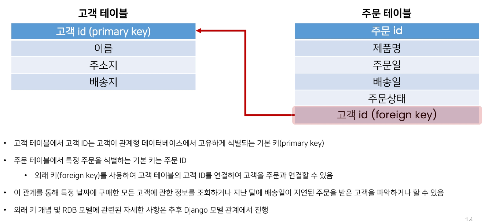

> ### RDB 기본 구조

1. 스키마

2. 테이블
   
   * 필드
   
   * 레코드
   
   * 기본 키

> ### 스키마

* 테이블의 구조

* 데이터베이스에서 자료의 구조, 표현 방법, 관계 등 전반적이 명세를 기술한 것

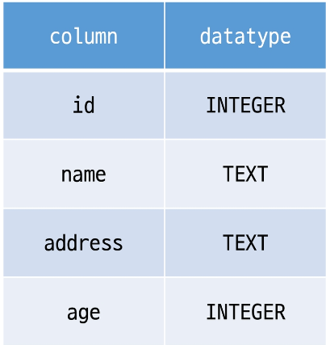

> ### 테이블

* 필드와 레코드를 사용해 조직된 데이터 요소들의 집합

* 관계라고도 부름
1. 필드
   
   * 속성, 컬럼

2. 레코드
   
   * 튜플, 행

> ### 필드

* 튜플 혹은 행

* 테이블의 데이터는 레코드에 저장됨

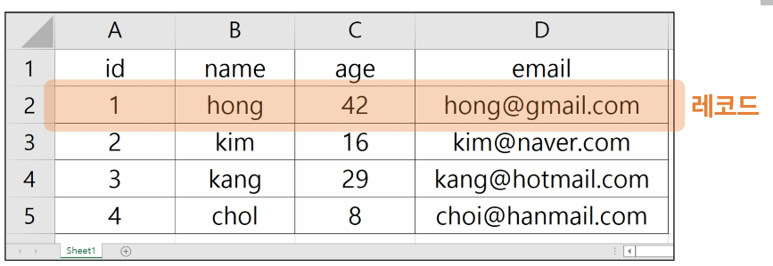

> ### PK (Primary key)

* 기본 키

* 각 레코드의 고유한 값
  
  * 각각의 데이터를 구분할 수 있는 고윳값

* 기술적으로 다른 항목과 절대로 중복될 수 없는 단일 값

* 데이터베이스 관리 및 테이블

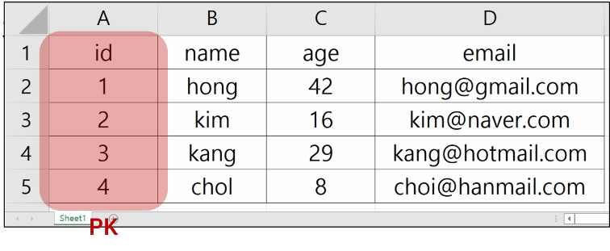

> ### 관계형 데이터베이스의 이점

* 데이터를 직관적으로 표현할 수 있음

* 관련한 각 데이터에 쉽게 접근할 수 있음

* 대랑의 데이터도 효율적으로 관리 가능

> ### RDBMS

* Relational Database Management System (관계형 데이터베이스 관리 시스템)

* 관계형 데이터베이스를 만들고 업데이트하고 관리하는 데 사용하는 프로그램

* 예시
  
  * SQLite, MySQL, PostgreSQL, Microsoft SQL Server, Oracle Database 등

> ### SQLite

* 응용 프로그램에 파일 형식으로 넣어 사용하는 비교적 가벼운 데이터베이스

* 안드로이드, iOS, macOS에 기본적으로 탑재되어 있으며 임베디드 소프트웨어에서도 많이 활용됨

* 오픈 소스 프로젝트이기 때문에 자유롭게 사용가능

> ### SQLite 단점

* 대규모 동시 처리 작업에는 적합하지 않음

* 다른 RDMBS에서 지원하는 SQL 기능을 지원하지 않을 수 있음

> ### SQLite를 학습하는 이유

* 어떤 환경에서나 실행 가능한 호환성

* 데이터 타입이 비교적 적고 강하지 않기 때문에 유연한 학습 환경을 제공

* Django Framework의 기본 데이터베이스

---

## SQL

---

> ### SQL이란

* "Structured Query Language"

* RDBMS의 데이터를 관리하기 위해 설계된 특수 목적의 프로그래밍 언어

* RDBMS에서 데이터베이스 스키마를 생성 및 수정할 수 있으며, 테이블에서의 자료 검색 및 관리도 할 수 있음

* 데이터베이스 객체에 대한 처리를 관리하거나 접근 권한을 설정하여 허가된 사용자만 RDBMS를 관리할 수 있도록 할 수 있음

* 많은 데이터베이스 관련 프로그램들이 SQL을 표준으로 채택하고 있음

> ### SQL 정리

* SQL은 데이터베이스와 상호작용하는 방법

* 따라서 SQL을 배우면서 데이터베이스의 동작원리 또한 익힐 수 있음

---

## SQL Commands

---

> ### SQL Commands 종류

* 명령어는 특성에 따라 다음 세 가지 그룹으로 분류
  
  1. DDl
  
  2. DML
  
  3. DCl

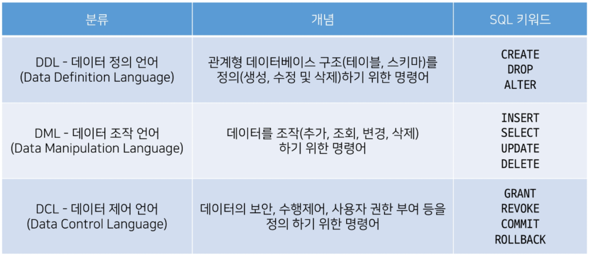

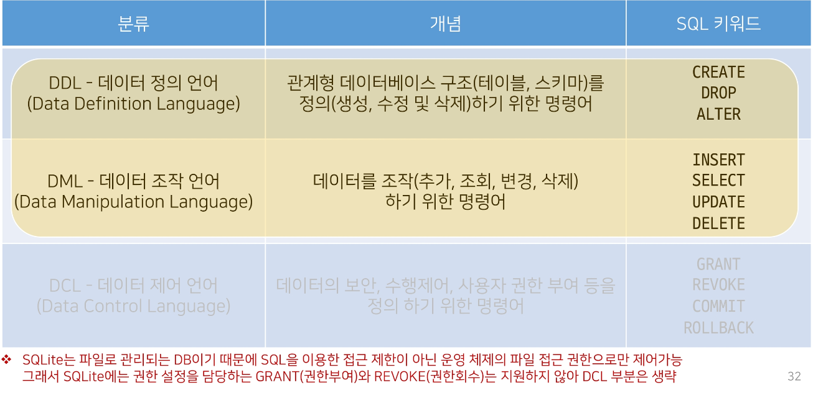

---

## SQL Syntax

---

* 모든 SQL 문(statement)는 SELECT, INSERT, UPDATE 등과 같은 키워드로 시작하고, 하나의 statement는 세미콜론(;)으로 끝남
  
  * 세미콜론은 각 SQL 문을 구분하는 표준 방법

* SQL 키워드는 대소문자를 구분하지 않음
  
  * 즉, SELECT와 select는 SQL 문에서 동일한 의미
  
  * 하지만 대문자로 작성하는 것을 권장

* SQL에 대한 세부적인 문법 사항들은 이어지는 DDL, DML을 진행하며 익혀볼 것

> ### [참고] Statement & Clause

* Statement (문)
  
  * 독립적으로 실행할 수 있는 완전한 코드 조각
  
  * statement는 clause로 구성됨

* clause (절)
  
  * statement의 하위 단위

* SELECT statement라 부름

* 이 statement는 다음과 같이 2개의 clause로 구성 됨
  
  1. SELECT column_name
  
  2. FROM table_name

---

## DDL

---

> ### 사전 준비

1. 데이터베이스 mydb.sqlite3 파일 생성

2. DDL.sql 파일 생성

3. vscode 실행 후 DDL.sql 화면에서 마우스 우측버튼 클릭
   
   * Use Database 선택

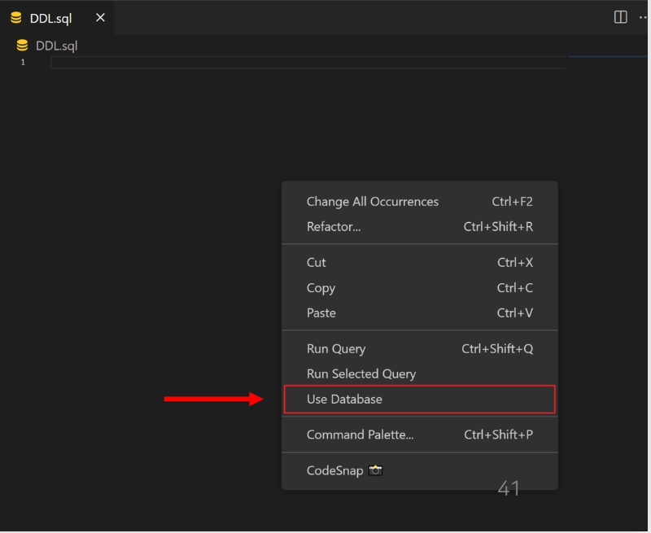

* 데이터베이스 목록에서 mydb.sqlite3 선택

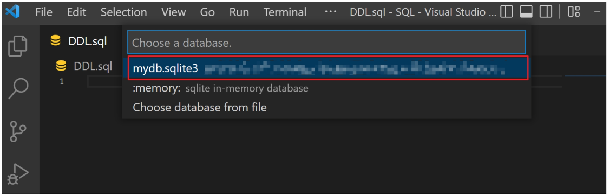

> ### 개요

* "Data definition"

* SQL 데이터 정의 언어를 사용하여 테이블 데이터베이스 개체를 만드는 방법을 학습

* DDL은 테이블 구조를 관리
  
  * CREATE, ALTER, DROP

---

## CREATE TABLE

---

> ### CREATE TABLE statement

* "Create a new table in the database"

* 데이터베이스에 새 테이블을 만듦

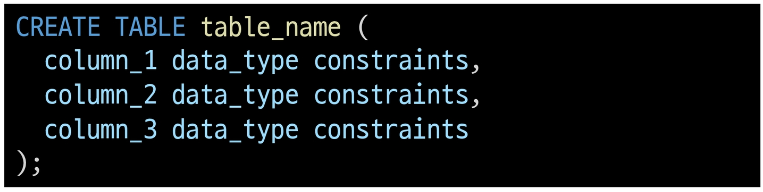

> ### CREATE TABLE 실습

* contacts 테이블 생성

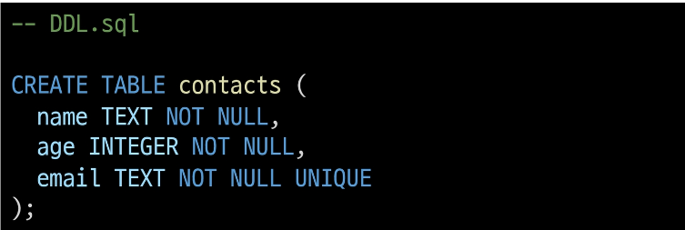

* Query 실행하기
  
  * 실행하고자 하는 명령문에 커서를 두고 마우스 우측 버튼
    
    => 'Run Selected Query' 선택
  
  * 명령문을 모두 선택 할 필요 없으며, 실행하고자 하는 명령문 안에 커서가 올라가 있으면 가능

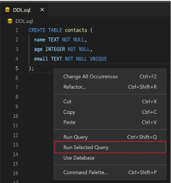

* 쿼리 실행 후 테이블 및 스키마 확인

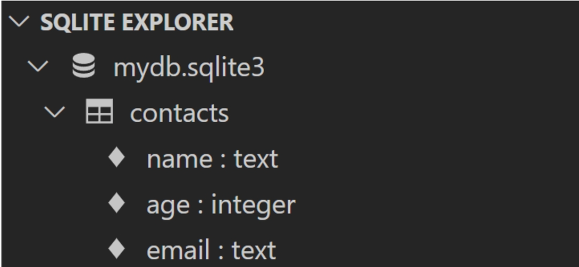

* id 컬럼은 우리가 직접 기본 키 역할의 컬럼을 정의하지 않으면 자동으로 rowid라는 컬럼으로 만들어짐

* rowid에 대한 자세한 사항은 이어지는 주제에서 자세히 다룸

* 먼저 테이블을 생성 하면서 작성한 "데이터 타입"과 "제약조건"을 알아본다.

---

## SQLite Data Types

---

> ### Data Types 종류

1. NULL
   
   * NULL value
   
   * 정보가 없거나 알 수 없음을 의미

2. INTEGER
   
   * 정수
   
   * 크기에 따라 0, 1, 2, 3, 4, 5, 6 또는 6바이트와 같은 가변 크기를 가짐

3. REAL
   
   * 실수
   
   * 8바이트 부동 소수점을 사용하는 10진수 값이 있는 실수

4. TEXT
   
   * 문자 데이터

5. BLOB
   
   * 입력된 그대로 저장된 데이터 덩어리 (대용 타입 없음)
   
   * 바이너리 등 멀티미디어 파일
   
   * 예시
     
     * 이미지 데이터

> ### [참고] Boolean type

* SQLite에는 별도의 Boolean 타입이 없음

* 대신 Boolean 값은 정수 0(false)과 1(true)로 저장됨

> ### [참고] Date & Time Datatype

* SQLite에는 날짜 및 시간을 저장하기 위한 타입이 없음

* 대신 SQLite의 built-in "Date And Time Functions"으로 TEXT, REAL 또는 INTEGER 값으로 저장할 수 있음

> ### [참고] Binary Data

* 데이터의 저장과 처리를 목적으로 0과 1의 이진 형식으로 인코딩 된 파일

* 기본적으로 컴퓨터의 모든 데이터는 binary data
  
  * 다만, 이를 필요에 따라서 텍스트 타입으로 변형해서 사용하는 것

> ### SQLite는 다음 규칙을 기반으로 데이터 타입을 결정

* 값에 둘러싸는 따옴표와 소수점 또는 지수가 없으면 - INTEGER

* 값이 작은 따옴표나 큰따옴표로 묶이면 - TEXT

* 값에 따옴표나 소수점, 지수가 없으면 - REAL

* 값이 따옴표 없이 NULL이면 - NULL

> ### SQLite Datatypes 특징

* SQLite는 다른 모든 SQL 데이터베이스 엔진의 정적이고 엄격한 타이 아닌 "동적 타입 시스템"을 사용
  
  * 컬럼에 선언된 데이터 타입에 의해서가 아니라 컬럼에 저장된 값에 따라 데이터 타입이 결정됨

* 또한 테이블을 생성할 때 컬럼에 대해 특정 데이터 타입을 선언하지 않아도 됨
  
  * 예를 들어 동일한 컬럼에 정수 1을 넣을 경우 INTEGER로 타입이 지정되고, 문자 '1'을 넣을 경우는 TEXT 타입으로 지정됨
  
  * 이러한 SQLite의 동적 타입 시스템을 사용하면 기존의 엄격하게 타입이 지정된 데이터베이스에서는 불가능한 작업을 유연하게 수행할 수 있음
  
  * 게다가 정적 타입 시스템이 지정된 데이터베이스에서 작동하는 SQL 문이 SQLite에서 동일한 방식으로 작동한다는 점
  
  * 다만 이는 다른 데이터베이스와의 호환성 문제가 있기 때문에 테이블 생성 시 데이터 타입을 지정하는 것을 권장

* 데이터 타입을 지정하게 되면 SQLite는 입력된 데이터의 타입을 지정된 데이터 타입으로 변환
  
  * 예를 들어 TEXT 타입 컬럼에 정수 1을 저장할 경우 문자 타입의 '1'로 저장됨
  
  * 허용 가능한 타입 변환은 다음과 같음

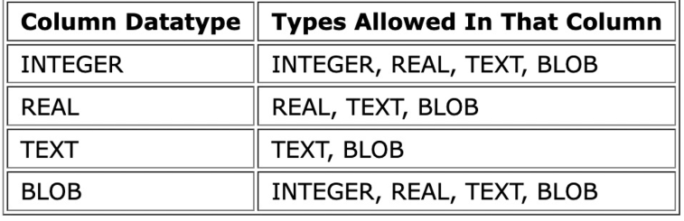

> ### [참고] "static, rigid typing" 데이터베이스

* statically, rigidly typed databases 라고도 부름

* 저장되는 값의 데이터 타입은 컬럼에 선언된 데이터 타입에 의해 결정된다.

* 동작 예시

* 만약 a컬럼에 '123', b 컬럼에 456 데이터를 삽입하려는 경우 삽입을 수행하기 전에 문자열 '123'을 정수 123으로 변환하고, 정수 456을 문자열 '456'으로 변환

> ### Type Affinity

* "타입 선호도"

* 특정 컬럼에 저장된 데이터에 권장되는 타입

* 데이터 타입 작성 시 SQLite의 5가지 데이터 타입이 아닌 다른 데이터 타입을 선언한다면, 내부적으로 각 타입의 지정된 선호도에 따라 5가지 선호도로 인식됨
  
  1. INTEGER
  
  2. TEXT
  
  3. BLOB
  
  4. REAL
  
  5. NUMERIC
