# Django

---

## 목차

* Django Intro

* Django 구조 이해하기 (MTV Design Pattern)

* Django Quick start

* Django Template

* Sending and Retrieving form data

* Django URLs

* 마무리

---

### Django Intro

---

### Django 시작하기

---

#### 지금까지 우리는

* Python도 익숙해졌고, HTML, CSS도 배워서 웹 페이지도 구성할 수 있는 상태
  
  하지만 '웹 서비스 하나 만들어줄 수 있어?' 라고 묻는다면?

* '웹 서비스 개발'에는 무엇이 필요할까?
  
  * 로그인, 로그아웃, 회원관리, 데이터베이스, 서버, 클라이언트, 보안 등
  
  * 너무 많은 기술들이 필요 -> 이걸 어떻게 다 만들어야 할까?
  
  * 모든 걸 직접 만들 필요 없음
  
  * 잘 만들어진 것들을 가져다가 좋은 환경에서 잘 쓰기만 하면 되는 세상
    
    * "거인의 어깨 위에서 프로그래밍하기"

#### Framework 이해하기 (1/3)

* 누군가 만들어 놓은 코드를 재사용 하는 것은 이미 익숙한 개발 문화

* 그렇다면 '웹 서비스'도 누군가 개발해 놓은 코드를 재사용하면 된다!

* 전 세계의 수많은 개발자들이 이미 수없이 많이 개발해 봤고, 그 과정에서 자주 사용되는 부분들을 재사용 할 수 있게 좋은 구조의 코드로 만들어 두었음

#### Framework 이해하기 (2/3)

* 그러한 코드들을 모아 놓은 것, 즉 서비스 개발에 필요한 기능들을 미리 구현해서 모아 놓은 것 = 프레임워크(Framework)

* Frame(뼈대, 틀) + Work(일하다)
  
  * 일정한 뼈대, 틀을 가지고 일하다
  
  * 제공받은 도구들과 뼈대, 규약을 가지고 무언가를 만드는 일
  
  * 특정 프로그램을 개발하기 위한 여러 도구들과 규약을 제공하는 것

* "소프트웨어 프레임워크"는 복잡한 문제를 해결하거나 서술하는데 사용되는 기본 개념 구조

#### Framework 이해하기 (3/3)

* 따라서, Framework를 잘 사용하기만 하면 웹 서비스 개발에 있어서 모든 것들을 하나부터 열까지 직접 개발할 필요 없이, 내가 만들고자 하는 본질(로직)에 집중해 개발할 수 있음

* 소프트웨어의 생산성과 품질을 높임

#### 여러가지 Web Framework

* 웹 서비스를 만들 수 있는 다양한 프레임워크

* 2020년 Github star 수 기준 인기 프레임워크 순위

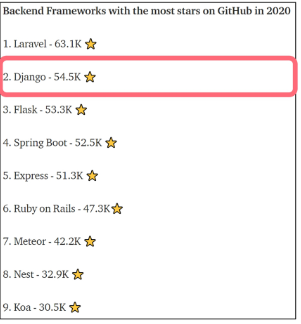

#### Django를 배워야 하는 이유

* Python으로 작성된 프레임워크
  
  * Python이라는 언어의 강력함과 거대한 커뮤니티

* 수많은 여러 유용한 기능들

* 검증된 웹 프레임워크
  
  * 화해, Toss, 두나무, 당근 마켓, 요기요 등
  
  * 유명한 많은 서비스들이 사용한다는 것 == 안정적으로 서비스를 할 수 있다는 검증

---

## Web 이해하기

---

#### WWW (World Wide Web)

* 인터넷이란?
  
  * 우리가 구글에 접속할 때
    
    * 1. 웹 브라우저를 켠다.
      
      2. 주소창에 주소를 입력한다 (www.google.com)
  
  * www, 즉 World Wide Web은 '전 세계에 퍼져 있는 거미줄 같은 연결망'

* 결국 우리가 인터넷을 이용한다는 건, 전세계의 컴퓨터가 연결되어 있는 하나의 인프라를 이용하는 것

---

## 클라이언트와 서버

---

#### 클라이언트-서버 구조

* 오늘날 우리가 사용하는 대부분의 웹 서비스는 클라이언트-서버 구조를 기반으로 동작
* 클라이언트와 서버 역시 하나의 컴퓨터이며 이들이 어떻게 상호작용하는지에 대한 간소화된 다이어그램은 다음과 같음

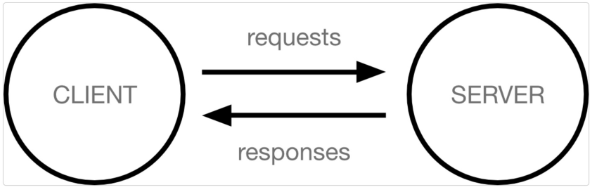

* 클라이언트
  
  * 웹 사용자의 인터넷에 연결된 장치(예를 들어 wi-fi에 연결된 컴퓨터 또는 모바일)
  
  * Chrome 또는 Firefox와 같은 웹 브라우저
  
  * 서비스를 요청하는 주체

* 서버
  
  * 웹 페이지, 사이트 또는 앱을 저장하는 컴퓨터
  
  * 클라이언트가 웹 페이지에 접근하려고 할 때 서버에서 클라이언트 컴퓨터로 웹 페이지 데이터를 응답해 사용자의 웹 브라우저에 표시됨
  
  * 요청에 대해 서비스를 응답하는 주체

* 상호작용 예시
  
  * 예를들어, 우리가 Google 홈페이지에 접속한다는 것은 무엇을 뜻하는가?
    
    1. 결론적으로 인터넷에 연결된 전세계 어딘가에 있는 구글 컴퓨터에게 'Google 홈페이지.html' 파일을 달라고 요청하는 것
    
    2. 그러면 구글 컴퓨터는 우리의 요청을 받고  'Google 홈페이지.html'파일을 인터넷을 통해서 우리 컴퓨터에게 응답해줌
    
    3. 그렇게 전달받은 Google  홈페이지.html파일을 웹 브라우저가 우리가 볼 수 있도록 해석해주는 것
  
  * 여기서 'Google 홈페이지.html'을 달라고 요청한 컴퓨터, 웹 브라우저를 클라이언트 라고 하고 'Google 홈페이지.html' 파일을 제공한 컴퓨터, 프로그램을 서버라고 함
  
  * 어떠한 자원을 달라고 요청하는 쪽을 클라이언트라고 하고 자원을 제공해주는 쪽을 서버라고 함

#### 정리

* 우리가 사용하는 웹은 클라이언트-서버 구조로 이루어져 있음

* 앞으로 우리가 배우는 것도 이 클라이언트-서버 구조를 만드는 방법으 ㄹ배우는 것

* 이 중에서 Django는 서버를 구현하는 웹 프레임워크

---

## Web browser와 Web page

---

#### 웹 브라우저란?

* 웹에서 페이지를 찾아 보여주고, 사용자가 하이퍼링크를 통해 다른 페이지로 이동할 수 있도록 하는 프로그램

* 웹 페이지 파일을 우리가 보는 화면으로 바꿔주는(렌더링, rendering) 프로그램

#### 웹 브라우저 예시

* 우리가 보고 있는 웹페이지는 사실 HTML문서 파일 하나

* google 홈페이지를 예로 들면 우리는 구글 로고가 있는 예쁜 화면을 보지만, 사실 빼곡한 코드로 작성된 HTML 문서를 서버로 부터 전달받게 됨

* 즉, 웹 페이지 코드를 받으면 우리가 보는 화면처럼 바꿔주는 것이 바로 웹 브라우저

* HTML / CSS / JS 등의 코드를 읽어 실제 사람이 볼 수 있는 화면으로 만들어 줌

#### 웹 페이지란?

* 웹에 있는 문서
  
  * 우리가 보는 화면 각각 한 장 한 장이 웹 페이지

* 웹 페이지 종류
  
  1. 정적 웹 페이지
  
  2. 동적 웹 페이지

#### 정적 웹 페이지

* Static Web page

* 있는 그대로를 제공하는 것을 의미

* 우리가 지금까지 작성한 웹 페이지이며 한 번 작성된 HTML 파일의 내용이 변하지 않고 모든 사용자에게 동일한 모습으로 전달되는 것
  
  == 서버에 미리 저장된 HTML 파일 그대로 전달된 웹 페이지
  
  == 같은 상황에서 모든 사용자에게 동일한 정보를 표시

#### 동적 웹 페이지

* Dynamic Web page

* 사용자의 요청에 따라 웹 페이지에 추가적인 수정이 되어 클라이언트에게 전달되는 웹 페이지

* 웹 페이지의 내용을 바꿔주는 주체 == 서버
  
  * 서버에서 동작하고 있는 프로그램이 웹 페이지를 변경해줌
    
    이렇게 사용자의 요청을 받아서 적절한 응답을 만들어주는 프로그램을 쉽게 만들 수 있게 도와주는 프레임워크가 바로 Django

* 다양한 서버 사이드 프로그래밍 언어(python, java, c++ 등) 사용 가능
  
  파일을 처리하고 데이터베이스와의 상호작용이 이루어짐

* 이 중에서 python을 이용해서 개발할 수 있는 프레임워크인 Django를 학습

---

## Django 구조 이해하기

---

### Design Pattern

---

#### Design Pattern 이란?

* 자주 사용되는 구조를 일반화해서 하나의 공법으로 만들어 둔 것

* 소프트웨어에서의 관점
  
  * 각기 다른 기능을 가진 다양한 응용 소프트웨어를 개발할 때 공통적인 설계 문제가 존재하며, 이를 처리하는 해결책 사이에도 공통점이 있다는 것을 발견
  
  * 이러한 유사점을 패턴이라 함

#### 소프트웨어 디자인 패턴

* 소프트웨어도 수십년간 전 세계의 개발자들이 계속 만들다 보니 자주 사용되는 구조와 해결책이 있다는 것을 알게 됨

* 앞서 배웠던 클라이언트-서버 구조도 소프트웨어 디자인 패턴 중 하나

* 자주 사용되는 소프트웨어의 구조를 소수의 뛰어난 엔지니어가 마치 건축의 공법처럼 일반적이 구조화를 해둔 것

#### 소프트웨어 디자인 패턴의 목적

* 특정 문맥에서 공통적으로 발생하는 문제에 대해 재사용 가능한 해결책을 제시

* 프로그래머가 어플리케이션이나 시스템을 디자인할 때 발생하는 공통된 문제들을 해결하는데 형식화 된 가장 좋은 관행

#### 소프트웨어 디자인 패턴의 장점

* 디자인 패턴을 알고 있다면 서로 복잡한 커뮤니케이션이 매우 간단해짐

* Before
  
  * "무언가 서비스를 요청을 하는 쪽을 하나 만들고.. 둘 사이에 데이터를 주고 받는 방식을 정의 한 다음.. 요청을 처리하는 쪽을 하나 따로 개발해서.. 다수의 요청을 처리하는 구조로 만들어보자..!"

* After
  
  * "우리 이거 클라이언트-서버 구조로 구현하자"

* 다수의 엔지니어들이 일반화된 패턴으로 소프트웨어 개발을 할 수 있도록 한 규칙, 커뮤니케이션의 효율성을 높이는 기법

---

## Django's Design Pattern

---

#### Django에서의 디자인 패턴

* Django에도 이러한 디자인 패턴이 적용이 되어 있는데, Django에 적용된 디자인 패턴은 MTV 패턴이다.

* MTV 패턴은 MVC 디자인 패턴을 기반으로 조금 변형된 패턴이다.

#### MVC 소프트웨어 디자인 패턴

* MVC는 Model - View - Controller의 준말
  
  데이터 및 논리 제어를 구현하는데 널리 사용되는 소프트웨어 디자인 패턴

* 하나의 큰 프로그램을 세가지 역할로 구분한 개발 방법론

* Model : 데이터와 관련된 로직을 관리

* View : 레이아웃과 화면을 처리

* Controller : 명령을 model과 view 부분으로 연결

#### MVC 소프트웨어 디자인 패턴의 목적

* "관심사 분리"

* 더 나은 업무의 분리와 향상된 관리를 제공

* 각 부분을 독립적으로 개발할 수 있어, 하나를 수정하고 싶을 때 모두 건들지 않아도 됨
  
  == 개발 효율성 및 유지보수가 쉬워짐
  
  == 다수의 멤버로 개발하기 용이함

#### Django에서의 디자인 패턴

* Django는 MVC패턴을 기반으로 한 MTV 패턴을 사용
  
  두 패턴은 서로 크게 다른 점은 없으며 일부 역할에 대해 부르는 이름이 다름


#### MTV 디자인 패턴

* Model
  
  * MVC 패턴에서 Model 의 역할에 해당
  
  * 데이터와 관련된 로직을 관리
  
  * 응용프로그램의 데이터 구조를 정의하고 데이터베이스의 기록을 관리

* Template
  
  * 레이아웃과 화면을 처리
  
  * 화면상의 사용자 인터페이스 구조와 레이아웃을 정의
  
  * MVC 패턴에서 View의 역할에 해당

* View
  
  * Model & Template과 관련한 로직을 처리해서 응답을 반환
  
  * 클라이언트의 요청에 대해 처리를 분기하는 역할
  
  * 동작 예시
    
    * 데이터가 필요하다면 mode에 접근해서 데이터를 가져오고 가져온 데이터를 template로 보내 화면을 구성하고 구성된 화면을 응답으로 만들어 클라이언트에게 반환
  
  * MVC 패턴에서 Controller의 역할에 해당

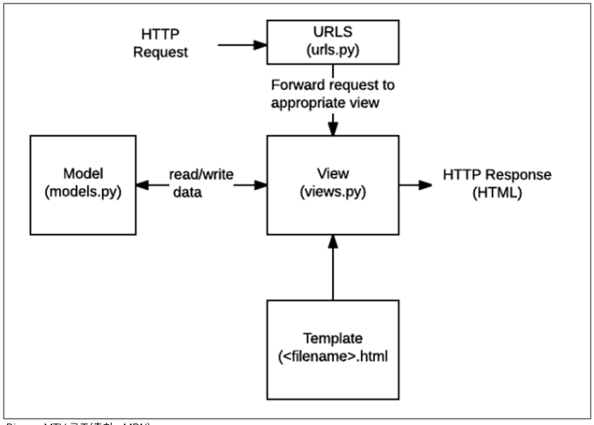

* 장고 흐름
  
  * 사용자 요청
  
  * 서버에서 어떤 요청인지 확인
  
  * 요청 처리
  
  * 필요한 데이터
  
  * 데이터 전달
  
  * 응답

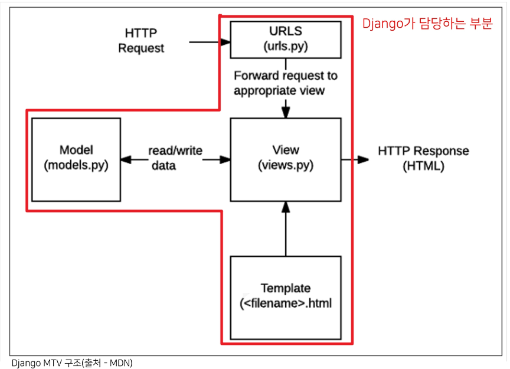

#### 정리

* Django는 MTV 디자인 패턴을 가지고 있음
  
  * Model : 데이터 관련
  
  * Template : 화면 관련
  
  * View : Model &  Template 중간 처리 및 응답 반환

---

## Django Quick start

---

### 기본 설정

---

#### Django 설치


#### Django 가상환경 생성

```bash
python -m venv 가상환경명
```

#### Django 가상환경 실행

```bash
source venv/Scripts/activate
```

#### [참고] LTS

* Long Term Support (장기 지원 버전)

* 일반적인 경우보다 장기간에 걸쳐 지원하도록 고안된 소프트웨어의 버전

* 컴퓨터 소프트웨어의 제품 수명주기 관리 정책

* 배포자는 LTS 확정을 통해 장기적이고 안정적인 지원을 보장함

#### Django Project

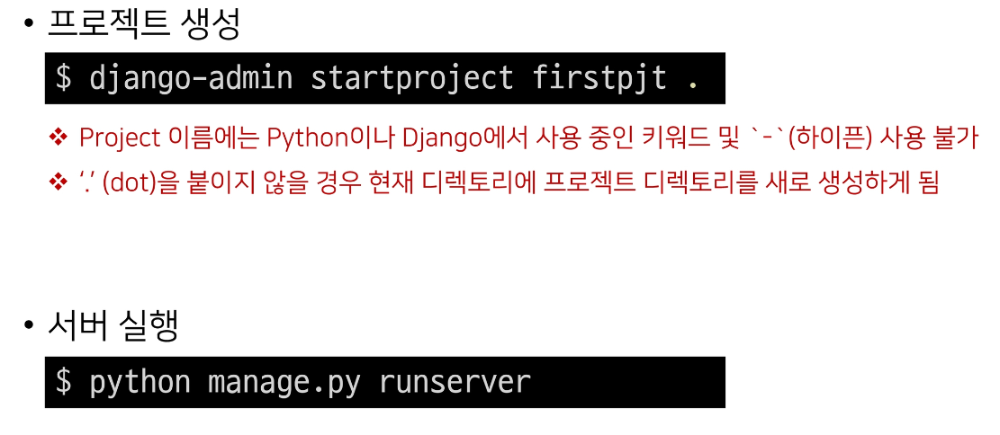

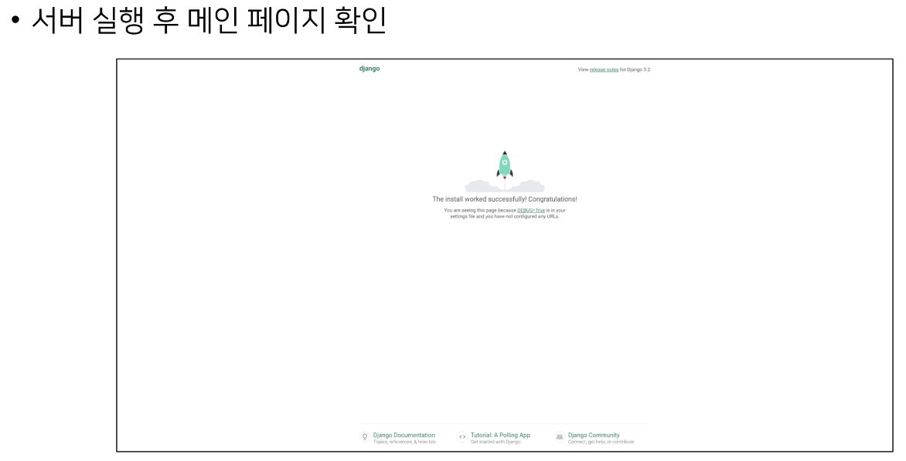


* 요청한 url주소가 존재하지 않음

---

#### 프로젝트 구조

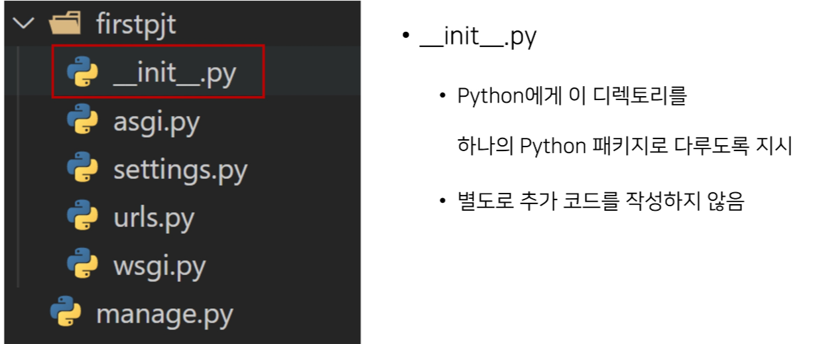

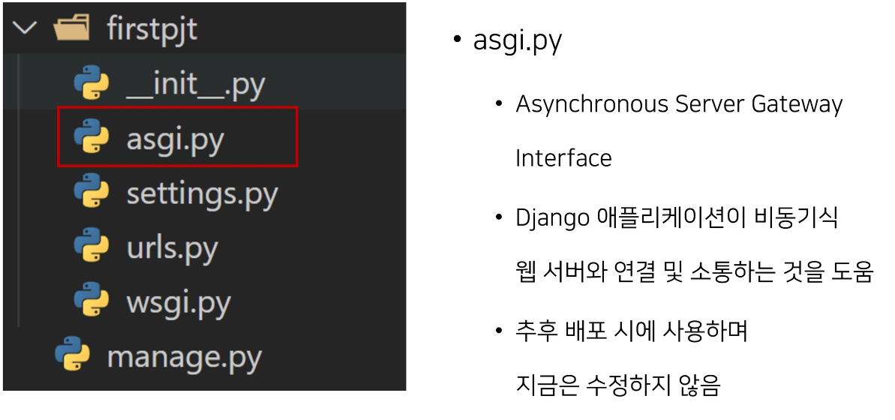

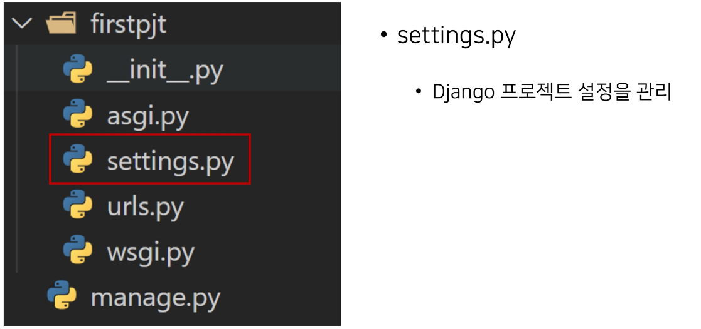


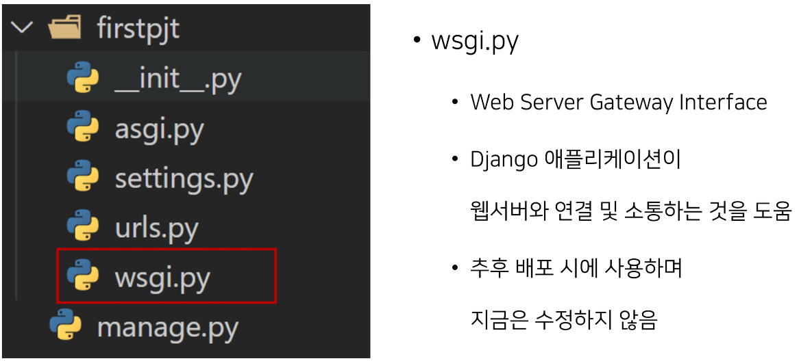

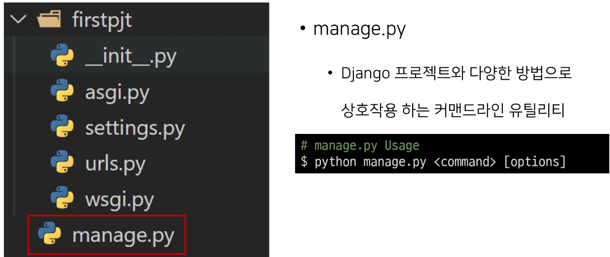

---

#### Django Application

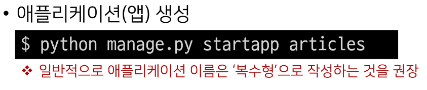

#### 애플리케이션 구조

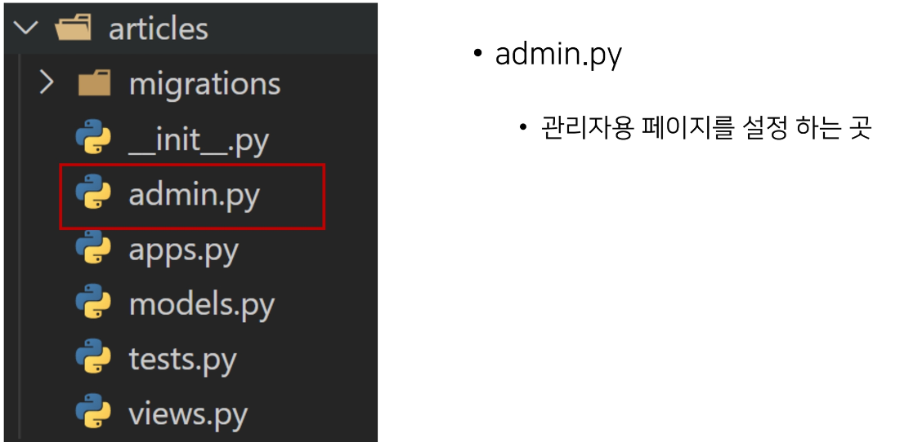

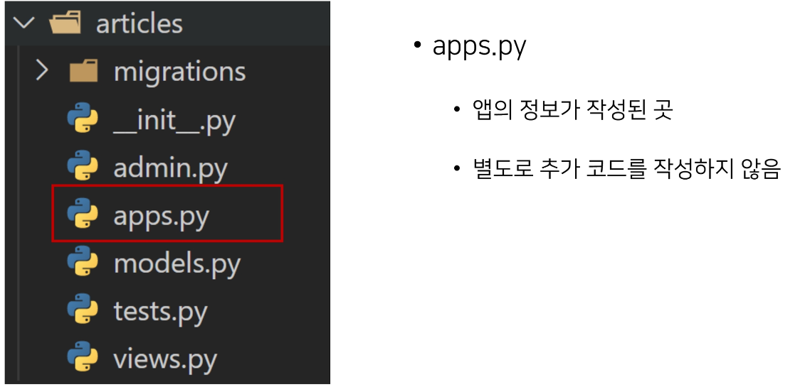

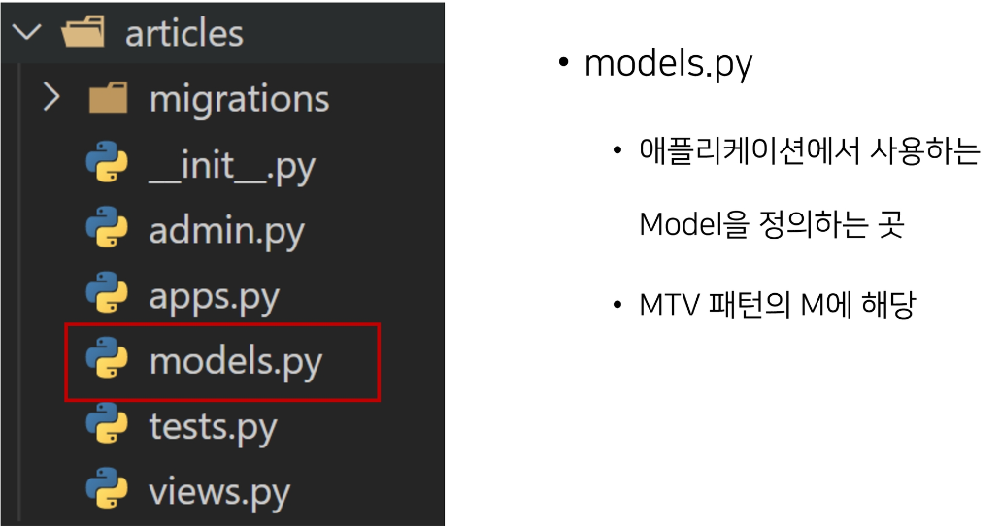

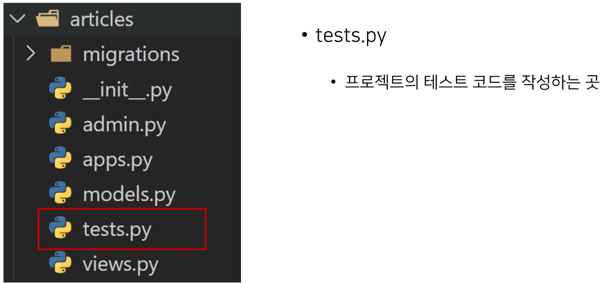

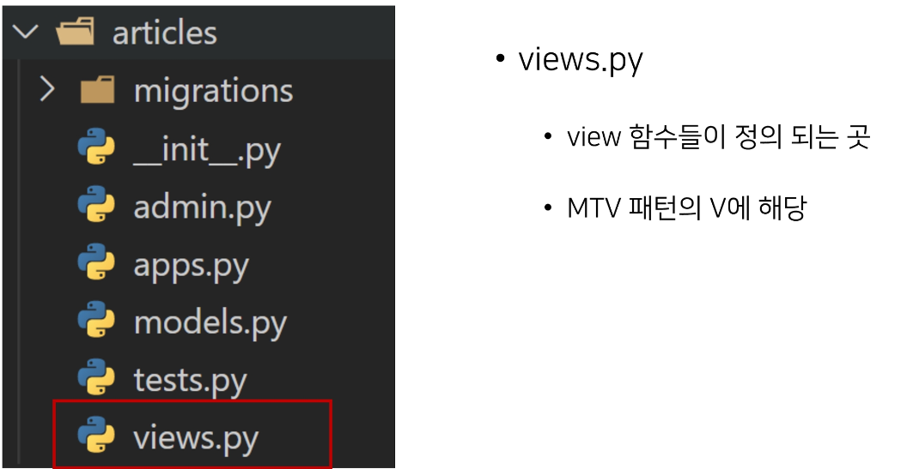

#### 애플리케이션 등록

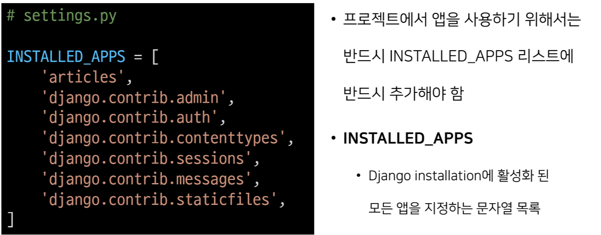

#### Project & Application

* Project
  
  * "collection of apps"
  
  * 프로젝트는 앱의 집합
  
  * 프로젝트에는 여러 앱이 포함될 수 있음
  
  * 앱은 여러 프로젝트에 있을 수 있음

* Application
  
  * 앱은 실제 요청을 처리하고 페이지를 보여주는 등의 역할을 담당
  
  * 일반적으로 앱은 하나의 역할 및 기능 단위로 작성하는 것을 권장함

#### 애플리케이션 주의사항

* <mark>반드시 생성 후 등록</mark>
  
  * INSTALLED_APPS에 먼저 작성(등록)하고 생성하려면 앱이 생성되지 않음

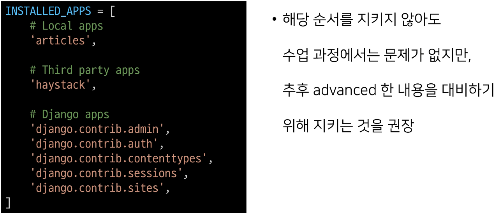

---

## 요청과 응답

---

#### 요청과 응답

* 요청 - URL - VIEW - TEMPLATE  의 <mark>흐름 이해</mark>!

#### URLs

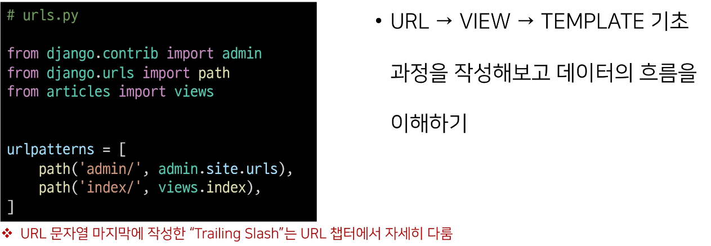

#### View

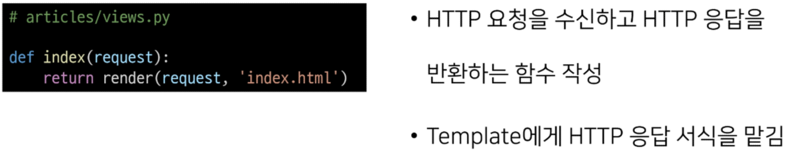

#### render()

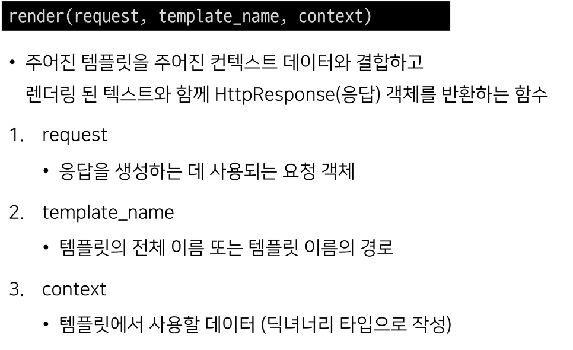

#### Templates

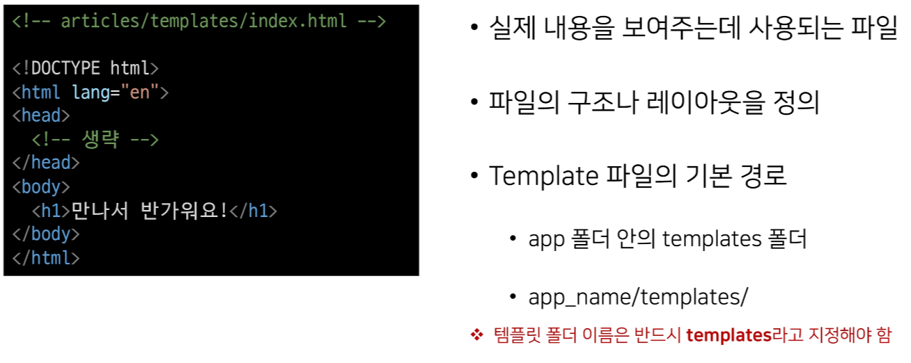

#### 코드 작성 순서

* 앞으로 Django에서의 코드 작성은 URL -> View -> Template 순으로 작성

* <mark>"데이터의 흐름 순서"</mark>

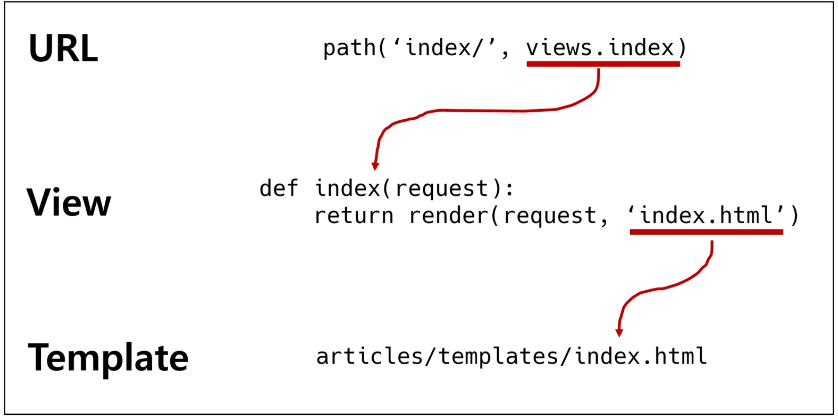

#### [참고] 추가 설정

* Language_code
  
  * 모든 사용자에게 제공되는 번역을 결정
  
  * 이 설정이 적용 되려면 USE_I18N이 활성화(True)되어 있어야 함
  
  * http://www.i18nguy.com/unicode/language-identifiers.html

* TIME_ZONE
  
  * 데이터베이스 연결의 시간대를 나타내는 문자열 지정
  
  * USE_TZ가 True이고 이 옵션이 설정된 경우 데이터베이스에서 날짜 시간을 읽으면, UTC 대신 새로 설정한 시간대의 인식 날짜 & 시간이 반환 됨
  
  * USE_TZ이 False인 상태로 이 값을 설정하는 것은 error가 발생하므로 주의
  
  * https://en.wifipedia.org/wiki/List_of_tz_database_time_zones

* USE_I18N
  
  * Django의 번역 시스템을 활성화해야 하는지 여부를 지정

* USE_L10N
  
  * 데이터의 지역화 된 형식(localized formatting)을 기본적으로 활성화할지 여부를 지정
  
  * True일 경우, Django는 현재 locale의 형식을 사용하여 숫자와 날짜를 표시

* USE_TZ
  
  * datatimes가 기본적으로 시간대를 인식하는지 여부를 지정
  
  * True일 경우 Django는 내부적으로 시간대 인식 날짜/시간을 사용

---

## Django Template

---

#### Django Template

* <mark>"데이터 표현을 제어하는 도구이자 표현에 관련된 로직"</mark>

* Django Template을 이용한 HTML 정적 부분과 동적 컨텐츠 삽입

* Template System의 기본 목표를 숙지

* Django Template System
  
  * 데이터 표현을 제어하는 도구이자 표현에 관련된 로직을 담당

#### Django Template Language (DTL)

* Django template에서 사용하는 built-in template system

* 조건, 반복, 변수 치환, 필터 등의 기능을 제공
  
  * Python처럼 일부 프로그래밍 구조(if, for등)를 사용할 수 있지만 이것은 Python 코드로 실행되는 것이 아님
  
  * Django 템플릿 시스템은 단순히 python이 HTML에 포함 된 것이 아니니 주의

* 프로그래밍적 로직이 아니라 프레젠테이션을 표현하기 위한 것임을 명심할 것

#### Variable

```django
{{ variable }}
```

* 변수명은 영어, 숫자와 밑줄(_)의 조합으로 구성될 수 있으나 밑줄로는 시작 할 수 없음
  
  * 공백이나 구두점 문자 또한 사용할 수 없음

* dot(.)를 사용하여 변수 속성에 접근할 수 있음

* render()의 세번째 인자로 {'key': value} 와 같이 딕셔너리 형태로 넘겨주며, 여기서 정의한 key에 해당하는 문자열이 template에서 사용가능한 변수명이 됨

#### Filters

```django
{{ variable|filter }}
```

* 표시할 변수를 수정할 때 사용

* Ex)
  
  * name 변수를 모두 소문자로 출력 

```django
{{ name|lower }}
```

* 60개의 built-in template filters를 제공

* chained가 가능하며 일부 필터는 인자를 받기도 함

```django
{{ name|truncatewords:30 }}
```

#### Tags

```django

```

* 출력 텍스트를 만들거나, 반복 또는 논리를 수행하여 제어 흐름을 만드는 등 변수보다 복잡한 일들을 수행

* 일부 태그는 시작과 종료 태그가 필요 

```django

```

* 약 24개의 built-in template tags를 제공

#### Comments

```django
{# #}
```

* Django template에서 라인의 주석을 표현하기 위해 사용

* 아래처럼 유효하지 않은 템플릿 코드가 포함될 수 있음

```django
{#  text  #}
```

* 한 줄 주석에만 사용할 수 있음(줄 바꿈이 허용되지 않음)

* 여러 줄 주석은 와 사이에 입력

```django

  여러 줄
  주석

```

---

## 실습

---

#### Variable

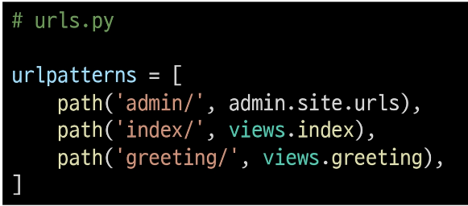

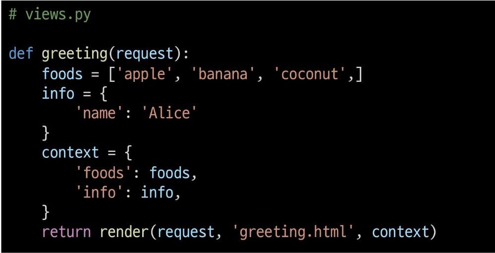

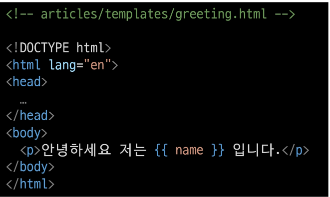

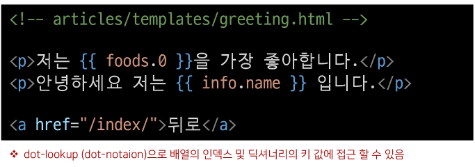

#### Filters

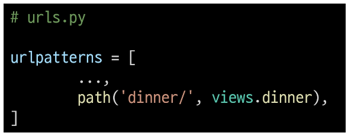

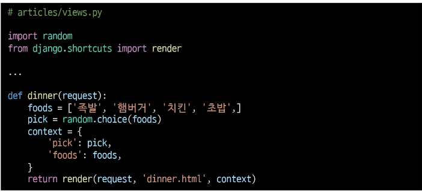

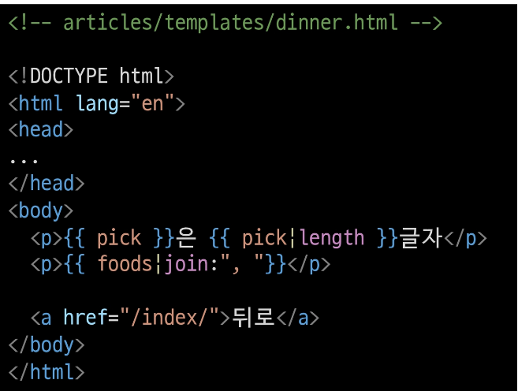

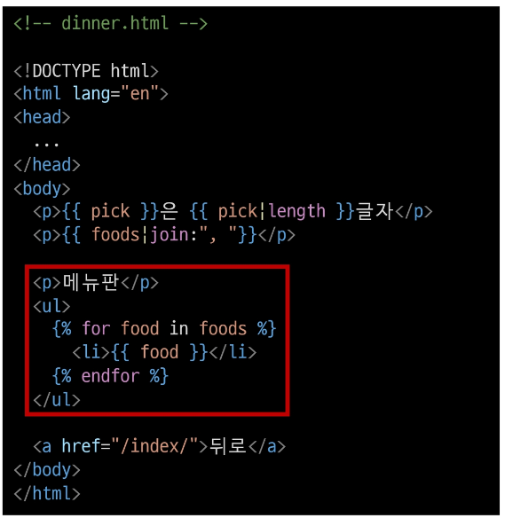

#### Comments

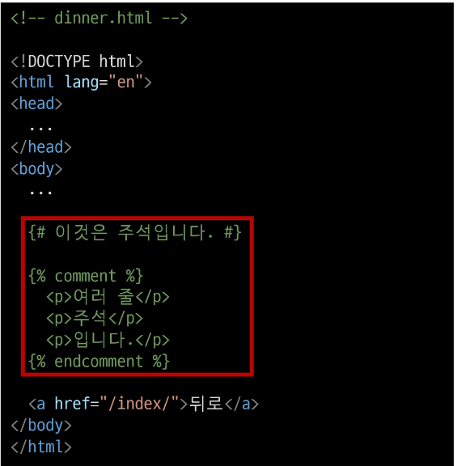

---

## 템플릿 상속

---

* 템플릿 상속은 기본적으로 코드의 재사용성에 초점을 맞춤

* 템플릿 상속을 사용하면 사이트의 모든 공통 요소를 포함하고, 하위 템플릿이 재정의(override) 할 수 있는 블록을 정의하는 기본'skeleton' 템플릿을 만들 수 있음

* 만약 모든 템플릿에 부트스트랩을 적용하려면 어떻게 해야 할까?
  
  * 모든 템플릿에 부트스트랩 CDN을 작성해야 할까?

#### 템플릿 상속에 관련된 태그

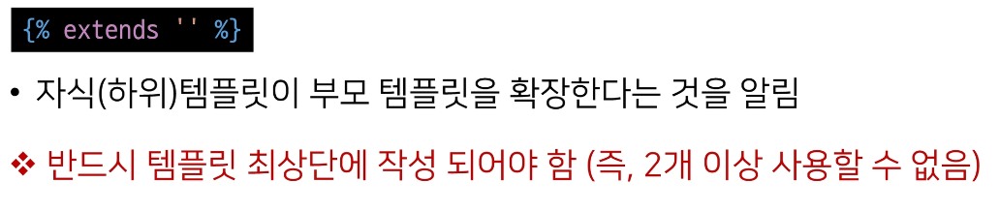

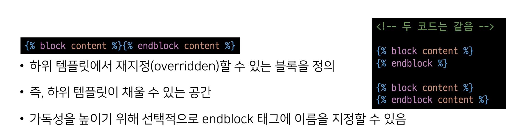

#### 템플릿 상속 예시

* base라는 이름의 skeleton 템플릿을 작성

* Bootstrap CDN 작성

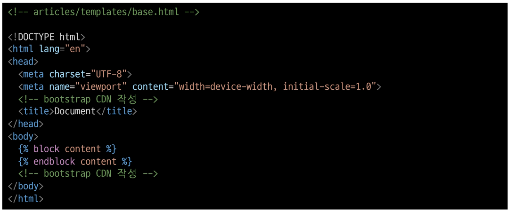

* index 템플릿에서 base 템플릿을 상속받음

* Bootstrap이 적용되었는지 확인

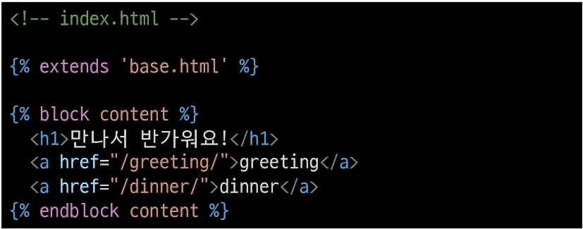

#### 추가 템플릿 경로 추가하기

* base.html의 위치를 앱 안의 template 디텍토리가 아닌 프로젝트 최상단의 templates 디텍토리 안에 위치하고 싶다면 어떻게 해야 할까?

* 기본 templates 경로가 아닌 다른 경로를 추가하기위해 다음과 같은 코드를 작성

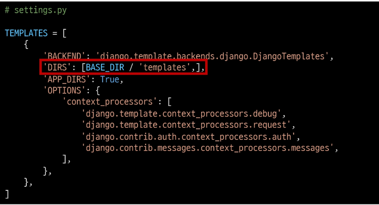

* app_name/templates/ 디텍토리 경로 외 추가 경로를 설정한 것

* base.html의 위치를 다음과 같이 이동 후 상속에 문제가 없는지 확인

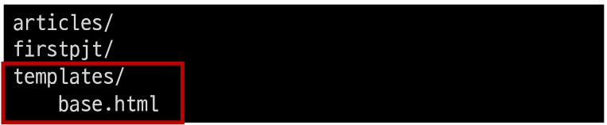

#### [참고] BASE_DIR

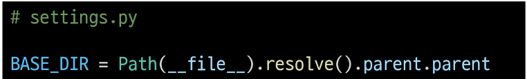

* settings.py에서 특정 경로를 절대 경로로 편하게 작성할 수 있도록 Django에서 미리 지정해둔 경로 값

* "객체 지향 파일 시스템 경로"
  
  * 운영체제별로 파일 경로 표기법이 다르기 때문에 어떤 운영체제에서 실행되더라도 각 운영체제 표기법에 맞게 해석될 수 있도록 하기 위해 사용
  
  * 자세한 내용은 공식문서에서 확인하기
  
  * https://docs.python.org/ko/3.9/library/pathlib.html#module-pathlib

---

## Sending and Retrieving form data

---

## Sending and Retrieving form data

* "데이터를 보내고 가져오기"

* HTML form element를 통해 사용자와 애플리케이션 간의 상호작용 이해하기

#### client & Server architecture

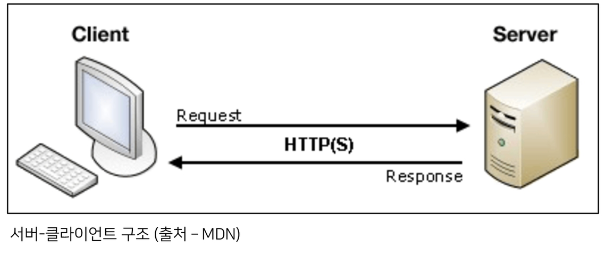

* 웹은 다음과 같이 가장 기본적으로 클라이언트-서버 아키텍처를 사용
  
  * 클라이언트(일반적으로 웹 브라우저)가 서버에 요청을 보내고, 서버는 클라이언트의 요청에 응답

* 클라이언트 측에서 HTML form은 HTTP 요청을 서버에 보내는 가장 편리한 방법

* 이를 통해 사용자는 HTTP 요청에서 전달할 정보를 제공할 수 있음

---

## Sending form data(Client)

---

#### HTML ``<form>``  element

* 데이터가 전송되는 방법을 정의

* 웹에서 사용자 정보를 입력하는 여러 방식(text, button, submit 등)을 제공하고, <mark>사용자로부터 할당된 데이터를 서버로 전송</mark>하는 역할을 담당

* "데이터를 어디(action)로 어떤 방식(method)으로 보낼지"

* 핵심 속성
  
  * action
  
  * method

#### HTML form's attributes

##### 1. action

* 입력 데이터가 전송될 URL을 지정

* 데이터를 어디로 보낼 것인지 지정하는 것이며 이 값은 반드시 유효한 URL이어야 함

* 만약 이 속성을 지정하지 않으면 데이터는 현재 form이 있는 페이지의 URL로 보내짐

##### 2. method

* 데이터를 어떻게 보낼 것인지 정의

* 입력 데이터의 HTTP request methods를 지정

* HTML form 데이터는 오직 2가지 방법으로만 전송 할 수 있는데 바로 GET 방식과 POST 방식

#### HTML `<form>` element 작성

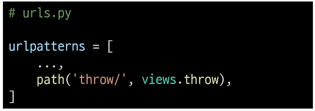

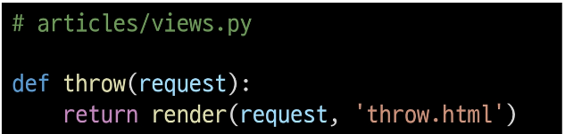

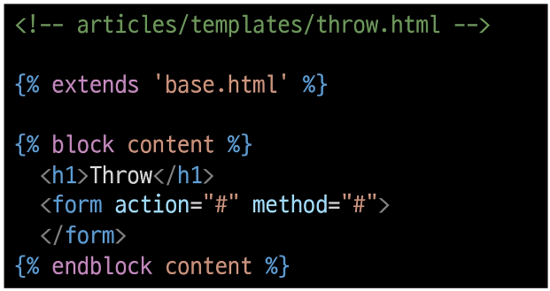

#### HTML `<input>` element

* 사용자로부터 데이터를 입력 받기 위해 사용

* "type" 속성에 따라 동작 방식이 달라진다.
  
  * input 요소의 동작 방식은 type 특성에 따라 현격히 달라지므로 각각의 type은 별도로 MDN 문서에서 참고하여 사용하도록 함
  
  * type을 지정하지 않은 경우, 기본값은 "text"

* 핵심 속성
  
  * name

#### HTML input's attribute

* name
  
  * form을 통해 데이터를 제출(submit)했을 때 name 속성에 설정된 값을 서버로 전송하고, 서버는 name 속성에 설정된 값을 통해 사용자가 입력한 데이터 값에 접근할 수 있음
  
  * 주요 용도는 GET/POST 방식으로 서버에 전달하는 파라미터(name은 key, value는 value)로 매핑하는 것
    
    * GET 방식에서는 URL에서 '?key=value&key=value/' 형식으로 데이터를 전달

#### HTML `<input>` element 작성

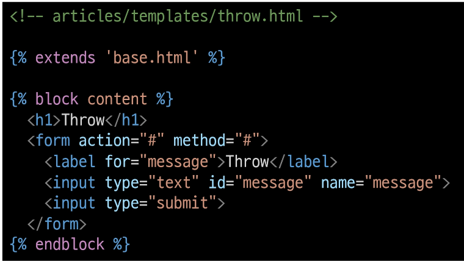

#### HTTP request methods

* HTTP
  
  * HTML 문서와 같은 리소스(데이터, 자원)들을 가져올 수 있도록 해주는 프로토콜(규칙, 규약)

* 웹에서 이루어지는 모든 데이터 교환의 기초

* HTTP는 주어진 리소스가 수행 할 원하는 작업을 나타내는 request methods를 정의

* 자원에 대한 행위(수행하고자 하는 동작)을 정의

* 주어진 리소스(자원)에 수행하길 원하는 행동을 나타냄

* HTTP Method 예시
  
  * GET, POST, PUT, DELETE

* GET이 아닌 다른 method는 추후 다시 알아볼 예정

#### GET

* 서버로부터 정보를 조회하는 데 사용
  
  * 즉, 서버에게 리소스를 요청하기 위해 사용

* 데이터를 가져올 때만 사용해야 함

* 데이터를 서버로 전송할 때 Query String Parameters를 통해 전송
  
  * 데이터는 URL에 포함되어 서버로 보내짐

#### GET 메서드 작성

* GET과 get 모두 대소문자 관계없이 동일하게 동작하지만 명시적 표현을 위해 대문자 사용을 권장

* 데이터를 입력 후 submit 버튼을 누르고 URL의 변화를 확인한다.

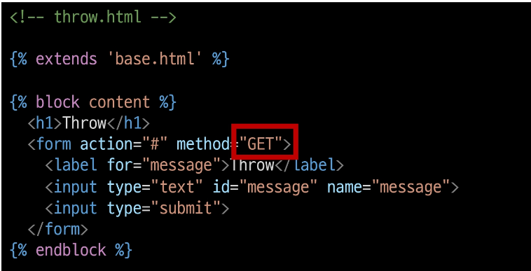

#### Query String Parameters

* 사용자가 입력 데이터를 전달하는 방법 중 하나로, url 주소에 데이터를 파라미터를 통해 넘기는 것

* 이러한 무낮열은 앰퍼샌드(&)로 연결된 key=value 쌍으로 구성되며 기본 URL과 물음표(?)로 구분됨
  
  * 예시
    
    * http://host:port/path<mark>?key=value&key=value</mark>

* Query String 이라고도 함

* 정해진 주소 이후에 물음표를 쓰는 것으로 Query String이 시작함을 알림

* "key=value"로 필요한 파라미터의 값을 적음
  
  * "="로 key와 value가 구분됨

* 파라미터가 여러 개일 경우 "&"를 붙여 여러 개의 파라미터를 넘길 수 있음

* 그런데 아직 어디로 보내야(action) 할 지 작성하지 않았다.

---

## Retrieving the data (Server)

---

#### Retrieving the data (Server)

* "데이터 가져오기(검색하기)"

* 서버는 클라이언트로 받은 key-value 쌍의 목록과 같은 데이터를 받게 됨

* 이러한 목록에 접근하는 방법은 사용하는 특정 프레임워크에 따라 다름

* 우리는 Django 프레임워크에서 어떻게 데이터를 가져올 수 있을지 알아볼 것
  
  * throw가 보낸 데이터를 catch에서 가져오기

#### catch 작성

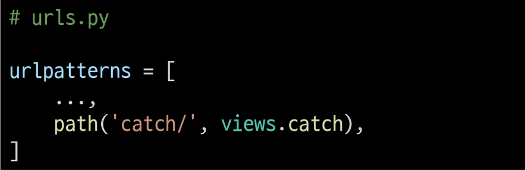

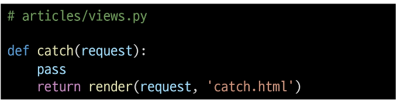

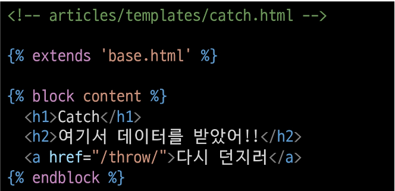

#### action 작성

* throw 페이지에서 form의 action 부분을 마저 작성하고 데이터를 보낸다.

* 실습 편의를 위해 index 페이지에 throw 하이퍼 링크를 작성한다.

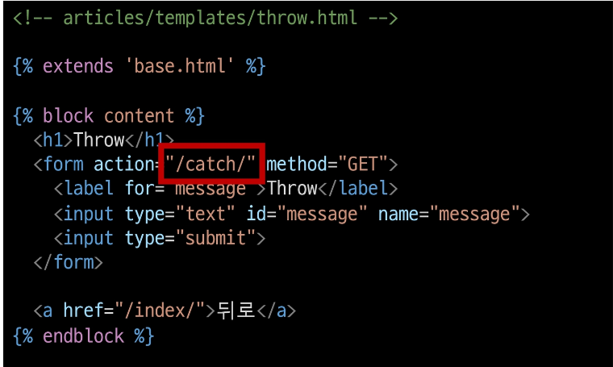

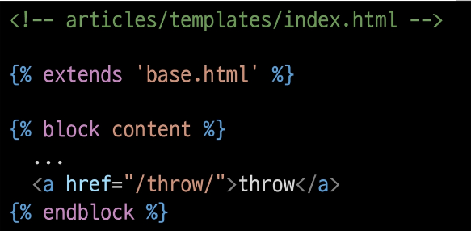

#### 데이터 가져오기

* catch 페이지가 잘 응답되어 출력됨을 확인

* 그런데 throw 페이지의 form이 보낸 데이터는 어디에 들어 있는걸까?
  
  * catch 페이지의 url 확인 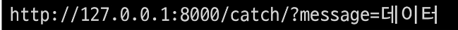
  
  * GET method로 보내고 있기 때문에 데이터를 서버로 전송할 때 Query String Parameters를 통해 전송
  
  * 즉, 데이터는 URL에 포함되어 서버로 보내짐

* 그러면 우리가 작성해야 하는 view 함수에서는 해당 데이터에 어떻게 접근 가능할까?

* "모든 요청 데이터는 view 함수의 첫번째 인자 <mark>request</mark>에 들어있다."

* request가 어떤 객체인지 확인해보기

#### request 객체 살펴보기

* print를 통해 살펴보기

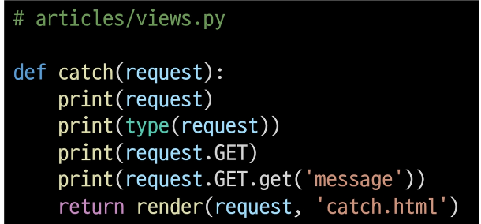

* 출력 결과

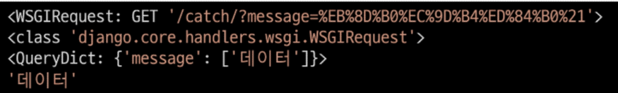

* 에러를 강제로 발생시켜 에러 페이지 하단에서 살펴보기

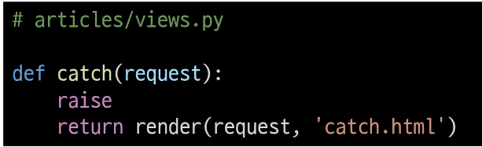

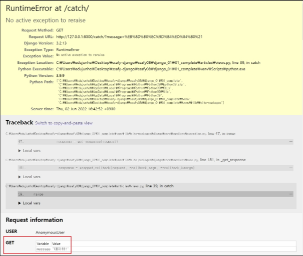

#### catch 작성 마무리

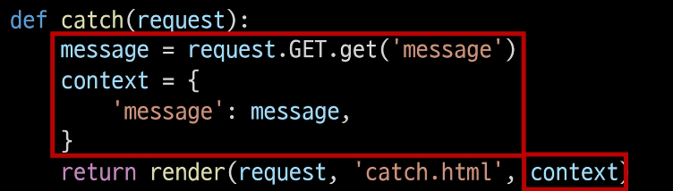

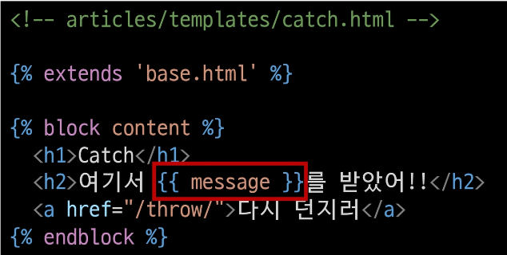

* 데이터를 보낸 후 결과 확인

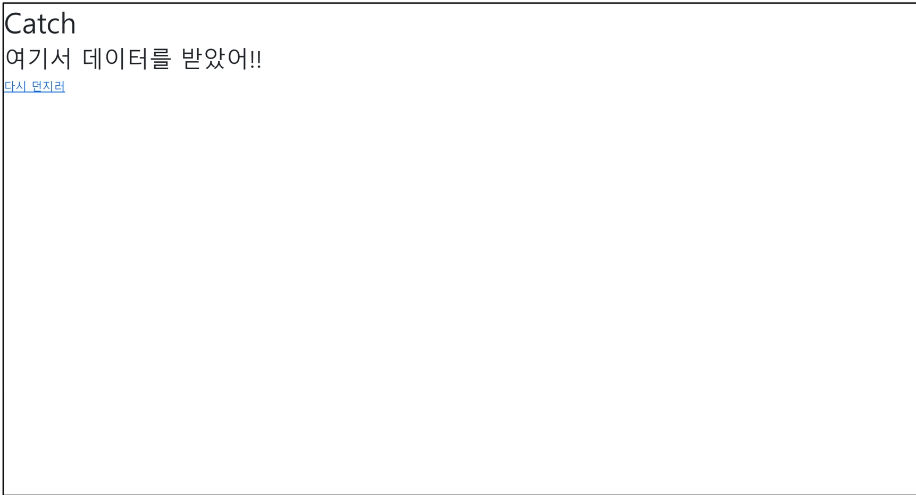

#### Request and Response objects

* 요청과 응답 객체 흐름
  
  1. 페이지가 요청되면 Django는 요쳥에 대한 메타데이터를 포함하는 HttpRequest object를 생성
  
  2. 그리고 해당하는 적절한 view 함수를 로드하고 HttpRequest를 첫번째 인자로 전달
  
  3. 마지막으로 view 함수는 HttpResponse object를 반환

---

## Django URLs

---

#### Django URLs

* "Dispatcher(운행 관리원)로서의 URL 이해하기"

* 웹 어플리케이션은 URL을 통한 클라이언트의 요청에서부터 시작함

---

## Trailing URL Slashes

---

#### Trailing Slashes

* Django는 URL 끝에 / 가(Trailing slash) 없다면 자동으로 붙여주는 것이 기본 설정
  
  * 그래서 모든 주소가 '/'로 끝나도록 구성 되어있음
  
  * 그러나 모든 프레임워크가 이렇게 동작하는 것은 아님

* Django의 url 설계 철학을 통해 먼저 살펴보면 다음과 같이 설명함
  
  "기술적인 측면에서, foo.com/bar와 foo.com/bar/는 서로 다른 URL이다."
  
  * 검색 엔진 로봇이나 웹 트래픽 분석 도구에서는 그 둘을 서로 다른 페이지로 봄
  
  * 그래서 Django는 URL을 정규화하여 검색 엔진 로봇이 혼동하지 않게 해야 함

#### [참고] URL 정규화

* 정규 URL(=오리지널로 평가되어야 할 URL)을 명시하는 것

* 복수의 페이지에서 같은 콘텐츠가 존재하는 것을 방지하기 위함

* "Django에서는 trailing slash가 없는 요청에 대해 자동으로 slash를 추가하여 통합된 하나의 콘텐츠로 볼 수 있도록 한다."

---

## Variable routing

---

#### Variable routing의 필요성

* 템플릿의 많은 부분이 중복되고, 일부분만 변경되는 상황에서 비슷한 URL과 템플릿을 계속해서 만들어야 할까?

#### Variable routing

* URL 주소를 변수로 사용하는 것을 의미

* URL의 일부를 변수로 지정하여 view 함수의 인자로 넘길 수 있음

* 즉, 변수 값에 따라 하나의 path()에 여러 페이지를 연결 시킬 수 있음

#### Variable routing 작성

* 변수는 "<>"에 정의하며 view 함수의 인자로 할당됨

* 기본 타입은 string 이며 5가지 타입으로 명시할 수 있음
  
  1. str
     
     * '/'를 제외하고 비어 있지 않은 모든 문자열
     
     * 작성하지 않을 경우 기본 값
  
  2. int
     
     * 0 또는 양의 정수와 매치
  
  3. slug
  
  4. uuid
  
  5. path

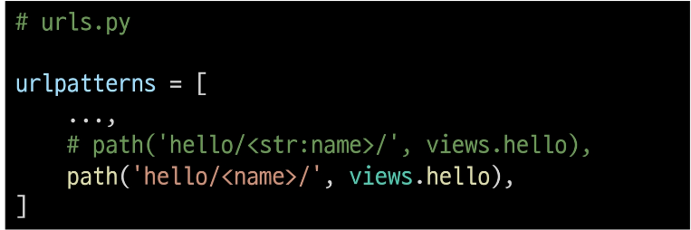

#### View 함수 작성

* variable routing으로 할당된 변수를 인자로 받고 템플릿 변수로 사용할 수 있음

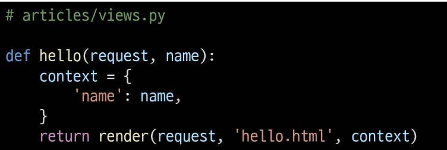


#### [참고] Routing(라우팅)

* 어떤 네트워크 안에서 통신 데이터를 보낼 때 최적의 경로를 선택하는 과정을 뜻함

---

## App URL mapping

---

#### App URL mapping

* 앱이 많아졌을 때 urls.py를 각 app에 매핑하는 방법을 이해하기

* 두번째 app인 pages를 생성 및 등록 하고 진행

* app의 view 함수가 많아지면서 사용하는 path() 또한 많아지고, app 또한 더 많이 작성되기 때문에 프로젝트의 urls.py에서 모두 관리하는 것은 프로젝트 유지보수에 좋지 않음

* 각 앱의 view 함수를 다른 이름으로 import할 수 있음

* 이렇게도 가능하지만.. 더 좋은 방법은..?

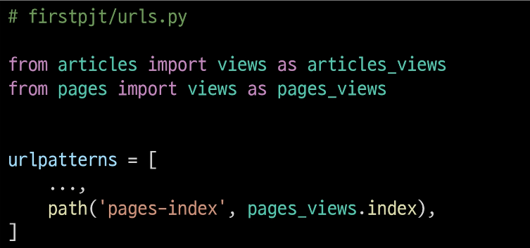

* 하나의 프로젝트의 여러 앱이 존재한다면, 각각의 앱 안에 urls.py을 만들고 프로젝트 urls.py에서 각 앱의 urls.py 파일로 URL 매핑을 위탁할 수 있음

* 각각의 app 폴더 안에 urls.py를 작성하고 다음과 같이 수정 진행

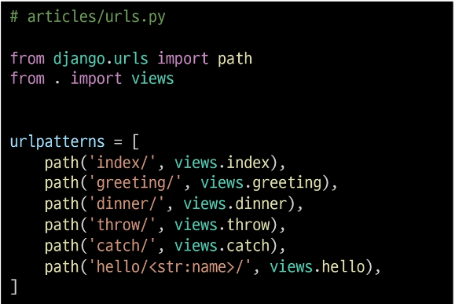

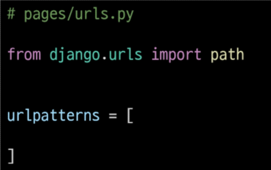

#### Including other URLconfs

* urlpattern은 언제든지 다른 URLconf 모듈을 포함(include)할 수 있음

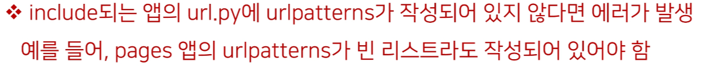

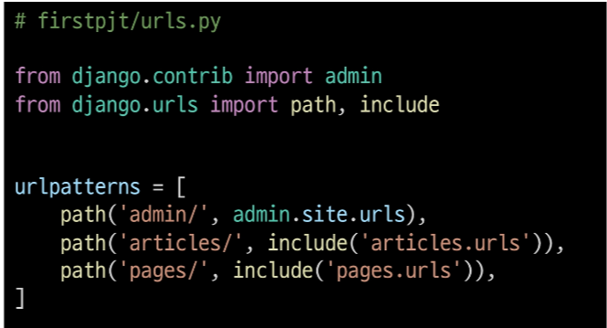

* 이제 메인 페이지의 주소는 이렇게 바뀌었음

* http://127.0.0.1:8000/index/
  
  -> http://128.0.0.1:8000/articles/index/

#### include()

* 다른 URLconf(app1/urls.py)들을 참조할 수 있도록 돕는 함수

* 함수 include()를 만나게 되면 URL의 그 시점까지 일치하는 부분을 잘라내고, 남은 문자열 부분을 후속 처리를 위해 include된 URLconf로 전달

#### URL 구조의 변화

* 앱의 URL을 project의 urls.py에서 관리

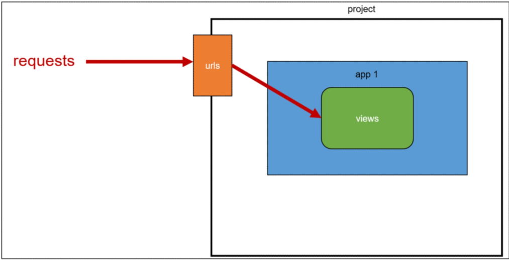

* 복수 개의 앱을 URL을 project의 urls.py에서 관리

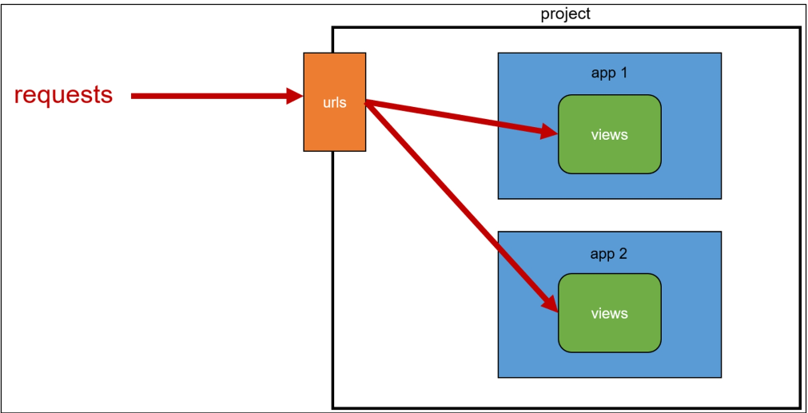

* 각각의 앱에서 URL을 관리

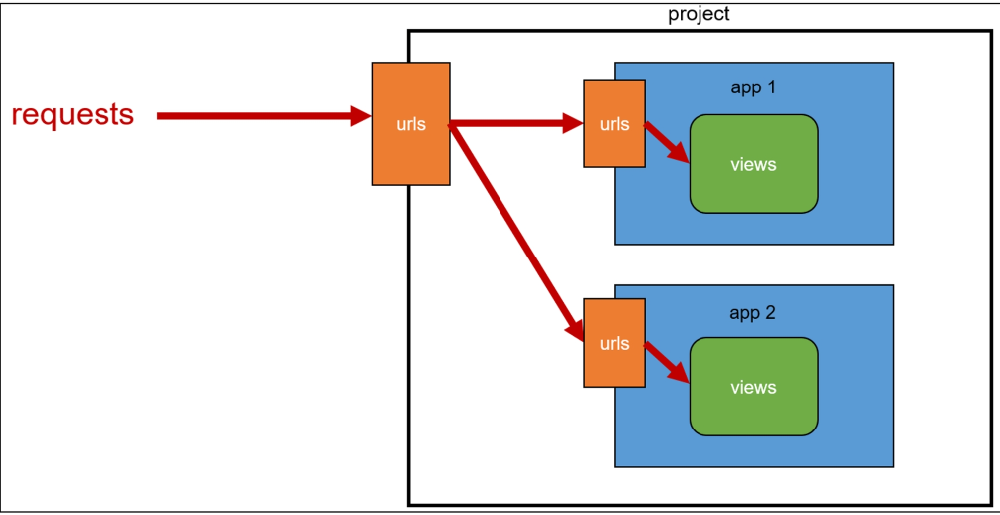

---

## Naming URL patterns

---

#### Naming URL patterns의 필요성

* 만약 "index/"의 문자열 주소를 "new-index/"로 바꿔야 한다고 가정해보자

* 그렇다면 "index/" 주소를 사용했떤 모든 곳을 찾아서 변경해야 하는 번거로움이 발생함

#### Naming URL patterns

* 이제는 링크에 URL을 직접 작성하는 것이 아니라 "path()" 함수의 name 인자를 정의해서 사용

* DTL의 Tag 중 하나인 URL 태그를 사용해서 "path()" 함수에 작성한 name을 사용할 수 있음

* 이를 통해 URL 설정에 정의된 특정한 경로들의 의존성을 제거할 수 있음

* Django는 URL에 이름을 지정하는 방법을 제공함으로써 view 함수와 템플릿에서 특정 주소를 쉽게 참조할 수 있도록 도움

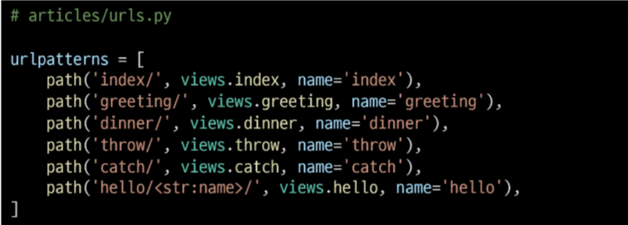

#### Built-in tag-"url"

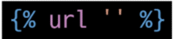

* 주어진 URL 패턴 이름 및 선택적 매개 변수와 일치하는 절대 경로 주소를 반환

* 템플릿에 URL을 하드 코딩하지 않고도 DRY 원칙을 위반하지 않으면서 링크를 출력하는 방법

#### url 태그 사용하기

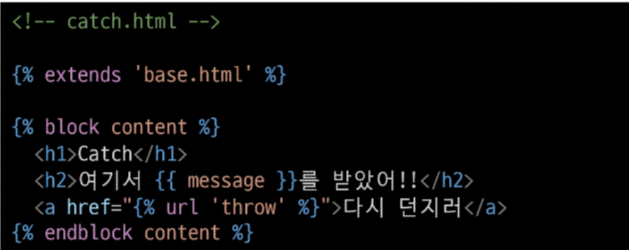

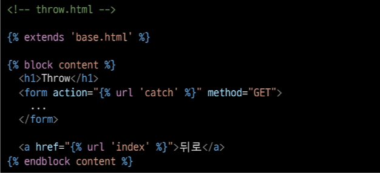

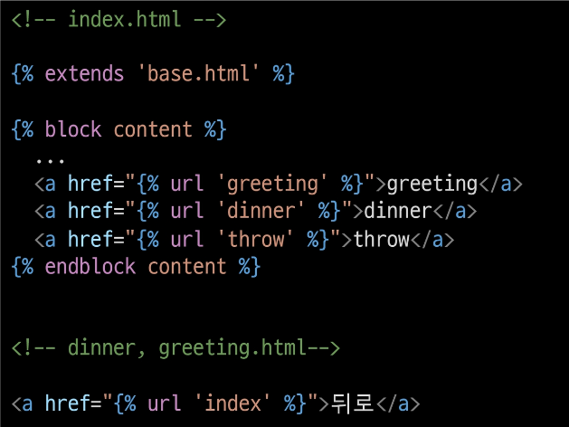

#### url 태그 출력 확인하기

* 마지막으로 개발자 도구를 통해 url 태그가 URL 패턴 이름과 일치하는 절대 경로 주소를 반환하는 것을 확인해보기

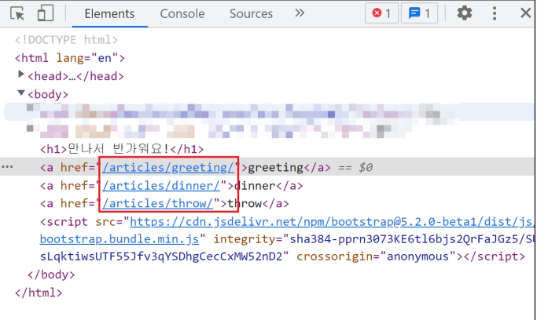

#### [참고] DRY 원칙

* Don't Repeat Yourself의 약어

* 더 품질 좋은 코드를 작성하기 위해서 알고, 따르면 좋은 소프트웨어 원칙들 중 하나로 "소스 코드에서 동일한 코드를 반복하지 말자" 라는 의미

* 동일한 코드가 반복된다는 것은 잠재적인 버그의 위협을 증가 시키고 반복되는 코드를 변경해야 하는 경우, 반복되는 모든 코드를 찾아서 수정해야 함

* 이는 프로젝트 규모가 커질수록 애플리케이션의 유지 보수 비용이 커짐

---

## 마무리

---

#### Django의 설계 철학

1. "표현과 로직(view)을 분리"
   
   * 템플릿 시스템은 표현을 제어하는 도구이자 표현에 관련된 로직일 뿐
   
   * 즉, 템플릿 시스템은 이러한 기본 목표를 넘어서는 기능을 지원하지 말아야 함

2. "중복을 배제"
   
   * 대다수의 동적 웹사이트는 공통 header, footer, navbar 같은 사이트 공통 디자인을 갖음
   
   * Django 템플릿 시스템은 이러한 요소를 한 곳에 저장하기 쉽게 하여 중복 코드를 없애야 함
   
   * 템플릿 상속의 기초가 되는 철학

#### Framework의 성격

* 독선적
  
  * 독선적인 프레임워크들은 어떤 특정 작업을 다루는 '올바른 방법'에 대한 분명한 의견(규약)을 가지고 있음
  
  * 대체로 특정 문제내에서 빠른 개발방법을 제시
  
  * 어떤 작업에 대한 올바른 방법이란 보통 잘 알려져 있고 문서화가 잘 되어있기 때문
  
  * 하지만 주요 상황을 벗어난 문제에 대해서는 그리 유연하지 못한 해결책을 제시할 수 있음

* 관용적
  
  * 관용적인 프레임워크들은 구성요소를 한데 붙여서 해결해야 한다거나 심지어 어떤 도구를 써야 한다는 '올바른 방법'에 대한 제약이 거의 없음
  
  * 이는 개발자들이 특정 작업을 완수하는데 가장 적절한 도구들을 이용할 수 있는 자유도가 높음
  
  * 하지만 개발자 스스로가 그 도구들을 찾아야 한다는 수고가 필요

#### Django Framework의 성격

* '다소 독선적'
  
  * 양쪽 모두에게 최선의 결과를 준다고 강조

* 결국 하고자 하는 말은 현대 개발에 있어서는 가장 중요한 것들 중 하나는 **'생산성'**

* 프레임워크는 우리가 하는 개발을 방해하기 위해 규칙, 제약을 만들어 놓은 것이 아님

* 우리가 온전히 만들고자 하는 것에만 집중할 수 있게 도와주는 것

* "수레바퀴를 다시 만들지 말라."
