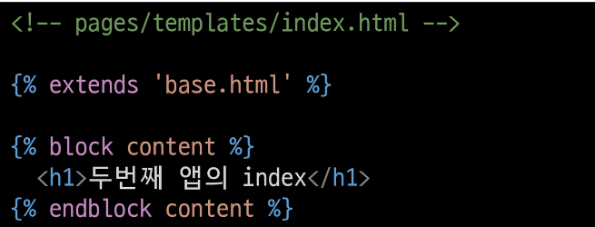
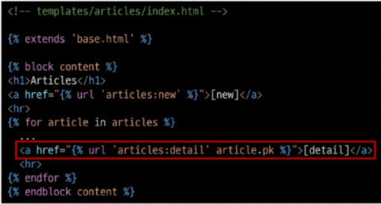
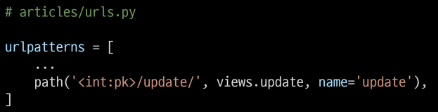

# Django

---

## 목차

* Namespae

* Django Model

* Queryset API

* CRUD with view functions

* Admin site

---

## Namespace

---

#### 개요

* 개체를 구분할 수 있는 범위를 나타내는 namespace(이름 공간)에 대한 이해

#### Namespace의 필요성

* 두번째 app pages의 index 페이지를 작성해보고 어떤 문제가 발생하는지 확인해보기





#### 2가지 문제 발생

1. articles app index 페이지에 작성한 두번째 앱 index로 이동하는 하이퍼 링크를 클릭 시 현재 페이지로 다시 이동
   
   * URL namespace

2. pages app의 index url (http:/127.0.0.1:8000/pages/index/)로 직접 이동해도 articles app의 index 페이지가 출력됨
   
   * Template namespace

---

## URL namespace

---

#### 개요

* URL namespace를 사용하면 서로 다른 앱에서 동일한 URL 이름을 사용하는 경우에도 이름이 지정된 URL을 고유하게 사용 할 수 있음

* app_name attribute를 작성해 URL namespace를 설정


#### URL tag의 변화


#### 기존 URL tag 변경


#### URL 참조

* " : " 연산자를 사용하여 지정
  
  * 예를 들어, app_name 이 articles이고 URL name이 index인 주소 참조는 <u>articles:index</u>가 됨

---

## Template namespace

---

#### 개요

* Django는 기본적으로 <mark>app_name/templates/</mark> 경로에 있는 templates 파일들만 찾을 수 있으며, settings.py의 INSTALLED_APPS에 작성한 app 순서로 template을 검색 후 렌더링 함

* 바로 이 속성 값이 해당 경로를 활성화하고 있음


#### 디텍토리 생성을 통해 물리적인 이름공간 구분

* Django templates의 기본 경로에 app과 같은 이름의 폴더를 생성해 폴더 구조를 <mark>app_name/templates/app_name/</mark> 형태로 변경

* Django templates의 기본 경로 자체를 변경할 수는 없기 때문에 물리적으로 이름 공간을 만드는 것


#### 템플릿 경로 변경

* 폴더 구조 변경 후 변경된 경로로 해당하는 모든 부분을 수정하기


#### 반드시 Template namespace를 고려해야 할까?

* 만약 단일 앱으로만 이루어진 프로젝트라면 상관없음

* 여러 앱이 되었을 때에도 템플릿 파일 이름이 겹치지 않게 하면 되지만, 앱이 많아지면 대부분은 같은 이름의 템플릿 파일이 존재하기 마련

---

## Django Model

---

#### 개요

* Model(이하 모델)의 핵심 개념과 ORM을 통한 데이터베이스 조작 이해

* Django는 웹 애플리케이션의 데이터를 구조화하고 조작하기 위한 추상적인 계층(모델)을 제공

---

## Database

---

#### Database

* 체계화된 데이터의 모임

* 검색 및 구조화 같은 작업을 보다 쉽게 하기 위해 조직화된 데이터를 수집하는 저장 시스템

* Database의 가장 기초적인 키워드에 대해 알아보고 자세한 내용은 추후 Database 시간에 다룰 예정

#### Database 기본 구조

1. 스키마(Schema)

2. 테이블(Table)

#### 

#### 스키마

* 뼈대(Structure)

* 데이터베이스에서 자료의 구조, 표현 방법, 관계 등을 정의한 구조


#### 테이블

* 필드와 레코드를 사용해 조직된 데이터 요소들의 집합

* 관계라고도 부름
1. 필드(field)
   
   * 속성, 컬럼(Column)

2. 레코드(record)
   
   * 튜플, 행(Row)


#### 필드

* 각 필드에는 고유한 데이터 형식이 지정됨
  
  * int, text 등


#### 레코드

* 테이블의 데이터는 레코드에 저장됨

* 예를 들어 해당 예시는 4명의 고객정보가 저장되어 있으며, 레코드는 4개가 존재


#### PK (Primary key)

* 기본 키

* 각 레코드의 고유한 값 (식별자로 사용)

* 기술적으로 다른 항목과 절대로 중복되어 나타날 수 없는 단일 값을 가짐

* 데이터베이스 관리 및 테이블 간 관계 설정 시 주요하게 활용 됨


#### PK 예시

* "주민등록번호"
  
  * 데이터베이스에 동일한 이름, 나이를 가진 사람들의 데이터는 존재할 수 있지만 각 사람들이 가진 주민등록번호는 절대 같을 수 없음
  
  * 즉, 주민등록번호는 그 사람을 나타내는 고유한 값으로써 사용할 수 있다는 것

#### 쿼리(Query)

* 데이터를 조회하기 위한 명령어를 일컬음

* 조건에 맞는 데이터를 추출하거나 조작하는 명령어
  
  (주로 테이블형 자료구조에서)

* "Query를 날린다"
  
  * "데이터베이스를 조작한다."

---

## Model

---

#### 개요

* Django는 Model을 통해 데이터에 접속하고 관리

* 단일한 데이터에 대한 정보를 가짐

* 사용자가 저장하는 데이터들의 필수적인 필드들과 동작들을 포함

* 저장된 데이터베이스의 구조 (layout)

* 일반적으로 각각의 모델은 하나의 데이터베이스 테이블에 매핑(mapping)
  
  * 모델 클래스 1개 == 데이터베이스 테이블 1개

* Model을 통해 데이터 관리


#### [참고] 매핑

* Mapping

* 하나의 값을 다른 값으로 대응시키는 것

#### Model 작성하기

* 새 프로젝트(crud), 앱(articles) 작성 및 앱 등록


* model.py 작성
  
  * 모델 클래스를 작성하는 것은 데이터베이스 <mark>테이블의 스키마를 정의</mark>하는 것
  
  * "모델 클래스 == 테이블 스키마"


#### Model 이해하기


* 각 모델은 django.models.Model 클래스의 서브 클래스로 표현됨
  
  * 즉, 각 모델은 django.db.models 모듈의 Model 클래스를 상속받아 구성됨
  
  * <mark>클래스 상속 기반 형태의 Django 프레임워크 개발</mark>
    
    * 프레임워크에서는 잘 만들어진 도구를 가져다가 잘 쓰는 것


* models 모듈을 통해 어떠한 타입의 DB 필드(컬럼)을 정의할 것인지 정의
  
  * 클래스 변수 title과 content은 DB 필드를 나타냄


1. 클래스 변수(속성)명
   
   * DB 필드의 이름


2. 클래스 변수 값 (models 모듈의 Field 클래스)
   
   * DB 필드의 데이터 타입

#### Django Model Field

* Django는 모델 필드를 통해 테이블의 필드(컬럼)에 저장할 데이터 유형 (INT, TEXT 등)을 정의

* 데이터 유형에 따라 다양한 모델 필드를 제공
  
  * DataField(), CharField(), IntergerField() 등
  
  * https://docs.djangoproject.com/en/3.2/ref/models/fields/

#### 사용한 모델 필드 알아보기

* CharField(max_length=None, **options)
  
  * 길이의 제한이 있는 문자열을 넣을 때 사용
  
  * <mark>max_length</mark>
    
    * 필드의 최대 길이(문자)
    
    * CharField의 필수 인자
    
    * 데이터베이스와 Django의 <mark>유효성 검사(값을 검증하는 것)</mark>에서 활용됨

* TextField(**options)
  
  * <u>글자의 수가 많을 때 사용</u>
  
  * max_length 옵션 작성 시 사용자 입력 단계에서는 반영 되지만, 모델과 데이터베이스 단계에는 적용되지 않음 (charField를 사용해야 함)
    
    * <u>실제로 저장될 때 길이에 대한 <mark>유효성을 검증하지 않음</mark></u>

#### 데이터베이스 스키마

* 지금까지 작성한 models.py는 다음과 같은 데이터베이스 스키마를 설계한 것

* 이제 데이터베이스에 테이블을 생성하기 위한 <mark>설계도</mark> 작성이 필요함


---

## Migrations

---

#### 개요

* 모델에 대한 청사진(blueprint)을 만들고 이를 통해 테이블을 생성하는 일련의 과정

* Django가 모델에 생긴 변화(필드 추가, 모델 삭제 등)를 DB에 반영하는 방법

#### Migrations 관련 주요 명령어

1. makemigrations

2. migrate

#### makemigrations

* 모델을 작성 혹은 변경한 것에 기반한 새로운 migration(설계도, 청사진 이하 마이그레이션)을 만들 때 사용

* "테이블을 만들기 위한 설계도를 생성하는 것"


* 명령어 실행 후 migrations/0001_initial.py가 생성된 것을 확인

* "파이썬으로 작성된 설계도"

#### migrate

* makemigrations로 만든 설계도를 실제 db.sqlite3 DB 파일에 반영하는 과정

* 결과적으로 모델에서의 변경사항들과 DB의 스키마가 동기화를 이룸
  
  * "모델과 DB의 동기화"


* 설계도(migration)를 실제 db.sqlite3 DB 파일에 반영


#### [참고] Migrations 기타 명령어

##### 1. showmigrations

* migrations 파일들이 migrate 됐는지 안됐는지 여부를 확인하는 용도

* X 표시가 있으면 migrate가 완료되었음을 의미


##### 2. sqlmigrate

* 해당 migrations 파일이 SQL 문으로 어떻게 해석 될 지 미리 확인 할 수 있음


#### 설계도는 어떻게 해석할까

* makemigrations로 인해 만들어진 설계도는 파이썬으로 작성되어있음

* 그런데 SQL만 알아 들을 수 있다는 DB가 어떻게 이 설계도를 이해하고 동기화를 이룰 수 있을까?

* 바로 이 과정에서 중간에 해석을 담당하는 것이 <mark>ORM</mark>

---

## ORM

---

#### 개요

* Object-Relational-Mapping

* 객체 지향 프로그래밍 언어를 사용하여 호환되지 않는 유형의 시스템 간에 (Django <-> SQL)데이터를 변환하는 프로그래밍 기술

* 객체 지향 프로그래밍에서 데이터베이스를 연동할 때, 데이터베이스와 객체 지향 프로그래밍 언어 간의 호환되지 않는 데이터를 변환하는 프로그래밍 기법

* Django는 내장 Django ORM을 사용

#### ORM 예시


#### ORM 장단점

* 장점
  
  * SQL을 잘 알지 못해도 객체지향 언어로 DB 조작이 가능
  
  * 객체 지향적 접근으로 인한 높은 생산성

* 단점
  
  * ORM 만으로 완전한 서비스를 구현하기 어려운 경우가 있음

#### ORM을 사용하는 이유

* <mark>"생산성"</mark>

* 현시대 개발에서 가장 중요한 키워드는 바로 생산성

* 우리는 DB를 객체(object)로 조작하기 위해 ORM을 사용할 것

---

## 추가 필드 정의

---

#### Model 변경사항 반영하기

* models.py에 변경사항이 생겼을 때 어떤 과정의 migration이 필요할까?

* 추가 모델 필드 작성 후 다시 한번 makemigrations 진행


* 기존에 id, title, content 컬럼을 가진 테이블에 2개의 컬럼이 추가되는 상황

* Django 입장에서는 이미 존재하는 테이블에 새로운 컬럼이 추가되는 요구 사항을 받았는데, 이 컬럼들은 기본적으로 빈값으로 추가될 수 없음
  
  * 그래서 Django는 우리에게 추가되는 컬럼에 대한 기본 값을 설정해야 하니 어떻게 어떤 값을 설정할 것인지를 물어보는 과정을 진행


* 각 보기 번호의 의미
  
  * 1. 다음 화면으로 넘어가서 새 컬럼의 기본 값을 직접 입력하는 방법
  
  * 2. 현재 과정에서 나가고 모델 필드에 default 속성을 직접 작성하는 방법

* "1"을 입력 후 Enter (reated_at 필드에 대한 default 값 설정)


* 다음 화면에서 아무것도 입력하지 않고 Enter를 입력하면 Django에서 기본적으로 파이썬의 timezone 모듈의 now 메서드 반환 값을 기본 값으로 사용하도록 해줌


* 새로운 설계도(마이그레이션 파일)가 만들어 진 것을 확인


* 새로운 설계도를 생성했기 때문에 DB와 동기화를 진행해야 함
  
  (아직 DB에는 변경사항이 반영하지 않았기 때문)


---

## 추가 필드 정의

---

#### 반드시 기억해야 할 migration 3단계

1. models.py 에서 변경사항이 발생하면

2. migrations 파일 생성 (설계도 생성)
   
   * makemigrations

3. DB 반영 (모델과 DB의 동기화)
   
   * migrate

#### DataTimeField()

* python의 datetime.datetime 인스턴스로 표시되는 날짜 및 시간을 값으로 사용하는 필드

* DateField를 상속받는 클래스

* 선택 인자
  
  1. auto_now_add
     
     * 최소 생성 일자 (Useful for creation of timestamps)
     
     * Django ORM이 최초 insert(테이블에 데이터 입력)시에만
       
       현재 날짜와 시간으로 갱신(테이블에 어떤 값을 최초로 넣을 때)
  
  2. auto_now
     
     * 최종 수정 일자(Useful for "last-modified" timestamps)
     
     * Django ORM이 save를 할 때마다 현재 날짜와 시간으로 갱신

#### Model 정리

* "웹 애플리케이션의 데이터를 <mark>구조화</mark>하고 <mark>조작</mark>하기 위한 도구"

---

## 사전 준비

---

#### 외부 라이브러리 설치 및 설정

* 실습 편의를 위한 추가 라이브러리 설치 및 설정


* 패키지 목록 업데이트


#### [참고] IPython & django-extensions

* IPython
  
  * 파이썬 기본 쉘보다 더 강력한 파이썬 쉘
  
  * django-extensions

* django-extensions
  
  * Django 확장 프로그램 모음
  
  * shell_plus, graph model 등 다양한 확장 기능 제공

#### [참고] Shell

* 운영체제 상에서 다양한 기능과 서비스를 구현하는 인터페이스를 제공하는 프로그램

* 셸(껍데기)은 사용자와 운영체제의 내부사이의 인터페이스를 감싸는 층이기 때문에 그러한 이름이 붙음

* "사용자 <-> 셸 <-> 운영체제"

#### [참고] Python Shell

* 파이썬 코드를 실행해주는 인터프리터
  
  * 인터프리터 : 코드를 한 줄 씩 읽어 내려가며 실행하는 프로그램

* 인터렉티브 혹은 대화형 shell 이라고 부름

* Python 명령어를 실행하여 그 결과를 바로 제공


#### Django shell

* ORM 관련 구문 연습을 위해 파이썬 쉘 환경을 사용

* 다만 일반 파이썬 쉘을 통해서는 장고 프로젝트 환경에 영향을 줄 수 없기 때문에 Django환경 안에서 진행할 수 있는 Django 쉘을 사용

* 원래는 다음과 같은 명령어를 통해 Django shell을 사용하지만

``python manage.py shell``

django-extension이 제공하는 더 강력한 shell_plus로 진행

``python manage.py shell_plus``

#### Django shell 실행


#### 첫 ORM 명령어 사용하기


---

## QuerySet API

---

#### Database API

* Django가 기본적으로 ORM을 제공함에 따른 것으로 DB를 편하게 조작할 수 있도록 도움

* Model을 만들면 Django는 객체들을 만들고 읽고 수정하고 지울 수 있는 DB API를 자동으로 만듦


#### "objects" manager

* Django 모델이 데이터베이스 쿼리 작업을 가능하게 하는 인터페이스

* Django는 기본적으로 모든 Django 모델 클래스에 대해 objects라는 Manager 객체를 자동으로 추가함

* 이 Manager(objects)를 통해 특정 데이터를 조작(메서드)할 수 있음

* <mark>"DB를 Python class로 조작할 수 있도록 여러 메서드를 제공하는 manager"</mark>

#### Query

* 데이터베이스에 특정한 데이터를 보여 달라는 요청
  
  * "쿼리문을 작성한다."
    
    -> 원하는 데이터를 얻기 위해 데이터베이스에 요청을 보낼 코드를 작성한다.

* 이 때, 파이썬으로 작성한 코드가 ORM의 의해 SQL로 변환되어 데이터베이스에 전달되며, 데이터베이스의 응답 데이터를 ORM이 <mark>QuerySet</mark>이라는 자료 형태로 변환하여 우리에게 전달

#### QuerySet

* DB 데이터를 담고 있는 <mark>유사 리스트</mark> (음수 인덱스는 사용X)

* 데이터베이스에게서 전달 받은 객체 목록(데이터 모음)
  
  * 순회가 가능한 데이터로써 1개 이상의 데이터를 불러와 사용할 수 있음

* Django ORM을 통해 만들어진 자료형이며, <mark>필터</mark>를 걸거나 <u>정렬</u> 등을 수행할 수 있음

* "objects" manager를 사용하여 복수의 데이터를 가져오는 queryset method를 사용할 때 반환되는 객체

* 단, 데이터베이스가 단일한 객체를 반환 할 때는 QuerySet이 아닌 모델(Class)의 인스턴스로 반환됨 `.get()`

#### QuerySet API

* "QuerySet과 상호작용하기 위해 사용하는 도구 (메서드, 연산자 등)"


---

## QuerySet API 익히기

---

#### QuerySet API 익히기

* Queryset API를 활용해 데이터를 생성하고, 읽고, 수정하고 삭제해보기

#### CRUD

* Create / Read / Update / Delete
  
  * 생성 / 조회 / 수정 / 삭제

* 대부분의 컴퓨터 소프트웨어가 가지는 기본적인 데이터 처리 기능 4가지를 묶어서 일컫는 말

---

## CREATE

---

#### 데이터 객체를 만드는(생성하는) 3가지 방법

* 첫번째 방법
  
  1. article = Article()
     
     * 클래스를 통한 인스턴스 생성
  
  2. article.title
     
     * 클래스 변수명과 같은 이름의 인스턴스 변수를 생성 후 값 할당
  
  3. article.save()
     
     * 인스턴스로 save 메서드 호출

#### 첫번째 방법


* save 메서드를 호출해야 비로소 DB에 데이터가 저장된다. (레코드 생성)


#### 두번째 방법

* 인스턴스 생성 시 초기 값을 함께 작성하여 생성


#### 세번째 방법

* QuerySet API 중 create() 메서드 활용


#### <mark> .save()</mark>

* ."Saving object"

* 객체를 데이터베이스에 저장함

* 데이터 생성 시 save를 호출하기 전에는 개게의 id 값은 None
  
  * id 값은 Django가 아니라 데이터베이스에서 계산되기 때문

* 단순히 모델 클래스를 통해 인스턴스를 생성하는 것은 DB에 영향을 미치지 않기 때문에 반드시 save를 호출해야 테이블에 레코드가 생성됨

---

## READ

---

#### 개요

* QuerySet API method를 사용해 데이터를 다양하게 조회하기

* QuerySet API method는 크게 2가지로 분류됨
  
  1. Methods that "return new querysets"
  
  2. Methods that "do not return querysets"

#### all()

* QuerySet return

* 전체 데이터 조회


#### get()

* 단일 데이터 조회

* 객체를 찾을 수  없으면 DoesNotExist 예외를 발생시키고,
  
  둘 이상의 객체를 찾으면 MultipleObjectReturned 예외를 발생시킴

* 위와 같은 특징을 가지고 있기 때문에 primary key와 같이
  
  <mark>고유성(uniqueness)을 보장하는 조회에서 사용해야 함</mark>


#### filter()

* 지정된 조회 매개 변수와 일치하는 객체를 포함하는 새 QuerySet을 반환


#### Field lookups

* 특정 레코드에 대한 조건을 설정하는 방법

* QuerySet 메서드 ``filter()``, ``exclude()`` 및 ``get()``에 대한 키워드 인자로 지정됨

* 다양한 built-in lookups는 공식문서를 참고
  
  * https://docs.djangoproject.com/en/3.2/ref/models/querysets/#field-lookups


#### 실습


---

## Update

---

#### Update 과정

1. 수정하고자 하는 article 인스턴스 객체를 조회 후 반환 값을 저장

2. article 인스턴스 객체의 인스턴스 변수 값을 새로운 값으로 할당

3. save() 인스턴스 메서드 호출


* DB에서 값을 들고온다 => 변경한다 => 저장한다.

#### 실습


---

## DELETE

---

## Delete 과정

1. 삭제하고자 하는 article 인스턴스 객체를 조회 후 반환 값을 저장

2. delete() 인스턴스 메서드 호출


#### 실습


#### [참고] `__str__()`

* 표준 파이썬 클래스의 메서드인 str() 을 정의하여 각각의 object가 사람이 읽을 수 있는 문자열을 반환(return)하도록 할 수 있음


* Django shell에서 변화된 출력 확인


---

## CRUD with view functions

---

#### 개요

* 이전에 익힌 QuerySet API를 통해 view함수에서 직접 CRUD 구현하기

---

### 사전 준비

---

#### base 템플릿 작성

* bootstrap CDN 및 템플릿 추가 경로 작성


#### Url 분리 및 연결


#### index 페이지 작성


---

## READ 1 (index page)

---

#### 전체 게시글 조회

* index 페이지에서는 전체 게시글을 조회해서 출력한다.


---

## CREATE

---

#### 개요

* CREATE 로직을 구현하기 위해서는 몇 개의 view 함수가 필요할까?
  
  * 사용자의 입력을 받을 페이지를 렌더링 하는 함수 1개
    
    * "new" view function
  
  * 사용자가 입력한 데이터를 전송 받아 DB에 저장하는 함수 1개
    
    * "create" view function

#### New


* new 페이지로 이동할 수 있는 하이퍼 링크 작성


#### Create


* 2번째 생성 방식을 사용하는 이유
  
  * create 메서드가 더 간단해 보이지만 추후 데이터가 저장되기 전에 유효성 검사 과정을 거치게 될 예정
  
  * 유효성 검사가 진행된 후에 save 메서드가 호출되는 구조를 택하기 위함

* 게시글 작성 후 확인


* 게시글 작성 후 index 페이지로 돌아가도록 함


#### 2가지 문제점 발생

1. 게시글 작성 후 index 페이지가 출력되지만 게시글은 조회되지 않음
   
   * create 함수에서 index.html 문서를 렌더링할 때 context 데이터와 함께 렌더링 하지 않았기 때문
   
   * index 페이지 url로 다시 요청을 보내면 정상적으로 출력됨

2. 게시글 작성 후 URL은 여전히 create에 머물러 있음
   
   * index view 함수를 통해 렌더링 된 것이 아니기 때문
   
   * index view 함수의 반환 값이 아닌 단순히 index 페이지만 render 되었을 뿐

#### Django shortcut function - "redirect()"

* 인자에 작성된 곳으로 요청을 보냄

* 사용 가능한 인자
  
  * view name (URL pattern name) 
  
  
  
  * absolute or relative URL
  
  

* 동작 확인 후 불필요해진 create.html는 삭제


#### redirect 동작 이해하기

* 게시글 작성 후 터미널 로그 확인하기


* 동작 원리
  
  1. 클라이언트가 create url로 요청을 보냄
  
  2. create view 함수의 redirect 함수가 302 status code를 응답
  
  3. 응답 받은 브라우저는 redirect 인자에 담긴 주소(index)로 사용자를 이동시키기 위해 index url로 Django에 재요청
  
  4. index page를 정상적으로 응답 받음 (200 status code)

#### [참고] 302 Found

* HTTP response status code 중 하나

* 해당 상태 코드를 응답 받으면 브라우저는 사용자를 해당 URL의 페이지로 이동 시킴

#### HTTP response status code

* 클라이언트에게 특정 HTTP <mark>요청이 성공적으로 완료되었는지 여부</mark>를 알려줌

* 응답은 5개의 그룹으로 나뉘어짐
  
  1. Informational responses (1xx)
  
  2. Successful responses (2xx)
  
  3. Redirection messages (3xx)
  
  4. Client error responses (4xx)
  
  5. Server error responses (5xx)

#### HTTP method GET 재검토

* 현재는 게시글이 작성될 때 `/articles/create/?title=11&content=22`와 같은 URL로 요청이 보내짐

* GET은 쿼리 스트링 파라미터로 데이터를 보내기 때문에 url을 통해 데이터를 보냄

* 하지만 현재 요청은 데이터를 조회하는 것이 아닌 작성을 원하는 요청

* GET이 아닌 다른 HTTP method를 알아보기

#### HTTP request method

* HTTP는 request method를 정의하여, 주어진 리소스에 수행하길 원하는 행동을 나타냄

* GET
  
  * <u>특정 <mark>리소스</mark>를 가져오도록 요청</u>할 때 사용
  
  * <u>반드시 데이터를 <mark>가져올 때</mark>만 **사용**</u>해야 함
  
  * <u>DB</u>에 **변화를 주지 않음**
  
  * CRUD에서 R 역할을 담당

* <mark>POST</mark>
  
  * <u>서버로 <mark>데이터</mark></u>를 <u>전송</u>할 때 사용
  
  * 서버에 <u>변경사항을<mark> 만듦</mark></u>
  
  * 리소스를 생성/변경하기 위해 데이터를 <u>HTTP <mark>body</mark>에 담아 전송</u>
  
  * GET의 <u>쿼리 스트링 파라미터</u>와 다르게 <u>URL로 보내지지 않음</u>
  
  * CRUD에서 <u>C/U/D <mark>역할</mark></u>을 담당

#### POST method 적용하기

* 실제 네이버에서 로그인 부분을 확인해보기

* 로그인 부분에서 GET이 아닌 POST를 사용하고 있음


* 그럼 왜 검색에서는 GET을 사용할까?
  
  * 검색은 서버에 영향을 미치는 것이 아닌 특정 데이터를 조회만 하는 요청이기 때문
  
  * 특정 페이지를 조회하는 요청을 보내는 HTML의 a tag 또한 GET을 사용

* 코드를 변경하고 URL에서 쿼리 스트링 파라미터가 없어진 것을 확인해보기


* 게시글 작성 후 서버로그 확인하기


* 403 Forbidden 응답을 받았지만 이는 나중에 확인하고 요청된 URL(/articles/create/)을 확인
  
  * 개발자도구 - NETWORK 탭 - Payload 탭의 Form-Data 확인


* 데이터가 담긴 위치가 바뀌었기 때문에 view함수에서도 다음과 같이 수정 필요


#### HTTP methods 정리

* GET은 단순히 조회하려는 경우 & POST는 서버나 DB에 변경을 요청하는 경우

* TMDB API나 다른 API문서에서 봤던 요청 예시 문서에서 등장했던 친구들이 바로 HTTP methods 였음


#### [참고] 403 Forbidden

* 서버에 요청이 전달되었지만, 권한 때문에 거절되었다는 것을 의미

* 서버에 요청은 도달했으나 서버가 접근을 거부할 때 반환됨

* 즉, 게시글을 작성할 권한이 없다 --> Django 입장에서는
  
  "작성자가 누구인지 모르기 때문에 함부로 작성할 수 없다" 라는 의미

* 모델(DB)을 조작하는 것은 단순 조회와 달리 최소한의 신원 확인이 필요하기 때문

#### CSRF

* Cross-Site_Request_Forgery

* "사이트 간 요청 위조"

* 사용자가 자신의 의지와 무관하게 공격자가 의도한 행동을 하여 특정 웹페이지를 보안에 취약하게 하거나 수정, 삭제 등의 작업을 하게 만드는 공격 방법

* 실제 사례 - "2008년 옥X 개인정보 해킹 사건"
  
  * 해커가 옥X 운영자에게 CSRF 코드가 포함된 가짜 사이트가 담긴 이메일을 보냄
  
  * 관리자는 해당 사이트에 정보를 입력하여 관련 정보가 해커에게 보내졌고, 해커는 옥X 사이트의 관리자 권한을 얻어냄 (당시 1860만건 유출)

#### CSRF 공격 방어

* "Security Token 사용 방식 (CSRF Token)"
  
  * 사용자의 데이터에 임의의 난수 값(token)을 부여해 매 요청마다 해당 난수 값을 포함시켜 전송 시키도록 함
  
  * 이후 서버에서 요청을 받을 때마다 전달된 token 값이 유효한지 검증
  
  * 일반적으로 데이터 변경이 가능한 POST, PATCH, DELETE Method 등에 적용
  
  * Django 는 DTL에서 csrf_token 템플릿 태그를 제공

#### csrf_token 템플릿 태그


* 해당 태그가 없다면 Django 서버는 요청에 대해 403 forbidden으로 응답

* 템플릿에서 내부 URL로 향하는 Post form을 사용하는 경우에 사용
  
  * 외부 URL로 향하는 POST form에 대해서는 CSRF 토큰이 유출되어 취약성을 유발할 수 있기 때문에 사용해서는 안됨

* 태그 작성 후 확인하기

* input type이 hidden으로 작성되며 value는 Django에서 생성한 hash 값으로 설정ㅁ


#### csrf_token 템플릿 태그 정리

* 마지막으로 게시글을 작성하고 문제없이 저장되는지 확인해보기

* "csrf_token은 해당 POSt 요청이 내가 보낸 것 인지를 검증하는 것"

---

## READ 2 (detail page)

---

#### 개요

* 개별 게시글 상세 페이지 제작

* 모든 게시글 마다 뷰 함수와 템플릿 파일을 만들 수는 없음
  
  * 글의 번호(pk)를 활용해서 하나의 뷰 함수와 템플릿 파일로 대응

* 무엇을 활용할 수 있을까?
  
  * Variable Routing

#### urls

* URL로 특정 게시글을 조회할 수 있는 번호를 받음


#### Views

* `Article.objects.get(pk=pk)`  에서 오른쪽 pk는 variable routing을 통해 받은 pk, 왼쪽 pk는 DB에 저장된 레코드의 id 컬럼


#### templates




#### redirect 인자 변경


---

## DELETE

---

#### urls

* 모든 글을 삭제 하는 것이 아니라 삭제하고자 하는 특정 글을 조회 후 삭제해야 함


#### views


#### templates

* Detail 페이지에 작성하며 DB에 영향을 미치기 때문에 POST method를 사용


----

## UPDATE

---

#### 개요

* 수정은 CREATE 로직과 마찬가지로 2개의 view 함수가 필요

* 사용자의 입력을 받을 페이지를 렌더링 하는 함수 1개
  
  * "edit" view function

* 사용자가 입력한 데이터를 전송 받아 DB에 저장하는 함수 1개
  
  * "update" view function

#### Edit - urls & views


#### Edit - templates

* html 태그의 value 속성을 사용해 기존에 입력 되어 있던 데이터를 출력


* Edit 페이지로 이동하기 위한 하이퍼 링크 작성


#### Update 로직 작성




---

## Admin site

---

#### 개요

* Django의 가장 강력한 기능 중 하나인 automatic admin interface 알아보기

* "관리자 페이지"
  
  * 사용자가 아닌 서버의 관리자가 활용하기 위한 페이지
  
  * 모델 class를 admin.py에 등록하고 관리
  
  * 레코드 생성 여부 확인에 매우 유용하며 직접 레코드를 삽입할 수도 있음

#### admin 계정 생성


#### admin site 로그인

* http://127.0.0.1:8000/admin/ 로 접속 후 로그인

* 계정만 만든 경우 Django 관리자 화면에서 모델 클래스는 보이지 않음


#### admin에 모델 클래스 등록

* 모델의 record를 보기 위해서는 admin.py에 등록 필요


#### 등록된 모델 클래스 확인


#### 데이터 CRUD 테스트

* admin 페이지에서 데이터를 조작해보기


---

## 마무리

---

* Model
  
  * Django는 Model을 통해 데이터에 접속하고 관리

* ORM
  
  * 객체지향 프로그래밍을 이용한 DB조작

* Migrations
  
  * 모델에 생긴 변화(필드 추가, 모델 삭제 등)를 DB에 반영하는 방법(과정)

* HTTP request & response
  
  * 요청에 행동을 표현하는 HTTP request method
  
  * 요청에 대한 성공 여부 응답을 숫자로 표현하는 HTTP response status codes

---

## Django 모델 기본 구조

---

1. `[models.py](<http://models.py>)` 에 클래스를 정의한다.
   
   1. 이 때 클래스는 models.Model 을 상속 받아서 작성한다.
   
   2. 필요한 필드를 구성한다.
   
   3. 예시 코드
      
      ```python
      class Post(models.Model):
        # CharField / TextField 문자를 저장하기 위한 필드
        # CharField : 글자 제한 / Textfield : 글자 제한이 없을 때 사용
        title = models.CharField(max_length=255)  
        content = models.TextField()
      ```

2. 작성 완료 되었으면 DB에 적용시켜야 하는데
   
   1. 가장 먼저 설계도를 만들어야 한다.
      1. `python manage.py makemigrations`
   2. 설계도 생성이 되었으면 이제 DB에 적용시켜줘야 한다.
      1. `python manage.py migrate`

3. CREATE (3가지 방법이 존재)
   
   1. 빈 인스턴스 생성하는 방법
   2. 인스턴스 생성할 때 값을 주는 방법
   3. Queryset API 의 create 사용하는 방법

4. READ
   
   1. 전체 데이터를 읽어 오는 방법
   2. 단일 데이터를 읽어 오는 방법
      1. 어떤 글에 대한 정보를 가져오는지 글 정보를 variable routing으로 전달되어야 한다.

5. UPDATE
   
   1. 데이터를 수정하는 방법
      1. DB에서 수정할 데이터를 가져온다.
      2. 수정한다
      3. 저장한다
   2. 데이터를 수정하기 위해 필요한 정보
      1. 어떤 데이터를 수정하는지 데이터의 pk 값
      2. 클릭했을 때 해당 글의 정보를 variable routing 으로 전달해야 한다.

6. DELETE
   
   1. 데이터를 삭제하는 방법
      1. 삭제할 데이터를 DB에서 가져온다
      2. 삭제한다

7. CRUD의 동작은 다음 페이지 혹은 동작이 어떤 것이 되어야 하는지 고민해 보면서 정리해주세요.
