# Django

---

## 목차

* The Django authentication system

* HTTP Cookies

* Authentication in Web requests

* Authentication with User

* Limiting access to logged-in users

---

## The Django authentication system

---

> ### 개요

* Django authentication system(인증 시스템)은 <mark>인증(Authenticaiton)</mark>과 <mark>권한(Authorization)</mark> 부여를 함께 제공(처리)하며, 이러한 기능을 일반적으로 인증 시스템이라고 함

* 필수 구성은 settings.py에 이미 포함되어 있으며 INSTALLED_APPS에서 확인 가능
  
  * django.contrib.auth

* **Authentication (인증)**
  
  * 신원 확인
  
  * 사용자가 자신이 누구인지 확인하는 것

* **Authorization (권한, 허가)**
  
  * 권한 부여
  
  * 인증된 사용자가 수행할 수 있는 작업을 결정

> ### 사전 설정

* 두번째 app acounts 생성 및 등록

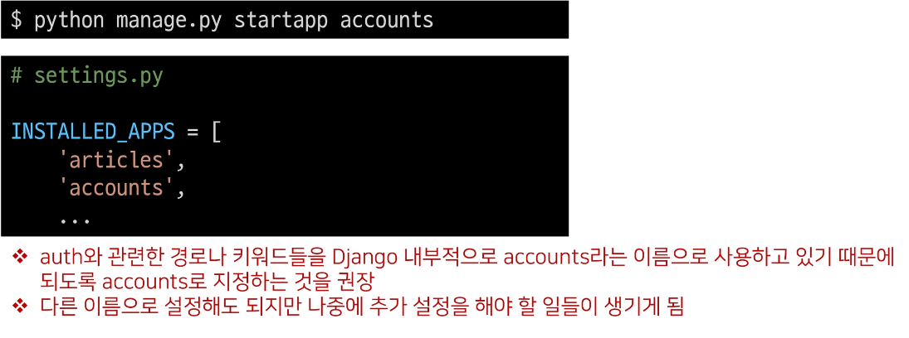

* url 분리 및 매핑

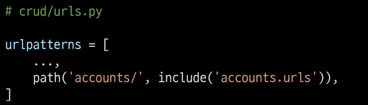

---

## Substituting a custom User model

---

> ### 개요

* "Custom User Model로 대체하기"

* 기본 User Model을 필수적으로 Custom User model로 대체하는 이유 이해하기

* Django는 기본적인 인증 시스템과 여러 가지 필드가 포함된 User Model을 제공, 대부분의 개발 환경에서 기본 User Model을 Custom User Model로 대체함

* 개발자들이 작성하는 일부 프로젝트에서는 django에서 제공하는 built - in User model의 기본 인증 요구사항이 적절하지 않을 수 있음
  
  * 예를 들어, 내 서비스에서 회원가입 시 username 대신 email을 식별 값으로 사용하는 것이 더 적합한 사이트인 경우,
    
    Django의 User Model은 기본적으로 username를 식별 값으로 사용하기 때문에 적합하지 않음

* Django는 현재 프로젝트에서 사용할 User Model을 결정하는 AUTH_USER_MODEL 설정 값으로 Default User Model을 재정의(override)할 수 있도록 함

> ### AUTH_USER_MODEL

* 프로젝트에서 User를 나타낼 때 사용하는 모델

* 프로젝트가 진행되는 동안 (모델을 만들고 마이그레이션 한 후) 변경할 수 없음

* 프로젝트 시작 시 설정하기 위한 것이며, 참조하는 모델은 첫 번째 마이그레이션에서 사용할 수 있어야 함
  
  * 즉, 첫번째 마이그레이션 전에 확정 지어야 하는 값

* 다음과 같은 기본 값을 가지고 있음

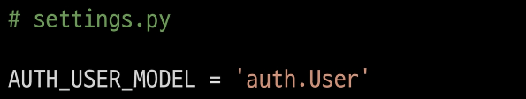

> ### [참고] settings의 로드 구조

* AUTH_USER_MODEL은 settings.py에서 보이지 않는데 어디에 기본 값이 작성되어 있는 걸까?
  
  * 우리가 작성하는 settings.py는 사실 global_settings.py를 상속받아 재정의하는 파일임

---

## How to substituting a custom User model

---

> ### 개요

* "custom User model로 대체하기"

* 대체하는 과정을 외우기 어려울 경우 공식문서를 보며 순서대로 진행하는 것을 권장
  
  * https://docs.djangoproject.com/en/3.2/topics/auth/customizing/#substituting-a-custom-user-model

> ### 대체하기

* AbstractUser를 상속받는 커스템 User 클래스 작성

* 기존 User 클래스도 AbstractUser를 상속받기 때문에 커스텀 User 클래스도 완전히 같은 모습을 가지게 됨

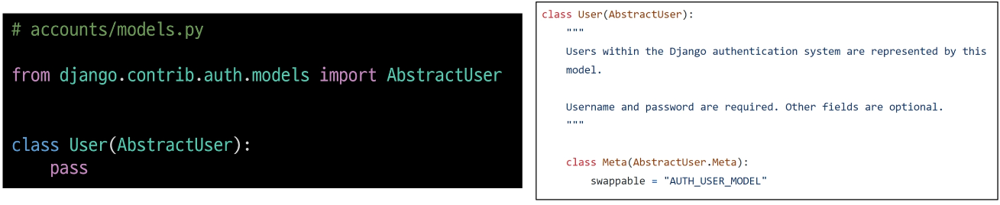

* Django 프로젝트에서 User를 나타내는데 사용하는 모델을 방금 생성한 커스템 User 모델로 지정

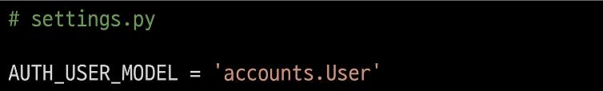

* admin.py에서 커스텀 User 모델을 등록
  
  * 기본 User 모델이 아니기 때문에 등록하지 않으면 admin site에 출력되지 않음

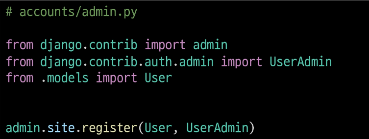

> ### [참고] User 모델 상속 관계

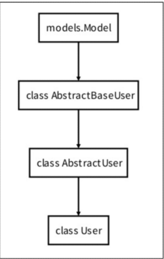

> ### [참고] AbstractUser

* "관리자 권한과 함께 완전한 기능을 가지고 있는 User model을 구현하는 추상 기본 클래스"

* Abstract base classes (추상 기본 클래스)
  
  * 몇 가지 공통 정보를 여러 다른 모델에 넣을 때 사용하는 클래스
  
  * 데이터베이스 테이블을 만드는 데 사용되지 않으며, 대신 다른 모델의 기본 클래스로 사용되는 경우 해당 필드가 하위 클래스의 필드에 추가 됨
  
  * https://docs.python.org/3/library/abc.html

> ### [주의] 프로젝트 중간에 AUTH_USER_MODEL 변경하기

* 모델 관계에 영향을 미치기 때문에 훨씬 더 어려운 작업이 필요
  
  * 예를 들면 변경사항이 자동으로 수행될 수 없기 때문에 DB 스키마를 직접 수정하고, 이전 사용자 테이블에서 데이터를 이동하고, 일부 마이그레이션을 수동으로 다시 적용해야 하는 등..

* 결론은 중간 변경은 권장하지 않음 (프로젝트 처음에 진행하기)

> ### 데이터베이스 초기화

* 수업 진행을 위한 데이터베이스 초기화 후 마이그레이션 (프로젝트 중간일 경우)
1.  migrations 파일 삭제
   
   * migrations 폴더 및 `__init__.py`는 삭제하지 않음
   
   * 번호가 붙은 파일만 삭제

2.  db.sqlite3 삭제

3.  migrations 진행
   
   * makemigrations
   
   * migrate

> ### custom User로 변경된 테이블 확인

* 이제 auth_user 테이블이 아니라 accounts_user 테이블을 사용하게 됨

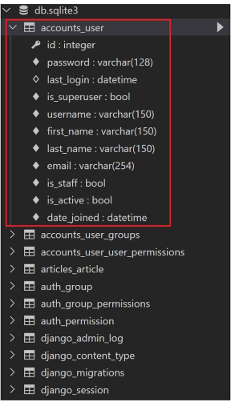

> ### 반드시 User 모델을 대체해야 할까?

* Django는 새 프로젝트를 시작하는 경우 비록 기본 User 모델이 충분 하더라도 커스텀 User 모델을 설정하는 것을 강력하게 권장(highly recommended)

* 커스텀 User 모델은 기본 User 모델과 동일하게 작동 하면서도 필요한 경우 나중에 맞춤 설정할 수 있기 때문
  
  * 단, User 모델 대체 작업은 프로젝트의 모든 migrations 혹은 첫 migrate를 실행하기 전에 이 작업을 마쳐야 함

---

## HTTP Cookies

---

> ### 개요

* 로그인과 로그아웃을 이해하기 전 반드시 알아야하는 HTTP Cookies에 대해 먼저 알아보기

---

## HTTP

---

> ### HTTP

* Hyper Text Transfer Protocol

* HTML 문서와 같은 리소스들을 가져올 수 있도록 해주는 프로토콜(규칙, 규약)

* 웹(www)에서 이루어지는 모든 데이터 교환의 기초

* 클라이언트 - 서버 프로토콜이라고도 부름

> ### 요청과 응답

* 요청(requests)
  
  * 클라이언트(브라우저)에 의해 전송되는 메시지

* 응답(response)
  
  * 서버에서 응답으로 전송되는 메시지

> ### HTTP 특징

1.  비 연결 지향(connectionless)
   
   * 서버는 요청에 대한 응답을 보낸 후 연결을 끊음
     
     * 예를 들어 우리가 네이버 메인 페이지를 보고 있을 때 우리는 네이버 서버와 연결되어 있는 것이 아님
     
     * 네이버 서버는 우리에게 메인 페이지를 응답하고 연결을 끊은 것

2.  무상태(stateless)
   
   * 연결을 끊는 순간 클라이언트와 서버 간의 통신이 끝나며 상태 정보가 유지되지 않음
   
   * 클라이언트와 서버가 주고받는 메시지들은 서로 완전히 독립적

> ### 어떻게 로그인 상태를 유지할까?

* 그런데 우리가 로그인을 하고 웹 사이트를 사용할 때 페이지를 이동해도 로그인 "상태"가 유지됨

* 서버와 클라이언트 간 지속적인 상태 유지를 위해 "쿠키와 세션"이 존재

---

## 쿠키(Cookie)

---

> ### 개요

* HTTP 쿠키는 상태가 있는 세션을 만들도록 해 줌

> ### 개념

* 서버가 사용자의 웹 브라우저에 전송하는 작은 데이터 조각이다.

* 사용자가 웹사이트를 방문할 경우 해당 웹사이트의 서버를 통해 사용자의 컴퓨터에 설치되는 작은 기록 정보 파일
  
  1.  브라우저(클라이언트)는 쿠키를 로컬에 KEY-VALUE의 데이터 형식으로 저장
  
  2.  이렇게 쿠키를 저장해 놓았다가, <mark>동일한 서버에 재요청 시 저장된 쿠키를 함께 전송</mark>

* 쿠키는 두 요청이 동일한 브라우저에서 들어왔는지 아닌지를 판단할 때 주로 사용됨
  
  * 이를 이용해 사용자의 로그인 상태를 유지할 수 있음
  
  * 상태가 없는(stateless) HTTP 프로토콜에서 상태 정보를 기억 시켜 주기 때문

* 즉, 웹 페이지에 접속하면 웹 페이지를 응답한 서버로부터 쿠키를 받아 브라우저에 저장하고, 클라이언트가 같은 서버에 재요청 시마다 요청과 함께 저장해 두었던 쿠키도 함께 전송

> ### 쿠키 사용 예시

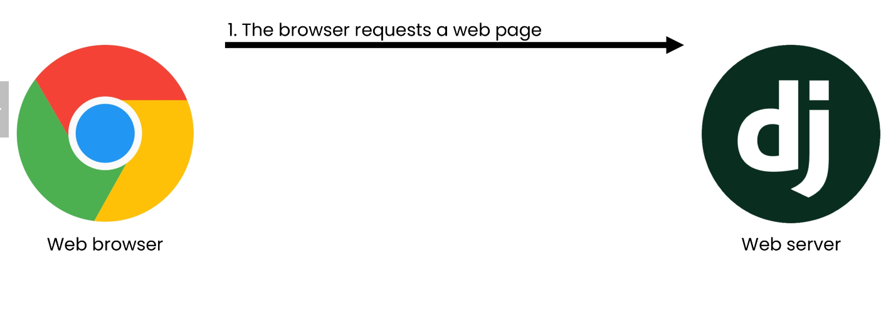

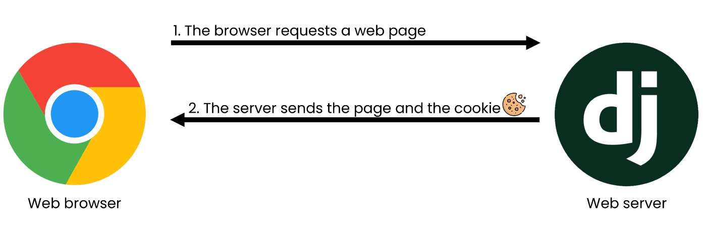

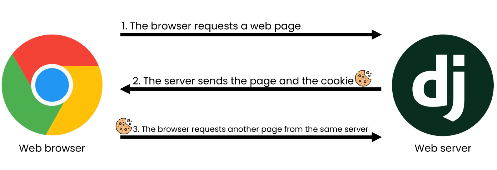

> ### 쿠키 사용 목적

1.  **세션 관리**
   
   * **로그인, 아이디 자동완성, 공지 하루 안보기, 팝업 체크, 장바구니 등의 정보 관리**

2.  개인화
   
   * 사용자 선호, 테마 등의 설정

3.  트래킹
   
   * 사용자 행동을 기록 및 분석

> ### 쿠키를 이용한 장바구니 예시

* 장바구니에 상품 담기

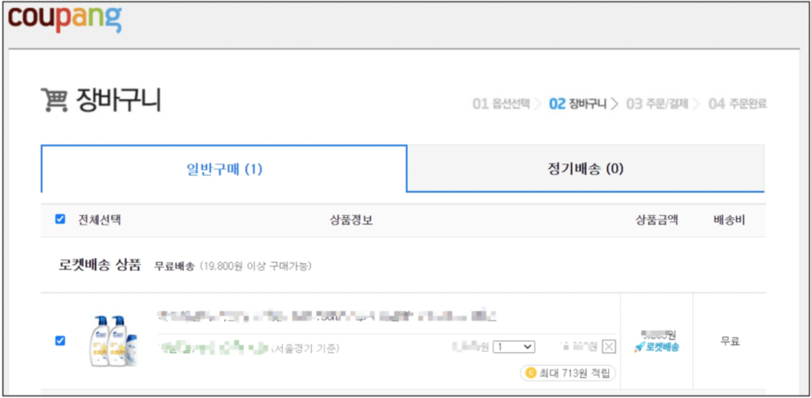

* 개발자 도구 -Network 탭 - cartView.pang 확인

* 서버는 응답과 함께 Set-Cookie 응답 헤더를 브라우저에게 전송

* 이 헤더는 클라이언트에게 쿠키를 저장하라고 전달

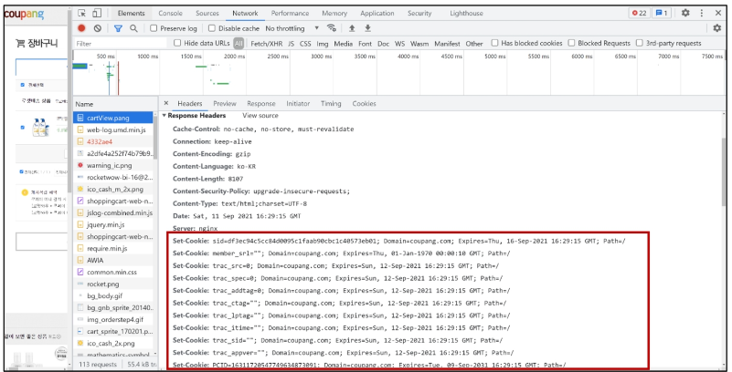

* Cookie 데이터 자세히 확인

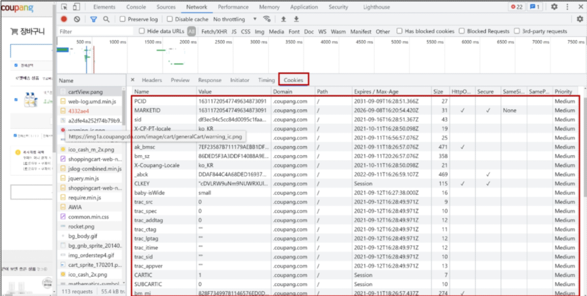

* 메인 페이지 이동 - 장바구니 유지 상태 확인

* 서버로 전송되는 모든 요청에 브라우저는 Cookie HTTP 헤더를 사용해 서버로 이전에 저장했던 모든 쿠키들을 함께 전송 (장바구니 정보를 매 요청마다 보내는 것)

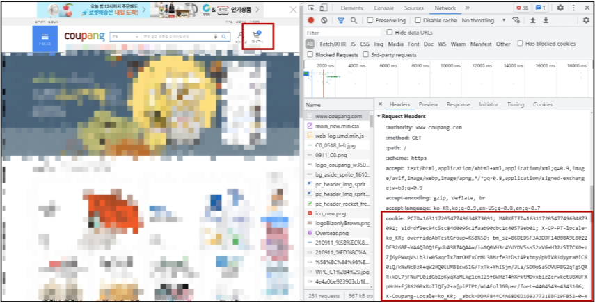

* 개발자 도구 - Application 탭 - Cookies

* 마우스 우측 버튼 - Clear 후 새로고침

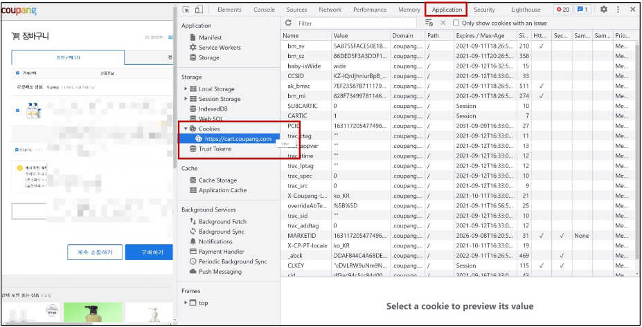

* 빈 장바구니로 변경된 것을 확인

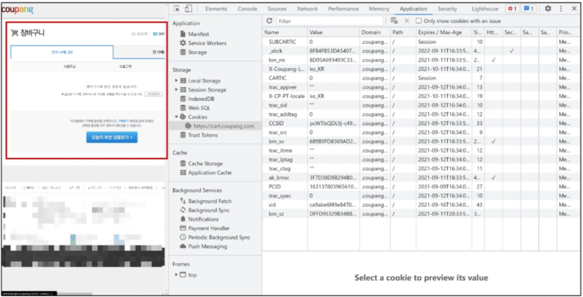

> ### 세션 (Session)

* 사이트와 특정 브라우저 사이의 "state(상태)" 를 유지시키는 것

* 클라이언트가 서버에 접속하면 서버가 특정 session id를 발급하고, 클라이언트는 session id를 쿠키에 저장
  
  * 클라이언트가 다시 동일한 서버에 접속하면 요청과 함께 쿠키(session id가 저장된)를 서버에 전달
  
  * 쿠키는 요청 때마다 서버에 함께 전송 되므로 서버에서 session id를 확인해 알맞은 로직을 처리

* session id는 세션을 구별하기 위해 필요하며, 쿠키에는 session id만 저장

> ### 쿠키 LIfetime (수명)

1.  Session Cookie
   
   * 현재 세션이 종료되면 삭제됨
   
   * 브라우저 종료와 함께 세션이 삭제됨

2.  Persistent cookies
   
   * Expires 속성에 지정된 날짜 혹은 Max-Age 속성에 지정된 기간이 지나면 삭제됨

52
