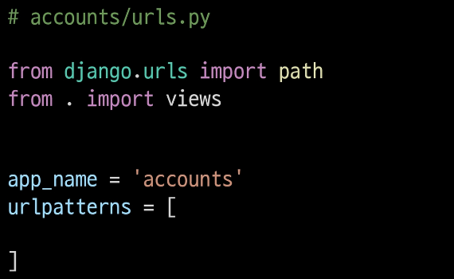

# Django

---

## 목차

* The Django authentication system

* HTTP Cookies

* Authentication in Web requests

* Authentication with User

* Limiting access to logged-in users

---

## The Django authentication system

---

> ### 개요

* Django authentication system(인증 시스템)은 <mark>인증(Authenticaiton)</mark>과 <mark>권한(Authorization)</mark> 부여를 함께 제공(처리)하며, 이러한 기능을 일반적으로 인증 시스템이라고 함

* 필수 구성은 settings.py에 이미 포함되어 있으며 INSTALLED_APPS에서 확인 가능
  
  * django.contrib.auth

* **Authentication (인증)**
  
  * 신원 확인
  
  * 사용자가 자신이 누구인지 확인하는 것

* **Authorization (권한, 허가)**
  
  * 권한 부여
  
  * 인증된 사용자가 수행할 수 있는 작업을 결정

> ### 사전 설정

* 두번째 app acounts 생성 및 등록

* url 분리 및 매핑

---

## Substituting a custom User model

---

> ### 개요

* "Custom User Model로 대체하기"

* 기본 User Model을 필수적으로 Custom User model로 대체하는 이유 이해하기

* Django는 기본적인 인증 시스템과 여러 가지 필드가 포함된 User Model을 제공, 대부분의 개발 환경에서 기본 User Model을 Custom User Model로 대체함

* 개발자들이 작성하는 일부 프로젝트에서는 django에서 제공하는 built - in User model의 기본 인증 요구사항이 적절하지 않을 수 있음
  
  * 예를 들어, 내 서비스에서 회원가입 시 username 대신 email을 식별 값으로 사용하는 것이 더 적합한 사이트인 경우,
    
    Django의 User Model은 기본적으로 username를 식별 값으로 사용하기 때문에 적합하지 않음

* Django는 현재 프로젝트에서 사용할 User Model을 결정하는 AUTH_USER_MODEL 설정 값으로 Default User Model을 재정의(override)할 수 있도록 함

> ### AUTH_USER_MODEL

* 프로젝트에서 User를 나타낼 때 사용하는 모델

* 프로젝트가 진행되는 동안 (모델을 만들고 마이그레이션 한 후) 변경할 수 없음

* 프로젝트 시작 시 설정하기 위한 것이며, 참조하는 모델은 첫 번째 마이그레이션에서 사용할 수 있어야 함
  
  * 즉, 첫번째 마이그레이션 전에 확정 지어야 하는 값

* 다음과 같은 기본 값을 가지고 있음

> ### [참고] settings의 로드 구조

* AUTH_USER_MODEL은 settings.py에서 보이지 않는데 어디에 기본 값이 작성되어 있는 걸까?
  
  * 우리가 작성하는 settings.py는 사실 global_settings.py를 상속받아 재정의하는 파일임

---

## How to substituting a custom User model

---

> ### 개요

* "custom User model로 대체하기"

* 대체하는 과정을 외우기 어려울 경우 공식문서를 보며 순서대로 진행하는 것을 권장
  
  * https://docs.djangoproject.com/en/3.2/topics/auth/customizing/#substituting-a-custom-user-model

> ### 대체하기

* AbstractUser를 상속받는 커스템 User 클래스 작성

* 기존 User 클래스도 AbstractUser를 상속받기 때문에 커스텀 User 클래스도 완전히 같은 모습을 가지게 됨

* Django 프로젝트에서 User를 나타내는데 사용하는 모델을 방금 생성한 커스템 User 모델로 지정

* admin.py에서 커스텀 User 모델을 등록
  
  * 기본 User 모델이 아니기 때문에 등록하지 않으면 admin site에 출력되지 않음

18
