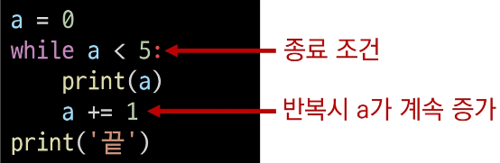
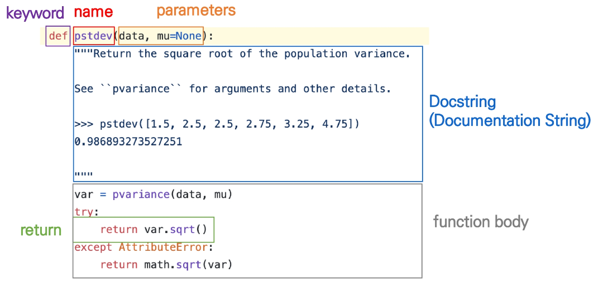
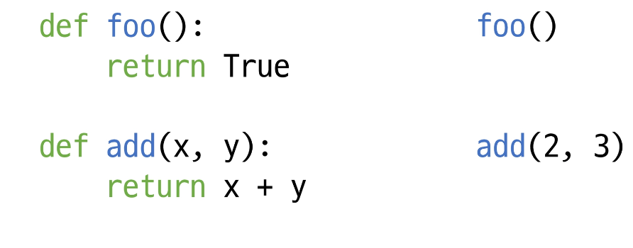
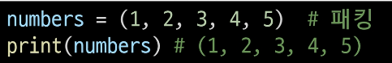
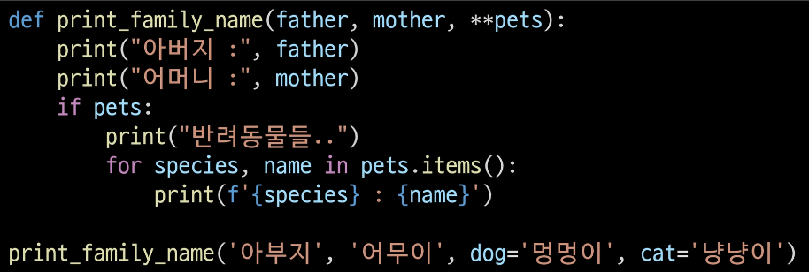
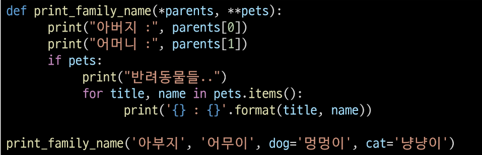
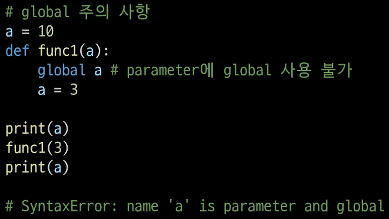

# 제어문(control statement)

* 조건문

* 반복문

제어문(Control statemene)

* 파이썬은 기본적으로 위에서부터 아래로 차례대로 명령을 수행

* 특정 상황에 따라 코드를 선택적으로 실행(분기/조건)하거나 계속하여 실행(반복)하는 제어가 필요함

* 제어문은 순서도(flowchart)로 표현이 가능

# 조건문(conditional Statement)

---

조건문

* 조건문은 참/거짓을 판단할 수 있는 조건식과 함께 사용


기본형식

* 조건에는 참/거짓에 대한 조건식

* 조건이 참인 경우 이후 들여쓰기 되어있는 코드 블록을 실행

* 이외의 경우 else 이후 들여쓰기 되어있는 코드 블록을 실행
  
  * else는 선택적으로 활용할 수 있음

조건문 예시


* a = 5 준비된 데이터

* a > 5 조건

5 이하')


조건문 실습 문제

* 조건문을 통해 변수 num의 값의 홀수/짝수 여부를 출력하시오.
  
  * 이때 num은 input을 통해 사용자로부터 입력을 받으시오.


# 복수 조건문

복수 조건문

* 복수의 조건식을 활용할 경우 elif를 활용하여 표현함


복수 조건문 실습 문제

* 미세먼지 농도에 따른 위험 등급이 다음과 같을 때,
  
  dust 값에 따라 등급을 출력하는 조건식을 작성하시오.
  
   (단, 조건식 완료후 미세먼지 확인 완료라는 문구를 출력)


실습 문제 순서도


---

# 중첩 조건문

중첩 조건문

* 조건문은 다른 조건문에 중첩되어 사용될 수 있음
  
  * 들여쓰기에 유의하여 작성할 것


# 조건 표현식

* 조건표현식(Conditional Expression)이란?
  
  * 조건 표현식을 일반적으로 조건에 따라 값을 정할 때 활용
  
  * 삼항 연산자(Ternary Operator)로 부르기도 함
  
  * true인 경우 값 if 조건 else false인 경우 값

조건 표현식 실습 문제

* num이 정수일 때, 아래의 코드는 무엇을 위한 코드일까요?


* 정답: 절댓값을 저장하기 위한 코드


# 반복문

* 특정 조건을 만족할 때까지 같은 동작을 계속 반복하고 싶을 때 사용
  
  * ex) 문제를 맞추는 웹사이트 일 경우 정답을 맞출 때 까지 문제를 내고 정답을 맞춘다면 문제 출제 그만


반복문의 종류

* while 문
  
  * 종료 조건에 해당하는 코드를 통해 반복문을 종료시켜야 함

* for 문 - 횟수(10회, 20회)
  
  * 반복가능한 객체를 모두 순회하면 종료(별도의 종료 조건이 필요 없음)

* 반복제어
  
  * break, continue, for-else

# while 문

* while문은 조건식이 참인 경우 반복적으로 코드를 실행
  
  * 조건이 참인 경우 들여쓰기 되어 있는 코드 블록이 실행됨
  
  * 코드 블록이 모두 실행되고, 다시 조건식을 검사하며 반복적으로 실행됨
  
  * while문은 무한 루프를 하지 않도록 종료 조건이 반드시 필요

while 문 예시

* 순서도


복합 연산자(In-Place Operator)

* 복합 연산자는 연산과 할당을 합쳐 놓은 것
  
  * 예시) 반복문을 통해서 개수를 카운트 하는 경우




# for 문

for 문

* for문은 시퀀스(string, tuple, list, range)를 포함한 순회 가능한 객체(literable)의 요소를 모두 순회
  
  * 처음부터 끝까지 모두 순회하므로 별도의 종료 조건이 필요하지 않음

* lterable
  
  * 순회할 수 있는 자료형(string, list, dict, tuple, range, set 등)
  
  * 순회형 함수(range, enumerate)


for문을 이용한 문자열(String) 순회

* 사용자가 입력한 문자를 한 글자씩 출력하시오.


딕셔너리 순회

* 딕셔너리는 기본적으로 key를 순회하며, key를 통해 값을 활용


추가 메서드를 활용한 딕셔너리 순회

* 추가 메서드를 활용하여 순회할 수 있음
  
  * keys() : key로 구성된 결과
  
  * values() : value로 구성된 결과
  
  * items() : (key, value)의 튜플로 구성된 결과


enumerate 순회

* enumerate()
  
  * 인덱스와 객체를 쌍으로 담은 열거형(enumerate) 객체 반환
    
    * (index, value) 형태의 tuple로 구성된 열거 객체를 반환


List Comprehension

* 표현식과 제어문을 통해 특정한 값을 가진 리스트를 간결하게 생성하는 방법


dictionary Comprehension

* 표현식과 제어문을 통해 특정한 값을 가진 딕셔너리를 간결하게 생성하는 방법


dictionary Comprehension 실습

* 1~3의 세제곱의 결과가 담긴 딕셔너리를 만드시오.


# 

# 반복문 제어

* break
  
  * 반복문을 종료

* continue
  
  * continue 이후의 코드 블록은 수행하지 않고, 다음 반복을 수행

* for-else
  
  * 끝까지 반복문을 실행한 이후에 else문 실행
    
    * break를 통해 중간에 종료되는 경우 else 문은 실행되지 않음

* pass
  
  * 아무것도 하지 않음(문법적으로 필요하지만, 할 일이 없을 때 사용)

반복문 제어 기본 형식


break

* break문을 만나면 반복문은 종료됨

* 아래 코드의 실행 결과는?


Continue

* continue 이후의 코드 블록은 수행하지 않고, 다음 반복을 수행


pass

* 아무것도 하지 않음

* 특별히 할 일이 없을 때 자리를 채우는 용도로 사용

* 반복문 아니어도 사용 가능


else

* 끝까지 반복문을 실행한 이후에 else문 실행


반복문 제어 정리


# 함수

개요

* 함수 기초

* 함수의 결과값(Output)

* 함수의 입력(Input)

* 함수의 범위(Scope)

* 함수의 문서화(Doc-string)

* 함수 응용

함수

* 함수를 왜 사용할까요?
  
  * Decomposition(분해)
  
  * Abstraction(추상화)

Decomposition

```python
len([1, 2, 3])
```


```python
sum([1, 2, 3)
```


보기 간결하고, 이해하기 쉽다!


Abstraction

복잡한 내용을 모르더라도 사용할 수 있도록(스마트폰)

재사용성과 가독성, 생산성

* 사실 내부 구조를 변경할게 아니라면 몰라도 무방
  
  * 그것이 함수의 장점이자 프로그래밍의 매령
  
  * 스마트폰의 원리를 잘 몰라도 우리는 잘 사용할 수 있음

# 함수 기초

함수의 종류

* 함수는 크게 3 가지로 분류
  
  * 내장 함수
    
    * 파이썬에서 기본적으로 포함된 함수
  
  * 외장 함수
    
    * Import 문을 통해 사용하며, 외부 라이브러리에서 제공하는 함수
  
  * 사용자 정의 함수
    
    * 직접 사용자가 만드는 함수

함수의 정의

* 함수(Function)
  
  * 특정한 기능을 하는 코드의 조각(묶음)
  
  * 특정 코드를 매번 다시 작성하지 않고, 필요시에만 호출하여 간편히 사용


함수 기본 구조

* 선언과 호출(define & call)

* 입력(Input)

* 문서화(Docstring)

* 범위(Scope)

* 결과값(Output)



선언과 호출(define & call)

* 함수의 선언은 def 키워드를 활용함

* 들여쓰기를 통해 Function body(실행될 코드 블록)를 작성함
  
  * Docstring은 함수 body 앞에 선택적으로 작성 가능
    
    * 작성 시에는 반드시 첫 번째 문장에 문자열 ''''''

* 함수는 parameter(재료)를 넘겨줄 수 있음

* 함수는 동작 후에 return을 통해 결과값을 전달함

함수의 정의

* 함수를 사용하기 위해서는 먼저 함수를 정의해야 함


선언과 호출

* 함수는 함수명()으로 호출하여 사용
  
  * parameter가 있는 경우, 함수명(값1, 값2, ...)로 호출



함수는 호출되면` `코드를 실행하고 return 값을 반환하며 종료된다.

# 함수의 결과값(Output)

값에 따른 함수의 종류

* Void function
  
  * 명시적인 return 값이 없는 경우, None을 반환하고 종료

* Value returning function
  
  * 함수 실행 후, return문을 통해 값 반환
  
  * return을 하게 되면, 값 반환 후 함수가 바로 종료


주의 - print vs return

* print 함수와 return의 차이점
  
  * print를 사용하면 호출될 때마다 값이 출력됨(주로 테스트를 위해 사용)
  
  * 데이터 처리를 위해서는 return 사용


* REPL(Read-Eval-Print Loop) 환경에서는 마지막으로 작성된 코드의 리턴 값을 보여주므로 같은 동작을 하는 것으로 착각할 수 있음

두 개 이상의 값 반환

* 아래 코드의 문제점은 무엇일까?


* return 이 2개이다.

* return은 항상 하나의 값 만을 반환

두 개 이상의 값을 반환하는 방법은?

* 반환 값으로 튜플 사용


함수 반환 정리

* return X --> None

* return O --> 하나를 반환

* 여러 개를 원하면, Tuple 활용(혹은 리스트와 같은 컨테이너 활용)


# 함수의 입력(Input)

Paremeter와 Argument

* Parameter : 함수를 정의할 때, 함수 내부에서 사용되는 변수

* Argument : 함수를 호출 할 때, 넣어주는 값

Argument

* Argument란?
  
  * 함수 호출 시 함수의 parameter를 통해 전달되는 값
  
  * Argument는 소괄호 안에 할당 func_name(argument)
    
    * 필수 Argument : 반드시 전달되어야 하는 argument
    
    * 선택 Argument : 값을 전달하지 않아도 되는 경우는 기본값이 전달

Positional Argument

* 기본적으로 함수 호출 시 Argument는 위치에 따라 함수 내에 전달됨


Keyword Argument

* 직접 변수의 이름으로 특정 Argument를 전달할 수 있음

* Keyword Argument 다음에 Positional Argument를 활용할 수 없음


Default Arguments Values

* 기본값을 지정하여 함수 호출 시 argument 값을 설정하지 않도록 함
  
  * 정의된 것 보다 더 적은 개수의 argument 들로 호출될 수 있음


정해지지 않은 여러 개의 Arguments 처리

print 함수의 Arguments 개수가 변해도 잘 동작하는 이유는?


가변 인자(*args)

* 가변인자란?
  
  * 여러 개의 Positional Argument를 하나의 필수 parameter로 받아서 사용

* 가변인자는 언제 사용하는가?
  
  * 몇 개의 Positional Argument를 받을지 모르는 함수를 정의할 때 유용


패킹/언패킹

* 가변 인자를 이해하기 위해서는 패킹, 언패킹을 이해해야 함

* 패킹
  
  * 여러 개의 데이터를 묶어서 변수에 할당하는 것



* 언패킹
  
  * 시퀀스 속의 요소들을 여러 개의 변수에 나누어 할당하는 것


* 언패킹시 변수의 개수와 할당하고자 하는 요소의 갯수가 동일해야함


* 언패킹시 왼쪽의 변수에 asterisk(*)를 붙이면, 할당ㅇ하고 남은 요소를 리스트에 담을 수 있음


Asterisk(*)와 가변 인자

* *는 스퀀스 언패킹 연산자라고도 불리며, 말 그대로 시퀀스를 풀어 헤치는 연산자
  
  * 주로 튜플이나 리스트를 언패킹하는데 사용
  
  * *를 활용하여 가변 인자를 만들 수 있음


가변 인자 예시

* packing을 통해 받은 모든 숫자들의 합을 구하는 함수 만들기


* 반드시 받아야하는 인자와, 추가적인 인자를 구분해서 사용할 수 있음


가변 키워드 인자(**kwargs)

* 몇 개의 키워드 인자를 받을지 모르는 함수를 정의할 때 유용

* **kwargs는 딕셔너리로 묶여 처리되며, parameter에 **을 붙여 표현

* 

가변 키워드 인자(**kwargs) 예시

* 반드시 받아야하는 키워드 인자와, 추가적인 키워드 인자를 구분해서 사용할 수 있음




가변 인자(*args)와 가변 키워드 인자(**kwargs) 동시 사용 예시

* 가변 인자와 가변 키워드 인자를 함께 사용할 수 있음




# Python의 범위(Scope)

Python의 범위(Scope)

* 함수는 코드 내부에 local scope를 생성하며,
  
  그 외의 공간인 global scope로 구분

* Scope
  
  * global scope : 코드 어디에서든 참조할 수 있는 공간
  
  * local scope : 함수가 만든 scope. 함수 내부에서만 참조 가능

* Variable
  
  * global variable : global scope에 정의된 변수
  
  * local variable : local scope에 정의된 변수

변수 수명주기(lifecycle)

* 변수는 각자의 수명주기(lifecycle)가 존재
  
  * built-in scope
    
    * 파이썬이 실행된 이후부터 영원히 유지
  
  * global scope
    
    * 모듈이 호출된 시점 이후 혹은 인터프리터가 끝날 때까지 유지
  
  * local scope
    
    * 함수가 호출될 때 생성되고, 함수가 종료될 때까지 유지

예시


이름 검색 규칙(Name Resolution)

* 파이썬에서 사용되는 이름(식별자)들은 이름공간(namespace)에 저장되어 있음

* 아래와 같은 순서로 이름을 찾아나가며, LEGB Rule이라고 부름
  
  * Local Scope : 지역 범위(현재 작업 중인 범위)
  
  * Enclosed Scope : 지역 범위 한 단계 위 범위
  
  * Global scope : 최상단에 위치한 범위
  
  * Built-in scope : 모든 것을 담고 있는 범위(정의하지 않고 사용할 수 있는 모든 것)
    
    * ex) print()

* 함수 내에서는 바깥 scope의 변수에 접근 가능하나 수정은 할 수 없음


LEGB 예시 1


LEGB 예시 2


global 문

* 현재 코드 블록 전체에 적용되며, 나열된 식별자(이름)이 global variable임을 나타냄
  
  * global에 나열된 이름은 같은 코드 블록에서 global 앞에 등장할 수 없음
  
  * global에 나열된 이름은 parameter, for 루프 대상, 클래스/함수 정의 등으로 정의되지 않아야 함

global 예시


* Loval scope에서 global 변수 값의 변경
  
  global 키워드를 사용하지 않으면, Local scope에 a 변수가 생성됨

global 관련 에러




nonlocal

* global을 제외하고 가장 가까운 (둘러싸고 있는) scope의 변수를 연결하도록 함
  
  * nonlocal에 나열된 이름은 같은 코드 블로겡서 nonlocal 앞에 등장할 수 없음
  
  * nonlocal에 나열된 이름은 parameter, for 루프 대상, 클래스/함수 정의 등으로 정의되지 않아야 함

* global과는 달리 이미 존재하는 이름과의 연결만 가능함

nonlocal 예시


* enclosed scope(fun1)의 변수 x의 변경

nonlocal, global 비교


* nonlocal은 이름공간상에 존재하는 변수만 가능

함수의 범위 주의

* 기본적으로 함수에서 선언된 변수는 Local scope에 생성되며, 함수 종료 시 사라짐

* 해당 scope에 변수가 없는 경우 LEGB rule에 의해 이름을 검색함
  
  * 변수에 접근은 가능하지만, 해당 변수를 수정할 수는 없음
  
  * 값을 할당하는 경우 해당 scope의 이름공간에 새롭게 생성되기 때문
  
  * 단, 함수 내에서 필요한 상위 scope 변수는 argument로 넘겨서 활용할 것

* 상위 scope에 있는 변수를 수정하고 싶다면 global, nonlocal 키워드를 활용 가능
  
  * 단, 코드가 복잡해지면서 변수의 변경을 추적하기 어렵고, 예기치 못한 오류가 발생
  
  * 가급적 사용하지 않는 것을 권장하며, 함수로 값을 바꾸고자 한다면 항상 argument로 넘기고 리턴 값을 사용 하는 것을 추천

# 함수 응용

내장함수

* 파이썬 인터프리터에는 항상 사용할 수 있는 많은 함수와 형(type)이 내장되어 있음

map

* 순회 가능한 데이터구조(iterable)의 모든 요소에 함수(function)적용하고, 그 결과를 map object로 반환


map 활용 사례

* 알고리즘 문제 풀이시 input값들을 숫자로 바로 활용하고 싶을 때


filter

* 순회 가능한 데이터구조(iterable)의 모든 요소에 함수(function)적용하고
  
  그 결과가 True인 것들을 filter object로 반환


zip

* 복수의 iterable을 모아 튜플을 원소로 하는 zip object를 반환


lambda 함수

* 람다함수
  
  * 표현식을 계산한 결과값을 반환하는 함수로, 이름이 없는 함수여서 익명함수
    
    라고도 불림

* 특징
  
  * return문을 가질 수 없음
  
  * 간편 조건문 외 조건문이나 반복문을 가질 수 없음

* 장점
  
  * 함수를 정의해서 사용하는 것보다 간결하게 사용 가능
  
  * def를 사용할 수 없는 곳에서도 사용가능


재귀 함수(recursive function)

* 자기 자신을 호출하는 함수

* 무한한 호출을 목표로 하는 것이 아니며, 알고리즘 설계 및 구현에서 유용하게 활용
  
  * 알고리즘 중 재귀 함수로 로직을 표현하기 쉬운 경우가 있음(예-점화식)
  
  * 변수의 사용이 줄어들며, 코드의 가독성이 높아짐

* 1개 이상의 base case(종료되는 상황)가 존재하고, 수렴하도록 작성

예시

* Factorial


팩토리얼을 코드로 구현해본다면?


재귀 함수 주의 사항

* 재귀 함수는 base case에 도달할 때까지 함수를 호출함

* 메모리 스택이 넘치게 되면(stack overflow) 프로그램이 동작하지 않게 됨

* 파이썬에서는 최대 재귀 깊이(maximum recursion depth)가 1,000번으로,
  
  호출 횟수가 이를 넘어가게 되면 Recursion Error 발생

재귀 함수를 반복문으로 표현

팩토리얼 코드를 반복문으로 작성한다면?


반복문과 재귀 함수 비교

* 알고리즘 자체가 재귀적인 표현이 자연스러운 경우 재귀함수를 사용함.

* 재귀 호출은 변수 사용을 줄여줄 수 있음.

* 재귀 호출은 입력 값이 커질 수록 연산 속도가 오래 걸림.

# 모듈

---

# 개요

* 모듈과 패키지

* 파이썬 표준 라이브러리

* 가상환경

* 유용한 패키지와 모듈

* 사용자 모듈과 패키지

---

모듈과 패키지

* 모듈
  
  * 특정 기능을 하는 코드를 파이썬 파일(.py) 단위로 작성한 거

* 패키지
  
  * 특정 기능과 관련된 여러 모듈의 집합
  
  * 패키지 안에는 또 다른 서브 패키지를 포함

모듈과 패키지 불러오기


---

# 파이썬 표준 라이브러리

* 파이썬에 기본적으로 설치된 모듈과 내장 함수
  
  * https://docs.python.org/ko/3/library/index.html

* 파이썬에 기본적으로 설치된 모듈과 내장 함수
  
  * 예시 - random.py

---

파이썬 패키지 관리자(pip)

* PyPI(Python Package Index)에 저장된 외부 패키지들을 설치하도록 도와주는 패키지 관리 시스템

* 패키지 설치
  
  * 최신 버전 / 특정 버전 / 최소 버전을 명시하여 설치할 수 있음
  
  * 이미 설치되어 있는 경우 이미 설치되어 있음을 알리고 아무것도 하지 않음


* 패키지 삭제
  
  * pip는 패키지 업그레이드를 하는 경우 과거 버전을 자동으로 지워줌
    
    * pip uninstall SomePackage

* 패키지 목록 및 특정 패키지 정보


* 패키지 관리하기
  
  * 아래의 명령어들을 통해 패키지 목록을 관리[1]하고 설치할 수 있음[2]
  
  * 일반적으로 패키지를 기록하는 파일의 이름은 requirements.txt로 정의함


---

# 파이썬 모듈과 패키지

패키지

* 패키지는 여러 모듈/하위 패키지로 구조화
  
  * 활용 예시 : package.module

* 모든 폴더에는 _ _ _init__ _.py를 만들어 패키지로 인식
  
  * Python 3.3부터는 파일이 없어도 되지만, 하위 버전 호환 및 프레임워크 등에의 동작을 위해 파일을 생성하는 것을 권장

패키지 만들기

* 계산 기능이 들어간 calculator 패키지를 아래와 같이 구성
  
  * check.py에서 caculator의 tools.py의 기능을 사용

* 폴더 구조


* calculator/tools.py에 add 함수와 minus 함수 작성


* 모듈을 활용하기 위해서는 import 문을 통해 가져옴


---

# 가상환경

* 파이썬 표준 라이브러리가 아닌 외부 패키지와 모듈을 사용하는 경우
  
  모두 pip를 통해 설치를 해야함

* 복수의 프로젝트를 하는 경우 버전이 상이할 수 있음
  
  * 과거 외주 프로젝트 - django 버전 2.x
  
  * 신규 회사 프로젝트 - django 버전 3.x

* 이러한 경우 가상환경을 만들어 프로젝트별로 독립적인 패키지를 관리 할 수 있음

* 가상 환경을 만들고 관리하는데 사용되는 모듈(Python 버전 3.5부터)

* 특정 디텍토리에 가상 환경을 만들고, 고유한 파이썬 패키지 집합을 가질 수 있음
  
  * 특정 폴더에 가상 환경이(패키지 집합 폴더 등) 있고
  
  * 실행 환경(예-bash)에서 가상환경을 활성화 시켜
  
  * 해당 폴더에 있는 패키지를 관리/사용함

---

# 가상환경 생성

* 가상환경을 생성하면, 해당 디텍토리에 별도의 파이썬 패키지가 설치됨


---

# 가상환경 활성화/비활성화

* 아래의 명령어를 통해 가상환경을 활성화
  
  * <venv>는 가상환경을 포함하는 디텍토리의 경로

* 가상환경 비활성화는 $ deactivate 명령어를 사용


* cmd와 bash 환경


---

# 가상환경 예시

* 동일 컴퓨터에서 별도의 가상환경


