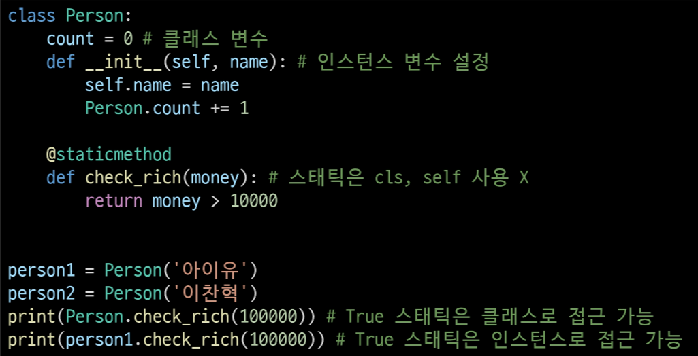
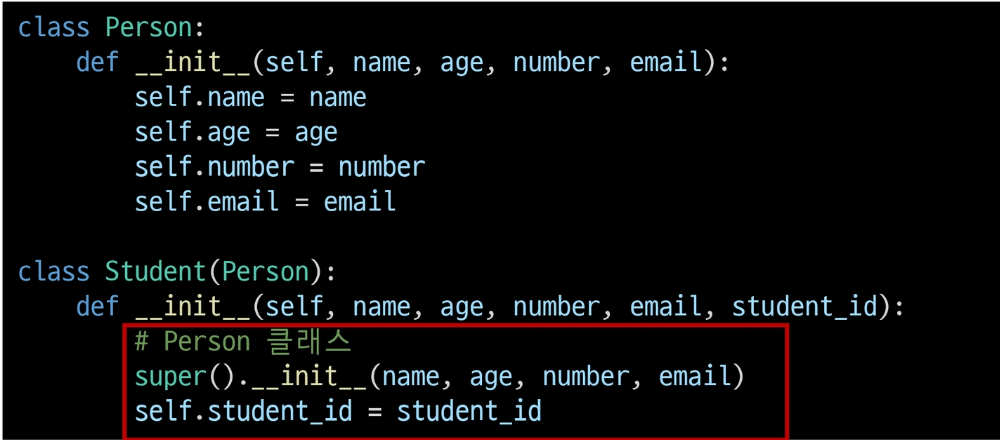
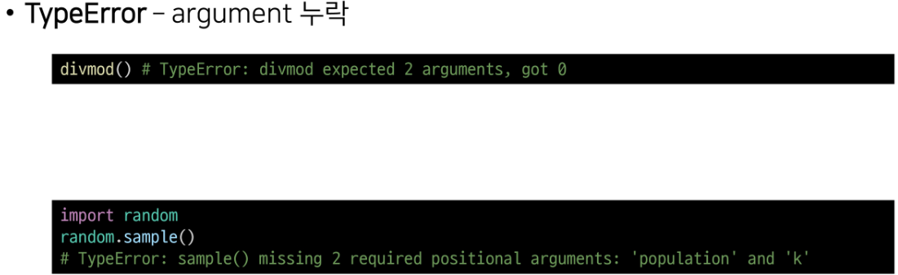

# OOP

---

# 개요

* 객체지향 프로그래밍(OOP)
  
  * 객체지향 프로그래밍이란?
  
  * OOP 기초
    
    * 객체/인스턴스/클래스
    
    * 클래스
    
    * 메서드

* 객체지향의 핵심 개념
  
  * 추상화
  
  * 상속
  
  * 다형성
  
  * 캡슐화

* 에러와 예외

---

# 객체지향 프로그래밍

* 객체 지향 프로그래밍(Object-Oriented Programming, OOP)은 컴퓨터 프로그래밍의 패러다임 중 하나이다.
  
  * 객체 지향 프로그래밍은 컴퓨터 프로그램을 명령어의 목록으로 보는 시각에서 벗어나 여러 개의 독립된 단위, 즉 "객체"들의 모임으로 파악하고자 하는 것이다. 각각의 객체는 메시지를 주고받고, 데이터를 처리할 수 있다.

* 객체
  
  * 세상에 존재하는 모든 것
    
    * ex) 현실의 사람1, 사람2 --> 컴퓨터로 표현? 추상화(이름, 나이, 신체, 직책, 하는일) 

* 객체지향 프로그래밍이란?
  
  * 프로그램을 여러 개의 독립된 객체들과 그 객체 간의 상호작용으로 파악하는 프로그래밍 방법
  
  * 예시
    
    * 콘서트
      
      * 가수 객체
      
      * 감독 객체
      
      * 관객 객체

* 절차지향 프로그래밍

* 객체지향 프로그래밍

* 객체지향 프로그래밍이 필요한 이유
  
  * 현실 세계를 프로그램 설계에 반영(추상화)

---

# 객체지향의 장점 / 단점

* 장점
  
  * 클래스 단위로 모듈화시켜 개발할 수 있으므로 많은 인원이 참여하는 대규모 소프트웨어 개발에 적합
  
  * 필요한 부분만 수정하기 쉽기 때문에 프로그램의 유지보수가 쉬움

* 단점
  
  * 설계 시 많은 노력과 시간이 필요함
    
    * 다양한 객체들의 상호 작용 구조를 만들기 위해 많은 시간과 노력이 필요
  
  * 실행 속도가 상대적으로 느림
    
    * 절차 지향 프로그래밍이 컴퓨터의 처리구조와 비슷해서 실행 속도가 빠름

---

# OOP 기초

# 객체

* 객체(컴퓨터 과학)
  
  * 컴퓨터 과학에서 객체 또는 오브젝트(object)는 클래스에서 정의한 것을 토대로 메모리(실제 저장공간)에 할당된 것으로 프로그램에서 사용되는 데이터 또는 식별자에 의해 참조되는 공간을 의미하며, 변수, 자료 구조, 함수 또는 메서드가 될 수 있다.
  
  * 속성과 행동으로 구성된 모든 것

# 객체 예시

# 클래스와 객체

# 객체와 인스턴스

* 클래스로 만든 개게를 인스턴스 라고도 함
  
  * 객체와 인스턴스의 차이점?

# 객체

* 객체는 특정 타입의 인스턴스 이다.
  
  * 123, 900, 5는 모두 int의 인스턴스
  
  * 'hello', 'bye'는 모두 string의 인스턴스
  
  * [232, 89, 1], []은 모두 list의 인스턴스

* 객체의 특징
  
  * 타입(type) : 어떤 연산자(operator)와 조작(method)이 가능한가?
  
  * 속성(attribute) : 어떤 상태(데이터)를 가지는가?
  
  * 조작법(method) : 어떤 행위(함수)를 할 수 있는가?

---

# 객체와 클래스  문법

---

# 기본 문법

* 클래스 정의
  * class Myclass:
* 인스턴스 생성
  * my_instance = MyClass()
* 메서드 호출
  * my_instance.my_method()
* 속성
  * my_instance.my_attribute

---

# 클래스와 인스턴스

* 객체의 설계도(클래스)을 가지고, 객체(인스턴스)를 생성한다.
  
  * 예시

* 클래스 : 객체들의 분류 / 설계도(class)

* 인스턴스 : 하나하나의 실체 / 예(instance)

* 파이썬은 모든 것이 객체, 모든 객체는 특정 타입의 인스턴스

# 객체 비교하기

* ==
  
  * 동등한(equal)
  
  * 변수가 참조하는 객체가 동등한(내용이 같은) 경우 True
  
  * 두 객체가 같아 보이지만 실제로 동일한 대상을 가리키고 있다고 확인해 준 것은 아님

* is
  
  * 동일한(identical)
  
  * 두 변수가 동일한 객체를 가리키는 경우 True

---

# OOP 속성

# 속성

* 특정 데이터 타입/클래스의 객체들이 가지게 될 상태 / 데이터를 의미

* 클래스 변수 / 인스턴스 변수 가 존재

# 인스턴스 변수

* 인스턴스 변수란?
  
  * 인스턴스가 개인적으로 가지고 있는 속성(attribute)
  
  * 각 인스턴스들의 고유한 변수

* 생성자 메서드(__init__)에서 self.<name>으로 정의

* 인스턴스가 생성된 이후 <instance>.<name>으로 접근 및 할당

# 클래스 변수

* 클래스 변수
  
  * 한 클래스의 모든 인스턴스가 공유하는 값을 의미
  
  * 같은 클래스의 인스턴스들은 같은 값을 갖게 됨
  
  * 예) 특정 사이트의 User 수 등은 클래스 변수를 사용해야 함

* 클래스 선언 냅에서 정의

* <classname>.<name>으로 접근 및 할당

# 클래스 변수 활용(사용자 수 계산하기)

* 사용자가 몇 명인지 확인하고 싶다면?
  
  * 인스턴스가 생성 될 때마다 클래스 변수가 늘어나도록 설정하면 됨

# 클래스 변수와 인스턴스 변수

* 클래스 변수를 변경할 때는 항상 클래스.클래스변수 형식으로 변경

---

# OOP 메서드

# 메서드

* 특정 데이터 타입/클래스의 객체에 공통적으로 적용 가능한 행위(함수)

---

# 메서드의 종류

* 인스턴스 메서드

* 클래스 메서드

* 정적 메서드

# 인스턴스 메서드

* 인스턴스 변수를 사용하거나, 인스턴스 변수에 값을 설정하는 메서드

* 클래스 내부에 정의되는 메서드의 기본

* 호출 시, 첫번째 인자로 인스턴스 자기자신(self)이 전달됨

# Self

* 인스턴스 자기자신

* 파이썬에서 인스턴스 메서드는 호출 시 첫번째 인자로 인스턴스 자신이 전달되게 설계
  
  * 매개변수 이름으로 self를 첫 번째 인자로 정의
  
  * 다른 단어로 써도 작동하지만, 파이썬의 암묵적인 규칙

# 생성자(constructor) 메서드

* 인스턴스 객체가 생성될 때 자동으로 호출되는 메서드

* 인스턴스 변수들의 초기값을 설정
  
  * 인스턴스 생성
  
  * init 메서드 자동 호출

# 매직 메서드

* Double underscore(__)가 있는 메서드는 특수한 동작을 위해 만들어진 메서드로, 스페셜 메서드 혹은 매직 메서드라고 불림

* 특정 상황에 자동으로 불리는 메서드

* 예시

# 매직 메서드 예시

* 객체의 특수 조작 행위를 지정(함수, 연산자 등)

# 소멸자(destructor) 메서드

* 인스턴스 객체가 소멸(파괴)되기 직전에 호출되는 메서드

# 매직 메서드 예시

---

# 클래스 메서드

* 클래스가 사용할 메서드

* @classmethod 데코레이터를 사용하여 정의

* 호출 시, 첫번째 인자로 클래스(cls)가 전달됨

# 클래스 메서드 활용

# 데코레이터

* 함수를 어떤 함수로 꾸며서 새로운 기능을 부여

* @데코레이터(함수명) 형태로 함수 위에 작성

* 순서대로 적용 되기 때문에 작성 순서가 중요

# 데코레이터 사용 예시

* 데코레이터 없이 함수 꾸미기

* 데코레이터를 활용하면 쉽게 여러 함수를 원하는대로 변경할 수 있음

# 클래스 메서드와 인스턴스 메서드

* 클래스 메서드 -> 클래스 변수 사용

* 인스턴스 메서드 -> 인스턴스 변수 사용

* 그렇다면 인스턴스 변수, 클래스 변수 모두 사용하고 싶다면?
  
  * 클래스는 인스턴스 변수 사용이 불가능
  
  * 인스턴스 메서드는 클래스 변수, 인스턴스 변수 둘 다 사용이 가능

# 스태틱 메서드

* 스태틱 메서드
  
  * 인스턴스 변수, 클래스 변수를 전혀 다루지 않는 메서드

* 언제 사용하는가?
  
  * 속성을 다루지 않고 단지 기능(행동)만을 하는 메서드를 정의할 때, 사용

* 인스턴스 변수, 클래스 변수 아무것도 사용하지 않을 경우 사용
  
  * 즉, 객체 상태나 클래스 상태를 수정할 수 없음

* @staticmethod 데코레이터를 사용하여 정의

* 일반 함수처럼 동작하지만, 클래스의 이름공간에 귀속됨
  
  * 주로 해당 클래스로 한정하는 용도로 사용

# 스태틱 메서드 사용 예시

# 인스턴스와 클래스 간의 이름 공간

* 클래스를 정의하면, 클래스와 해당하는 이름 공간 생성

* 인스턴스를 만들면, 인스턴스 객체가 생성되고 이름 공간 생성

* 인스턴스에서 특정 속성에 접근하면, 인스턴스-클래스 순으로 탐색

---

# 메서드 정리

* 인스턴스 메서드
  
  * 호출한 인스턴스를 의미하는 self 매개 변수를 통해 인스턴스를 조작

* 클래스 메서드
  
  * 클래스를 의미하는 cls 매개 변수를 통해 클래스를 조작

* 스태틱 메서드
  
  * 클래스 변수나 인스턴스 변수를 사용하지 않는 경우에 사용
    
    * 객체 상태나 클래스 상태를 수정할 수 없음

# 예시

* 인스턴스 메서드를 호출한 결과

* 클래스 자체에서 각 메서드를 호출하는 경우
  
  * 인스턴스 메서드는 호출할 수 없음

* 인스턴스는 클래스 메서드와 스태틱 메서드 모두 접근할 수 있음

# 객체 지향의 핵심개념

# 객체 지향의 핵심개념 4가지

* 추상화

* 상속

* 다형성

* 캡슐화

# 추상화

* 현실 세계를 프로그램 설계에 반영
  
  * 복잡한 것은 숨기고, 필요한 것만 들어내기

# 추상화 예시

# 상속

* 상속이란
  
  * 두 클래스 사이 부모-자식 관계를 정립하는 것

* 클래스는 상속이 가능함
  
  * 모든 파이썬 클래스는 object를 상속 받음

* 하위 클래스는 상위 클래스에 정의된 속성, 행동, 관계 및 제약 조건을 모두 상속 받음

* 부모클래스의 속성, 메서드가 자식 클래스에 상속되므로, 코드 재사용성이 높아짐

# 상속 - 상속 없이 구현하는 경우

* 학생/교수 정보를 나타내기 어려움

* 메서드 중복 정의

* 상속을 통한 메서드 재사용

# 상속 관련 함수와 메서드

* isinstance(object, classinfo)
  
  * classinfo의 instance거나 subclass*인 경우 True

* classinfo는 클래스 객체의 튜플일 수 있으며, classinfo의 모든 항목을 검사

* super()
  
  * 자식클래스에서 부모클래스를 사용하고 싶은 경우

# 상속 정리

* 파이썬의 모든 클래스는 object로부터 상속됨

* 부모 클래스의 모든 요소(속성, 메서드)가 상속됨

* super()를 통해 부모 클래스의 요소를 호출할 수 있음

* 메서드 오버라이딩을 통해 자식 클래스에서 재정의 가능함

* 상속관계에서의 이름 공간은 인스턴스, 자식 클래스, 부모 클래스 순으로 탐색

# 다중 상속

* 두 개 이상의 클래스를 상속 받는 경우

* 상속받은 모든 클래스의 요소를 활용 가능함

* 중복된 속성이나 메서드가 있는 경우 상속 순서에 의해 결졍됨

# 상속 관련 함수와 메서드

* mro 메서드
  
  * 해당 인스턴스의 클래스가 어떤 부모 클래스를 가지는지 확인하는 메서드
  
  * 기존의 인스턴스 -> 클래스 순으로 이름 공간을 탐색하는 과정에서 상속 관계에 있으면 인스턴스 -> 자식 클래스 -> 부모 클래스로 확장

---

# 다형성

* 다형성 이란?
  
  * 여러 모양을 뜻하는 그리스어
  
  * 동일한 메서드가 클래스에 따라 다르게 행동할 수 있음을 의미
  
  * 즉, 서로 다른 클래스에 속해있는 객체들이 동일한 메시지에 대해 다른 방식으로 응답할 수 있음

# 메서드 오버라이딩

* 상속받은 메서드를 재정의
  
  * 클래스 상속 시, 부모 클래스에서 정의한 메서드를 자식 클래스에서 변경
  
  * 부모 클래스의 메서드 이름과 기본 기능은 그대로 사용하지만, 특정 기능을 바꾸고 싶을 때 사용

* 상속받은 클래스에서 같은 이름의 메서드로 덮어씀

* 부모 클래스의 메서드를 실행시키고 싶은 경우 super를 활용

# 캡슐화

* 객체의 일부 구현 내용에 대해 외부로부터의 직접적인 액세스를 차단
  
  * 예시 : 주민등록번호

* 파이썬에서 암묵적으로 존재하지만, 언어적으로는 존재하지 않음

# 접근제어자 종류

* Public Access Modifier
* Protected Access Modifier
* Private Access Modifier

# Public Member

* 언더바 없이 시작하는 메서드나 속성

* 어디서나 호출이 가능, 하위 클래스 override 허용

* 일반적으로 작성되는 메서드와 속성의 대다수를 차지

# Protected Member

* 언더바 1개로 시작하는 메서드나 속성

* 암묵적 규칙에 의해 부모 클래스 내부와 자식 클래스에서만 호출 가능

* 하위 클래스 overide 허용

# Private Member

* 언더바 2개로 시작하는 메서드나 속성

* 본 클래스 내부에서만 사용이 가능

* 하위클래스 상속 및 호출 불가능 (오류)

* 외부 호출 불가능 (오류)

# getter 메서드와 setter 메서드

* 변수에 접근할 수 있는 메서드를 별도로 생성
  
  * getter 메서드 : 변수의 값을 읽는 메서드
    
    * @property 데코레이터 사용
  
  * setter 메서드 : 변수의 값을 설정하는 성격의 메서드
    
    * @변수.setter 사용

---

# 에러/예외 처리

# 개요

* 디버깅

* 에러와 예외

* 예외 처리

* 예외 발생 시키기

----

# 디버깅

# 버그란?

* 최초의 버그는 1945년 프로그래밍 언어의 일종인 코볼 발명자 그레이스 호퍼가 발견

* 역사상 최초의 컴퓨터 버그는 Mark ll 라는 컴퓨터 회로에 벌레인 나방이 들어가 합선을 일으켜 비정상적으로 동작

* 이때부터 소프트웨어에서 발생하는 문제를 버그라고 부름

# 디버깅의 정의

* 잘못된 프로그램을 수정하는 것을 디버깅이라함 de(없앤다) + bugging(버그)

* 에러 메시지가 발생하는 경우
  
  * 해당 하는 위치를 찾아 메시지를 해결

* 로직 에러가 발생하는 경우
  
  * 명시적인 에러 메시지 없이 예상과 다른 결과가 나온 경우
    
    * 정상적으로 동작하였던 코드 이후 작성된 코드를 생각해봄
    
    * 전체 코드를 살펴봄
    
    * 휴식을 가져봄
    
    * 누군가에게 설명해봄
    
    * ...

# 오류가 많이 발생하는 곳은?

* 제어가 되는 시점
  
  * 조건/반복, 함수

# 디버깅

* print 함수 활용
  
  * 특정 함수 결과, 반복/조건 결과 등 나눠서 생각, 코드를 bisection으로 나눠서 생각

* 개발 환경(text editor, IDE) 등에서 제공하는 기능 활용
  
  * breakpoint, 변수 조회 등

* Python tutor 활용 (단순 파이썬 코드인 경우)

* 뇌컴파일, 눈디버깅

---

# 에러와 예외

# 문법 에러(Syntax Error)

* SyntaxError가 발생하면, 파이썬 프로그램은 실행이 되지 않음

* 파일이름, 줄번호, ^문자를 통해 파이썬이 코드를 읽어 나갈 때(parser) 문제가 발생한 위치를 표현

* 줄에서 에러가 감지된 가장 앞의 위치를 가리키는 캐럿(caret)기호(^)를 표시

* Invalid syntax
  
  * 문법 오류

* assign to literal
  
  * 잘못된 할당

* EOL (End of Line)

* EOF (End of File)

# 예외(Exception)

* 실행 도중 예상치 못한 상황을 맞이하면, 프로그램 실행을 멈춤
  
  * 문장이나 표현식이 문법적으로 올바르더라도 발생하는 에러

* 실행 중에 감지되는 에러들을 예외라고 부름

* 예외는 여러 타입으로 나타나고, 타입이 메시지의 일부로 출력됨
  
  * NameError, TypeError 등은 발생한 예외 타입의 종류(이름)

* 모든 내장 예외는 Exception Class를 상속받아 이뤄짐

* 사용자 정의 예외를 만들어 관리할 수 있음

# 파이썬 내장 예외

# 예외 처리

* try 문(statement) / except 절(clause)을 이용하여 예외 처리를 할 수 있음

* try문
  
  * 오류가 발생할 가능성이 있는 코드를 실행
  
  * 예외가 발생되지 않으면, except 없이 실행 종료

* except 문
  
  * 예외가 발생하면, except 절이 실행
  
  * 예외 상황을 처리하는 코드를 받아서 적절한 조치를 취함

# 처리순서

# 작성방법

# 예외 처리 예시

# 에러 메시지 처리 (as)

* as 키워드를 활용하여 원본 에러 메시지를 사용할 수 있음
  
  * 예외를 다른 이름에 대입

# 복수의 예외 처리 실습

* 100을 사용자가 입력한 값으로 나누고 출력하는 코드를 작성해보시오.
  
  * 먼저, 발생 가능한 에러가 무엇인지 예상해보시오.

# 예외 처리 종합

* try
  
  * 코드를 실행함

* except
  
  * try 문에서 예외가 발생 시 실행함

* else
  
  * try 문에서 예외가 발생하지 않으면 실행함

* finally
  
  * 예외 발생 여부와 관계없이 항상 실행함

# 예외 처리 종합 예시

* 파일을 열고 읽는 코드를 작성하는 경우
  
  * 파일 열기 시도
    
    * 파일 없는 경우 -> '해당 파일이 없습니다. ' 출력
    
    * 파일 있는 경우 -> 파일 내용을 출력
  
  * 해당 파일 읽기 작업 종료 메시지 출력

