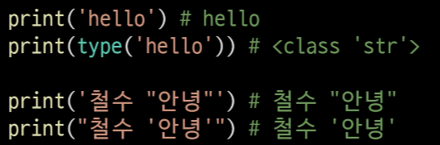
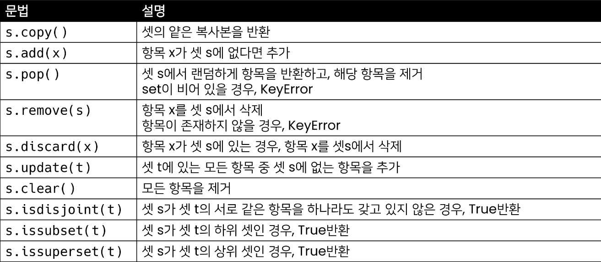
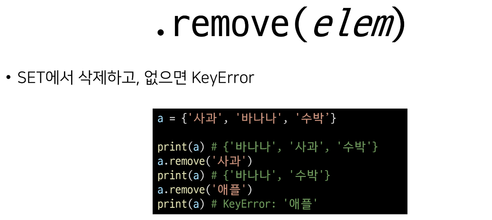

# 데이터 구조(Data Structure)

---

# 목차

* 순서가 있는 데이터 구조
  
  * 문자열(string)
  
  * 리스트(List)
  
  * 튜플(Tuple)

* 순서가 없는 데이터 구조
  
  * 셋(Set)
  
  * 딕셔너리(Dictionary)

* 얕은 복사와 깊은 복사

---

# 데이터 구조 활용

* 데이터 구조를 활용하기 위해서는 메서드(method)를 활용
  
  * 메서드는 클래스 내부에 정의한 함수, 사실상 함수 동일
  
  * 쉽게 설명하자면 객체의 기능(추후 객체 지향 프로그래밍에서 학습)

---

# 파이썬 공식 문서의 표기법(배커스-나우르 표기법)

* 컴퓨터 언어에서 언어의 문법을 수학적인 수식으로 나타낼 때 사용하는 언어 도구

* 프로그래밍 언어의 구문을 기술하는 데 매우 자연스러운 표기법
  
  * python 구문이 아니며, 배커스-나우르 표기법(문서 표준일 뿐)
    
    * old, new는 필수 /[,count]는 선택적 인자를 의미함

---

# 순서가 있는 데이터 구조

---

# 문자열(String Type)

* 문자들의 나열(sequence of characters)
  
  * 모든 문자는 str 타입(변경 불가능한 immutable)

* 문자열은 작은 따옴표(')나 큰따옴포(")를 활용하여 표기
  
  * 문자열을 묶을 때 동일한 문장부호를 활용
  
  * PEP8에서는 소스코드 내에서 하나의 문장부호를 선택하여 유지하도록 함

# 문자열 조회/탐색 및 검색 메서드

---

# 문자열은 immutable(불변형)인데, 문자열 변경이 되는 이유?

* 기존의 문자열을 변경하는 게 아니라, 변경된 문자열을 새롭게 만들어서 반환
  
  * ex) replace, strip, title 등

---

# 문자열 변경

# 문자열 변경 예시

---

# 리스트(List)

---

# 리스트

* 리스트는 여러 개의 값을 순서가 있는 구조로 저장하고 싶을 때 사용

---

# 리스트의 생성과 접근

* 리스트는 대괄호([]) 혹은 list()를 통해 생성
  
  * 파이썬에서는 어떠한 자료형도 저장할 수 있으며, 리스트 안에 리스트도 넣을 수 있음
  
  * 생성된 이후 내용 변경이 가능 -> 가변 자료형
  
  * 이러한 유연성 때문에 파이썬에서 가장 흔히 사용

* 순서가 있는 시퀀스로 인덱스를 통해 접근 가능
  
  * 값에 대한 접근은 list[i]

---

# 리스트 메서드

# 값 추가 및 삭제

# 탐색 및 정렬

* .sort()
  
  * 원본 변경

* sorted()
  
  * 새롭게 정렬된 것을 반환

---

# 튜플(Tuple)

---

# 튜플의 정의

* 튜플은 여러 개의 값을 순서가 있는 구조로 저장하고 싶을 때 사용
  
  * 리스트와의 차이점은 생성 후, 담고 있는 값 변경이 불가 (불변 자료형)

* 항상 소괄호 형태로 사용

# 튜플 관련 메서드

* 튜플은 변경할 수 없기 때문에 값에 영향을 미치지 않는 메서드만을 지원

* 리스트 메서드 중 항목을 변경하는 메서드들을 제외하고 대부분 동일

---

# 비시퀀스형 데이터 구조

---

# 셋(Set)

* Set이란 중복되는 요소가 없이, 순서에 상관없는 데이터들의 묶음
  
  * 데이터의 중복을 허용하지 않기 때문에 중복되는 원소가 있다면 하나만 저장
  
  * 순서가 없기 때문에 인덱스를 이용한 접근 불가능

* 수학에서의 집합을 표현한 컨테이너
  
  * 집합 연산이 가능(여집합을 표현하는 연산자는 별도로 존재 X)
  
  * 중복된 값이 존재하지 않음

* 담고 있는 요소를 삽입 변경, 삭제 가능-> 가변 자료형 (mutable)

# 셋 메서드

# 추가 및 변경

# 요소 삭제

# 삭제

---

# 딕셔너리(Dictionary)

---

# 딕셔너리의 정의

* 키-값(Key-value) 쌍으로 이뤄진 자료형(3.7부터는 ordered, 이하 버전은 unordered)

* Dictionary의 키(Key)
  
  * Key는 변경 불가능한 데이터(immutable)만 활용 가능
    
    * string, integer, float, boolean, tuple, range

* 각 키의 값(values)
  
  * 어떠한 형태든 관계없음

# 딕셔너리 메서드

# 조회

# 추가 및 삭제

---

# 얕은 복사와 깊은 복사

---

# 복사 방법

* 할당 (Assignment)

* 얕은 복사 (Shallow copy)

* 깊은 복사 (Deep copy)

# 할당

* 대입 연산자 (=)
  
  * 리스트 복사 확인하기

# 얕은 복사

* b= list(a)

* b = copy.copy(a)

# 얕은 복사 주의사항

# 깊은 복사

* 리스트 복사 확인하기

* 2차원 이상의 리스트 까지 복사

* copy 모듈 deepcopy
