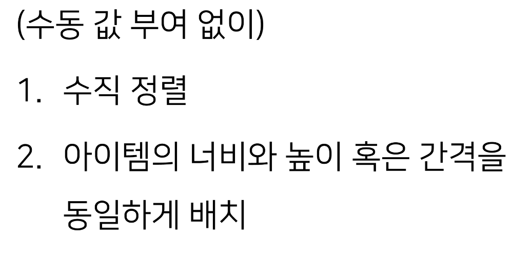
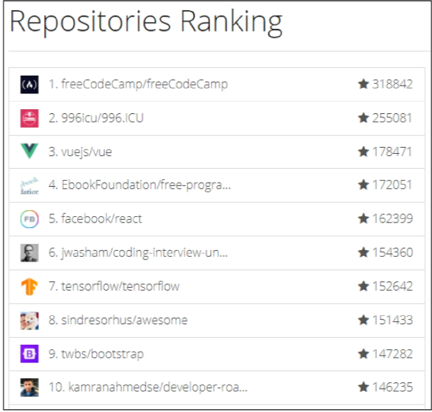
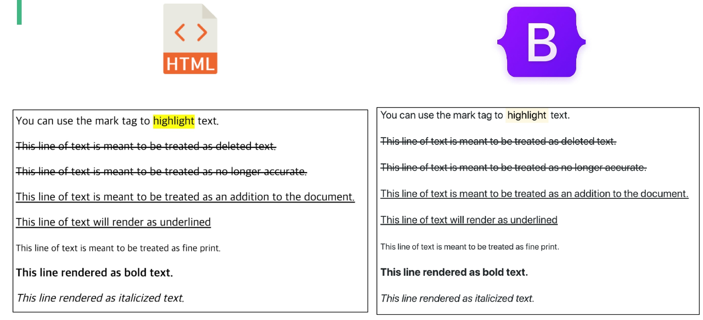
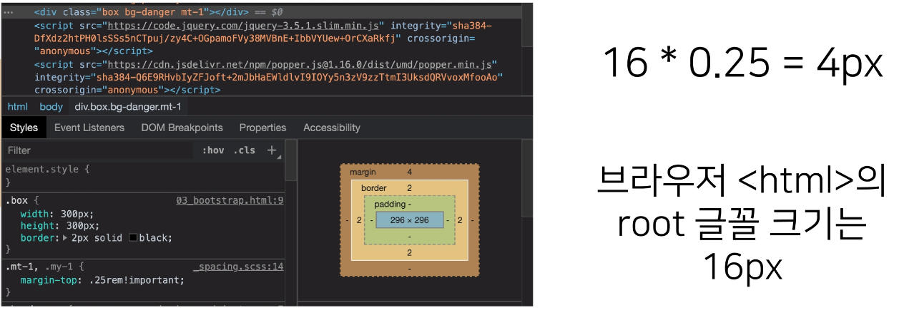
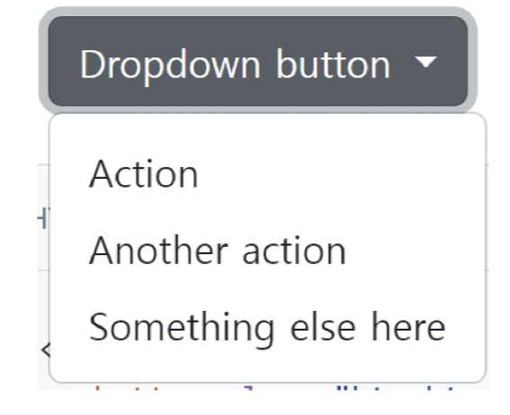
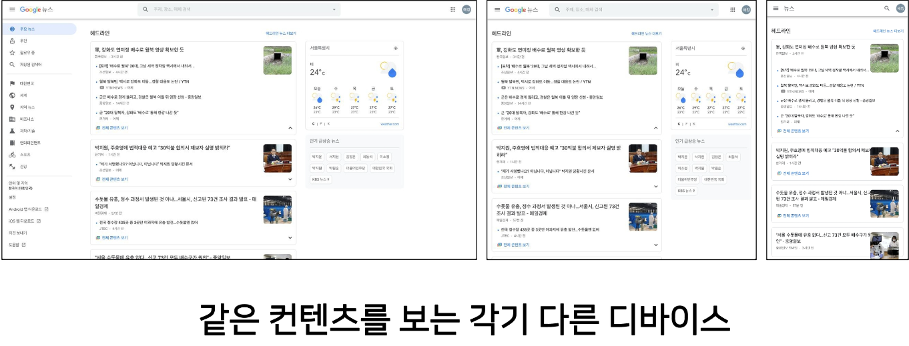
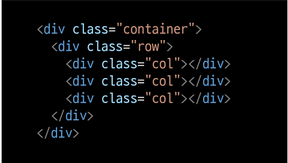
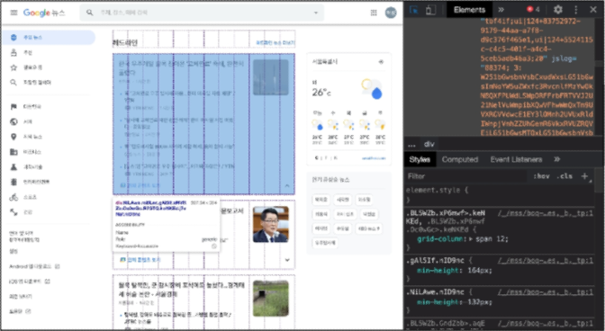
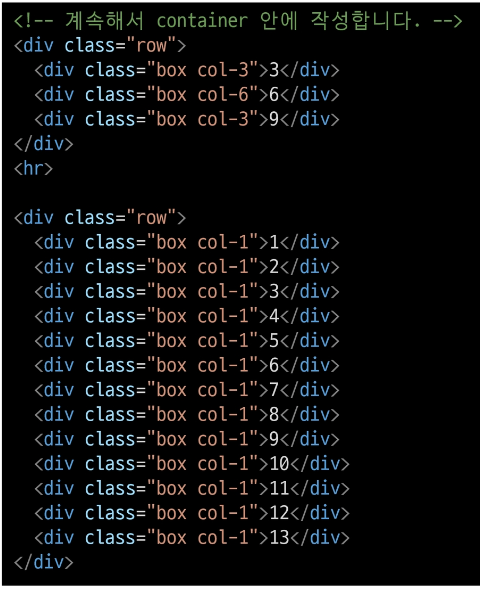

# Web

---

# 목차

* CSS Layout
  
  * float
  
  * flexbox

* bootstrap
  
  * bootstrap grid system

* Responsive Web

---

# CSS layout

---

## CSS layout techniques

* Display

* Position

* Float (CSS1, 1996)

* Flexbox (2012)

* Grid (2017)

* 기타
  
  * Responsive Web Design(2010), Media Queries (2012)

---

# Float

---

## CSS 원칙 1

---

## Float

* 박스를 왼쪽 혹은 오른쪽으로 이동시켜 텍스트를 포함 인라인요소들이 주변을 wrapping 하도록 함

* 요소가 Normal flow를 벗어나도록 함

## Float 속성

* none : 기본값

* left : 요소를 왼쪽으로 띄움

* right : 요소를 오른쪽으로 띄움

## Float 예시 1

## Float 활용 사례

---

# Flexbox

---

## CSS Flexible Box Layout

* 행과 열 형태로 아이템들을 배치하는 1차원 레이아웃 모델

* 축
  
  * main axis (메인 축)
  
  * cross axis (교차 축)

* 구성 요소
  
  * Flex Container (부모 요소)
  
  * Flex Item (자식 요소)

## Flexbox 축

* flex-direction : row

## Flexbox 구성 요소

* Flex Container (부모 요소)
  
  * flexbox 레이아웃을 형성하는 가장 기본적인 모델
  
  * Flex Item들이 놓여있는 영역
  
  * display 속성을 flex 혹은 inline-flex로 지정

* Flex Item (자식 요소)
  
  * 컨테이너에 속해 있는 컨텐츠(박스)

## flexbox 시작

## Flex 속성

* 배치 설정
  
  * flex-direction
  
  * flex-wrap

* 공간 나누기
  
  * justify-content (main axis)
  
  * align-content (cross axis)

* 정렬
  
  * align-items (모든 아이템을 cross axis 기준으로)
  
  * align-self (개별 아이템)

### flex-direction

* Main axis 기준 방향 설정

* 역방향의 경우 HTML 태그 선언 순서와 시각적으로 다르니 유의 (웹 접근성에 영향)

### flex-wrap

* 아이템이 컨테이너를 벗어나는 경우 해당 영역 내에 배치되도록 설정

* 즉, 기본적으로 컨테이너 영역을 벗어나지 않도록 함

### flex-direction & flex-wrap

* flex-direction : Main axis의 방향을 설정

* flex-wrap : 요소들이 강제로 한 줄에 배치 되게 할 것인지 여부 설정
  
  * nowrap (기본 값) : 한 줄에 배치
  
  * wrap : 넘치면 그 다음 줄로 배치

* flex-flow
  
  * flex-direction 과 flex-wrap 의 shorthand
  
  * flex-direction 과 flex-wrap에 대한 설정 값을 차례로 작성
  
  * 예시) flex-flow: row nowrap;

### justify-content

* Main axis를 기준으로 공간 배분

### align-content

* Cross axis를 기준으로 공간 배분(아이템이 한 줄로 배치되는 경우 확인할 수 없음)

### justify-content & align-content

* 공간 배분
  
  * flex-start (기본 값) : 아이템들을 axis 시작점으로
  
  * flex-end : 아이템들을 axis 끝 쪽으로
  
  * center : 아이템들을 axis 중앙으로
  
  * space-between : 아이템 사이의 간격을 균일하게 분배
  
  * space-around : 아이템을 둘러싼 영역을 균일하게 분배 (가질 수 있는 영역을 반으로 나눠서 양쪽에)
  
  * space-evenly : 전체 영역에서 아이템 간 간격을 균일하게 분배

## align-items

* 모든 아이템을 Cross axis를 기준으로 정렬

## align-self

* 개별 아이템을 Cross axis 기준으로 정렬
  
  * <mark>주의! 해당 속성은 컨테이너에 적용하는 것이 아니라 개별 아이템에 적용</mark>

## align-items & align-self

* Cross axis를 중심으로
  
  * Stretch (기본 값) : 컨테이너를 가득 채움
  
  * flex-start : 위
  
  * flex-end : 아래
  
  * center : 가운데
  
  * baseline : 텍스트 baseline에 기준선을 맞춤

## Flex에 적용하는 속성

* 기타 속성
  
  * flex-grow : 남은 영역을 아이템에 분배
  
  * order : 배치 순서

## 활용 레이아웃-수직 수평 가운데 정렬

## 활용 레이아웃 - 카드 배치

---

# Bootstrap

## The world most popular front - end open source

## 편하게 사용해보자

## CDN

---

# Bootstrap 기본 원리

---

## spacing (Margin and padding)

## spacing

## spacing 종합

## spacing 실습

---

# Color

---

## Color

## Text

## Display

## Position

---

# Bootstrap 컴포넌트

---

## Components

* Bootstrap의 다양한 UI 요소를 활용할 수 있음

* 아래 Components 탭 및 검색으로 원하는 UI 요소를 찾을 수 있음

* 기본 제공된 Components를 변환해서 활용

## Buttons

* 클릭 했을 때 어떤 동작이 일어나도록 하는 요소

## Dropdowns

* dropdown, dropdown-menu, dropdown-item 클래스를 활용해 옵션 메뉴를 만들 수 있습니다.

## Forms > Form controls

* form-control 클래스를 사용해 input 및 form 태그를 스타일링할 수 있습니다.

## Navbar

* navbar 클래스를 활용하면 네비게이션 바를 제작할 수 있습니다.

## Carousel

* 콘텐츠(사진)을 순환시키기 위한 슬라이드쇼

## Modal

* 사용자와 상호작용 하기 위해서 사용하며, 긴급 상황을 알리는 데 주로 사용

* 현재 열려 있는 페이지 위에 또 다른 레이어를 띄움

* 페이지를 이동하면 자연스럽게 사라짐(제거를 하지 않고도 배경 클릭시 사라짐)

## Flexbox in Bootstrap

## Card > Grid Card

* 화면이 작아지면 1줄에 표시되는 카드의 개수가 줄어듬

## Responsive Web

## Responsive Web Design

* 다양한 화면 크기를 가진 디바이스들이 등장함에 따라 responsive web design 개념이 등장

* 반응형 웹은 별도의 기술 이름이 아닌 웹 디자인에 대한 접근 방식, 반응형 레이아웃 작성에 도움이 되는 사례들의 모음 등을 기술하는데 사용되는 용어

* 예시
  
  * Media Queries, Flexbox, Bootstrap Grid System, 
    
    The viewport meta tag

---

# Bootstrap Grid System

---

## Grid system (web design)

* 요소들의 디자인과 배치에 도움을 주는 시스템

* 기본 요소
  
  * Column : 실제 컨텐츠를 포함하는 부분
  
  * Gutter : 칼럼과 칼럼 사이의 공간 (사이 간격)
  
  * Container : Column들을 담고 있는 공간

## Bootstrap grid system

* Bootstrap Grid system은 flexbox로 제작됨

* container, rows, column으로 컨텐츠를 배치하고 정렬

* 반드시 기억해야 할 2가지 !
  
  * 12개의 column
  
  * 6개의 grid breakpoints

## Grid system

## Grid system breakpoints

## 연습해보기

